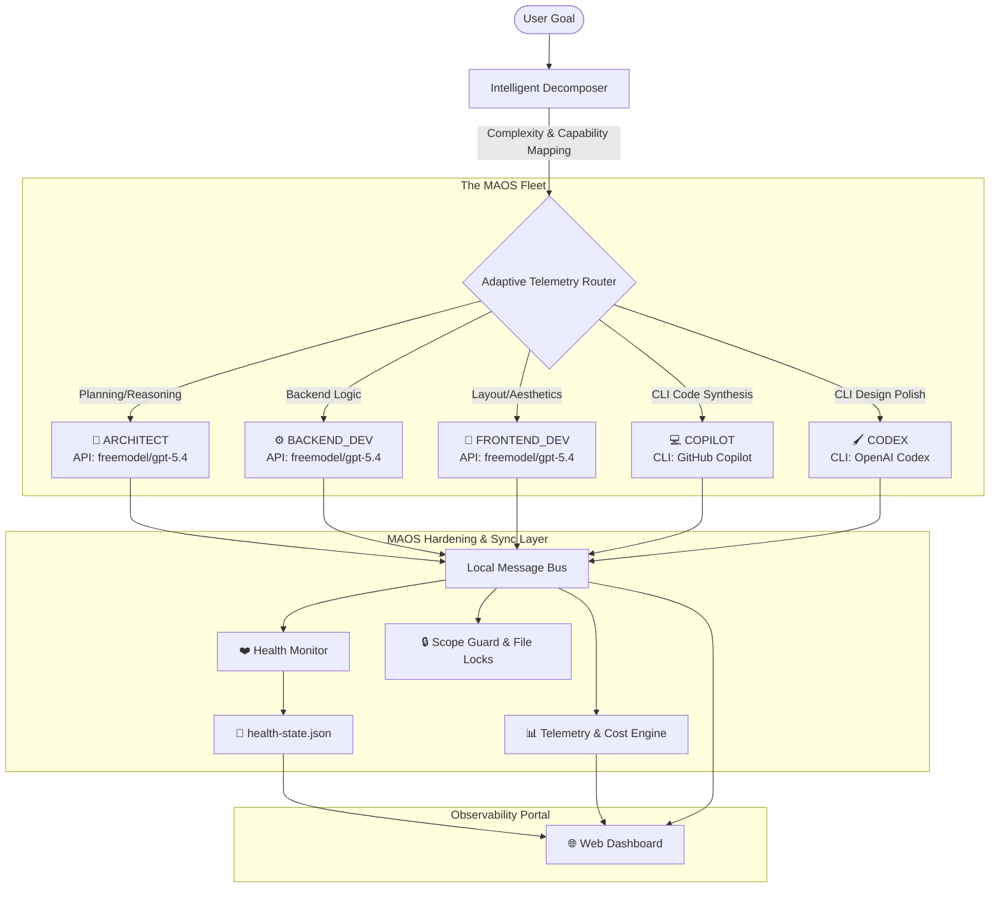

# 🤖 MAOS — Multi-Agent Orchestrator System
### *MAOS Core + MAOS Industrial Solution Pack*

---

## 📋 Hackathon Submission Details
* **Project Name**: MAOS (Multi-Agent Orchestrator System)
* **Tagline**: MAOS Core is docker-compose for autonomous AI agents. MAOS Industrial is an optional sovereign solution pack that coordinates local open-weight models and deterministic industrial tools to analyze confidential plant data without cloud calls.
* **Components**: MAOS Core (general-purpose orchestrator) + MAOS Industrial (optional vertical profile for sovereign industrial workflows)

---



---

# 🎴 Slide 1: Executive Summary & The Vision
### **MAOS (Multi-Agent Orchestrator System)**
> **Autonomous coding has evolved past the single-model chat window. MAOS provides the orchestration, state synchronization, and operational guardrails required to run a heterogeneous fleet of AI developer agents in parallel.**

```
+-------------------------------------------------------------------------------+
|  [ maos.config.json ]                                                         |
|  - Define specialized roles, capabilities, and token budgets.                 |
|  - Configure mixed runtimes: API endpoints + local models + CLI tools.        |
+-------------------------------------------------------------------------------+
                                       │
                                       ▼
+-------------------------------------------------------------------------------+
|  [ maos start ]                                                               |
|  - Decomposes goals into dependency-mapped, parallel task files.             |
|  - Executes agents in process-isolated, visible Windows Terminal tabs.       |
|  - Manages real-time telemetry, health checks, and semantic write-locks.      |
+-------------------------------------------------------------------------------+
                                       │
                                       ▼
+-------------------------------------------------------------------------------+
|  [ maos dashboard ]                                                           |
|  - High-performance web interface tracking live runs, queue states, and cost. |
|  - Live Health Monitor (Healthy, Degraded, Dead, Idle) with auto-retries.    |
+-------------------------------------------------------------------------------+
```

---

# 🎴 Slide 2: The Core Problem (Pain Points)
### **The Gap Between AI Models and Autonomous Software Production**

#### 1. The Fragmentation of Runtimes
AI developer tools are highly siloed. A developer has access to proprietary APIs (OpenAI, Anthropic), local models (Llama, DeepSeek), and powerful terminal CLI agents (Claude Code, GitHub Copilot CLI). There is **no cohesive orchestrator** that lets them work together on a single project.

#### 2. The Context & Capability Wall
Large-scale software tasks (e.g., *“Build an entire SaaS landing page with full navbar, pricing animations, testimonials, and SEO”*) quickly exceed the context window, token limits, and reasoning depth of any **single** AI model. 

#### 3. Operational Chaos in Multi-Agent execution
Without a synchronized runtime wrapper, agents running in parallel run into severe issues:
* **Write Conflicts**: Two agents write to `App.css` at the same time, corrupting the code.
* **Invisible Deadlocks**: CLI agents freeze waiting for user auth or interactive prompt inputs (REPL), hanging silently in the background while wasting host resources.
* **Cascading Failures**: A single API credential failure triggers infinite loops, retry storms, and resource exhaustion.
* **Observability Blindspots**: Developers have zero visibility into what concurrent external CLI processes are executing, making debugging impossible.

---

# 🎴 Slide 3: Proposed Solution & Key Features
### **The MAOS Solution: Process-Isolated Multi-Agent Composition**

| Feature | Technical Solution | Impact |
|---------|--------------------|--------|
| **Unified Fleet Configuration** | `maos.config.json` lets developers define specialized roles, capabilities, scope directories, and providers (mixed API + local + CLI). | Standardized, declarative agent deployment like `docker-compose.yml`. |
| **Intelligent Task Decomposer** | Recursively breaks down complex goals into a DAG (Directed Acyclic Graph) of subtasks, analyzing capabilities and dependencies. | Complex goals are distributed to the most qualified agent in parallel. |
| **Cross-Process Event Bus** | A local, process-isolated event storage and filesystem status map syncing the fleet with a real-time Web Dashboard. | Instant, high-fidelity monitoring of active tasks, logs, and agent states. |
| **Health Monitor & Auto-Recovery** | Periodic sweep checks (every 15s) tracking heartbeats. Identifies degraded/dead agents and triggers retry queues with backoff. | Zero frozen runs. Self-healing orchestration that detects and recovers from crashes. |
| **Visible Process Isolation** | Launches CLI agents in dedicated Windows Terminal tabs using isolated PowerShell scripts, complete with transcript logging. | Full developer visibility. You can physically watch Copilot or Codex write code in real-time. |
| **Semantic Scope Guards** | Active file-locking and semantic read/write directory rosters that manage agent ownership timeouts. | Eliminates write conflicts. Guaranteed database and codebase integrity. |

---

# 🎴 Slide 4: Tools & Tech Stack
### **A Lightweight, Zero-Dependency, High-Performance Architecture**

```
 ┌─────────────────────────────────────────────────────────────────────────┐
 │                            THE MAOS STACK                               │
 └─────────────────────────────────────────────────────────────────────────┘
                                     │
      ┌──────────────────────────────┼──────────────────────────────┐
      ▼                              ▼                              ▼
┌───────────────┐              ┌───────────────┐              ┌───────────────┐
│  CORE SYSTEM  │              │  INTELLIGENCE │              │ OBSERVABILITY │
├───────────────┤              ├───────────────┤              ├───────────────┤
│ • Node.js     │              │ • OpenAI API  │              │ • HTML5/CSS3  │
│ • TypeScript  │              │ • Anthropic   │              │ • ES6/REST    │
│ • Commander.js│              │ • Google GenAI│              │ • JSONL Bus   │
│ • PowerShell  │              │ • simple-git  │              │ • fsync Status│
└───────────────┘              └───────────────┘              └───────────────┘
```

* **Core Orchestrator**: Node.js, TypeScript, Commander.js. Zero heavy external framework dependencies. Fast, stable, and highly portable.
* **Mixed Runtime Factory**:
  * **API Runtimes**: Standardized OpenAPI / Anthropic SDK wraps with strict credential-doctor checking.
  * **CLI Runtimes**: Windows Terminal CLI Launcher via PowerShell, employing `Start-Transcript`/`Stop-Transcript` logging and `Start-Job` interactive prompts watchdog tasks.
* **State Synchronization**:
  * Atomically written `.status` and `health-state.json` file mappings.
  * High-performance, low-latency Server-Sent or polling REST interfaces powering the Web Dashboard.
* **Hardened Security Guardrails**:
  * Zero-dependency Node.js Git pre-commit hook scanning staged diffs and blocking commits if API keys or `.env` files are leaked.

---

# 🎴 Slide 5: Ideal Customer Profile (ICP) & Target Audience
### **Who is MAOS Built For?**

```
              ┌───────────────────────────────────────────────┐
              │              THE TARGET AUDIENCE              │
              └───────────────────────────────────────────────┘
                                      │
       ┌──────────────────────────────┼──────────────────────────────┐
       ▼                              ▼                              ▼
┌──────────────────────────────┐┌──────────────────────────────┐┌──────────────────────────────┐
│       THE INDIE HACKER       ││       THE AI ENGINEER        ││      THE ENTERPRISE TEAM     │
├──────────────────────────────┤├──────────────────────────────┤├──────────────────────────────┤
│ Wants to spin up an autonomous││ Needs a highly extensible,  ││ Needs strict observability,  │
│ engineering fleet to build   ││ hardened orchestrator with  ││ directory scope boundaries,  │
│ MVPs in parallel on their    ││ detailed telemetry to deploy ││ and detailed spend analytics │
│ local machine.               ││ custom agent flows.         ││ across heterogeneous models. │
└──────────────────────────────┘└──────────────────────────────┘└──────────────────────────────┘
```

#### 1. Autonomous Software Engineers & Indie Hackers
* **Pain Point**: Solopreneurs who want to build complete, complex SaaS products but are bottlenecked by context limitations and manually prompting multiple tools.
* **Why MAOS**: They can spin up `ARCHITECT`, `FRONTEND_DEV`, `BACKEND_DEV`, `COPILOT`, and `CODEX` in parallel on their local machine, watching their MVP get assembled in real-time.

#### 2. AI Engineering Teams
* **Pain Point**: Engineers building custom developer agent workflows who find existing frameworks too abstract, heavy, or lacking low-level system controls.
* **Why MAOS**: Provides a highly customizable, file-lock-protected, event-driven orchestrator built purely in TypeScript with a robust CLI and status API.

#### 3. Enterprise Development & DevOps Teams
* **Pain Point**: Organizations deploying LLM coding agents who need to strictly monitor, limit, and analyze token usage, API costs, and file access boundaries.
* **Why MAOS**: Features detailed spend telemetry, strict directory-based scope boundaries, pre-commit credential leak prevention, and comprehensive health monitoring.
