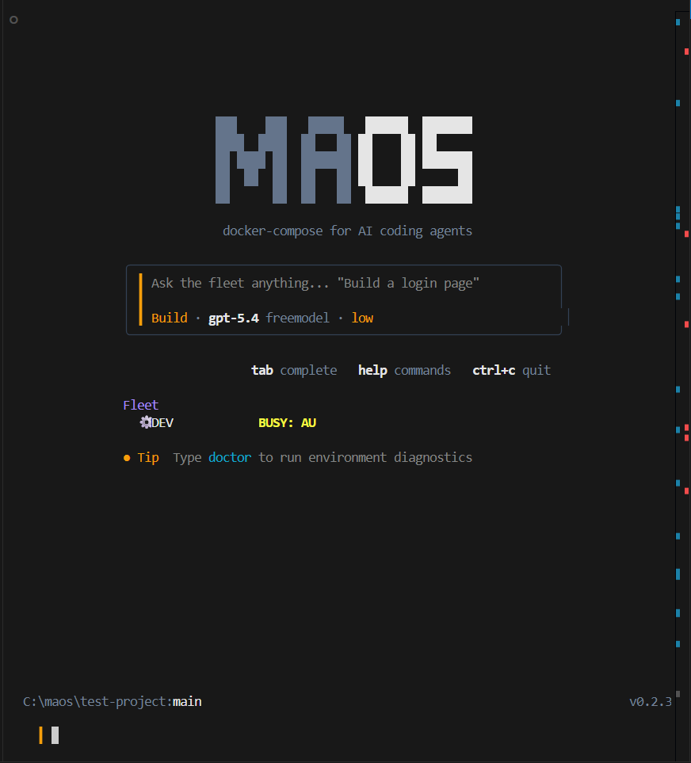

<div align="center">

# 🤖 MAOS - Sistema Orquestador Multi-Agente

### *docker-compose para agentes de codificación IA*

[](https://www.npmjs.com/package/maosorch)
[](https://maos.web.app/)
[](https://www.typescriptlang.org/)
[](https://nodejs.org/)
[](LICENSE)

```bash
npm install -g maosorch
```

**MAOS te permite definir, orquestar y ejecutar múltiples agentes de codificación IA en un solo proyecto: cada uno con su propio rol, alcance y capacidades, mediante un simple archivo de configuración.**

[Inicio Rápido](#-quick-start) · [Cómo Funciona](#-how-it-works) · [Arquitectura](#-architecture) · [Comandos](#-commands) · [Configuración](#-configuration)

</div>

---

<div align="center">

### 🖥️ REPL Interactivo



*El REPL de MAOS: pregúntale a la flota lo que sea, usa tabulación para autocompletar comandos y observa a los agentes trabajar en tiempo real.*

</div>

---

## 💡 El Problema

Los asistentes modernos de codificación IA son potentes pero **de un solo hilo**. Solo puedes usar un modelo a la vez, en una sola tarea. ¿Qué pasaría si pudieras:

- Contar con un **agente planificador** que descomponga un objetivo en subtareas
- Encaminar cada subtarea al **agente más adecuado** según sus capacidades
- Ejecutar en paralelo un **coder de backend**, un **diseñador de frontend** y un **redactor de pruebas**
- Usar **cualquier modelo** - GPT-5, Claude, Gemini, Llama, Qwen, DeepSeek - a través de una interfaz unificada
- Rastrear costos, tokens y latencia en toda tu flota de IA

**MAOS hace esto posible.**

---

## 🚀 Quick Start

### Install

```bash
npm install -g maosorch
```

### Or use directly with npx (no install needed)

```bash
npx maosorch init
```

### Step by step

```bash
# 1. Initialize MAOS in your project
cd your-project
maos init

# 2. Set your API key (Freemodel is default — free tier available)
echo "FREEMODEL_API_KEY=your_key_here" > .env

# 3. Run diagnostics to verify everything works
maos doctor

# 4. Decompose a complex goal into subtasks
maos plan "Build a REST API with auth" --yes

# 5. Start the orchestrator — agents work in parallel
maos start

# 6. Watch the fleet in your browser
maos dashboard
```

---

## 🧠 How It Works

MAOS sigue un ciclo de **Planificar → Enrutar → Ejecutar → Informar**:

```
┌──────────────────────────────────────────────────────────────┐
│                    maos plan "Build X"                        │
│                         │                                    │
│                    ┌────▼────┐                               │
│                    │DECOMPOSER│  AI breaks goal into subtasks│
│                    └────┬────┘                               │
│                         │                                    │
│              ┌──────────▼──────────┐                         │
│              │   CAPABILITY ROUTER  │  Scores agents per task│
│              └──────────┬──────────┘                         │
│                         │                                    │
│         ┌───────────────┼───────────────┐                    │
│         ▼               ▼               ▼                    │
│    ┌─────────┐    ┌─────────┐    ┌─────────┐                │
│    │  DEV    │    │ DESIGNER │    │ TESTER  │  Parallel exec │
│    │(Claude) │    │ (Gemini) │    │ (GPT-5) │                │
│    └────┬────┘    └────┬────┘    └────┬────┘                │
│         │              │              │                      │
│         └──────────────┼──────────────┘                      │
│                        ▼                                     │
│              ┌─────────────────┐                             │
│              │  GIT ISOLATION   │  Each agent = own branch   │
│              │  main ← merge    │                            │
│              └─────────────────┘                             │
└──────────────────────────────────────────────────────────────┘
```

### Key Concepts

| Concept | Description |
|---------|-------------|
| **Agent** | Una instancia de modelo IA con un rol, alcance y capacidades definidos |
| **Task** | Una unidad de trabajo en la cola (un archivo markdown en `.maos/queue/`) |
| **Router** | Evalúa agentes frente a tareas usando coincidencia de capacidades, afinidad de rol, costo y complejidad |
| **Decomposer** | Descomposición de objetivos a subtareas potenciada por IA con gráficos de dependencias |
| **Pool** | Habilitar/deshabilitar agentes sin modificar la configuración |
| **Branch Isolation** | Cada agente trabaja en su propia rama git: sin conflictos |

---

## 🏗️ Architecture

```
maos/
├── src/
│   ├── cli/                    # CLI commands
│   │   ├── index.ts            # Entry point — 10 commands + REPL
│   │   ├── init.ts             # maos init — scaffold .maos/
│   │   ├── task.ts             # maos task — queue a task
│   │   ├── plan.ts             # maos plan — AI decomposition
│   │   ├── start.ts            # maos start — run orchestrator
│   │   ├── status.ts           # maos status — fleet dashboard
│   │   ├── pool.ts             # maos pool — agent management
│   │   ├── logs.ts             # maos logs — view/tail logs
│   │   ├── brain.ts            # maos brain — codebase scanner + telemetry
│   │   ├── dashboard.ts        # maos dashboard — web UI at localhost:3847
│   │   ├── repl.ts             # Interactive REPL shell
│   │   └── clean.ts            # maos clean — reset queue
│   │
│   ├── core/                   # Core orchestration engine
│   │   ├── orchestrator.ts     # Main event loop (poll → match → dispatch)
│   │   ├── router.ts           # Capability-based routing engine
│   │   ├── decomposer.ts       # AI task decomposition
│   │   ├── agent-runner.ts     # Agentic tool-calling loop
│   │   ├── queue.ts            # File-based task queue (pending → active → done)
│   │   ├── pool-manager.ts     # Agent pool state management
│   │   ├── telemetry.ts        # Append-only JSONL task telemetry
│   │   └── brain.ts            # Codebase scanner + context injection
│   │
│   ├── backends/               # LLM provider abstraction (12+ providers)
│   │   ├── provider.ts         # IProvider interface
│   │   ├── openai-provider.ts  # OpenAI-compatible (GPT, DeepSeek, Qwen, Groq, etc.)
│   │   ├── anthropic-provider.ts # Native Anthropic SDK (Claude)
│   │   ├── gemini-provider.ts  # Native Google Gemini SDK
│   │   └── factory.ts          # Provider factory
│   │
│   ├── integrations/           # External tool integrations
│   │   ├── tools.ts            # Agent tools (read/write/list/exec/git)
│   │   └── git.ts              # Git branch isolation
│   │
│   └── utils/                  # Utilities
│       ├── logger.ts           # Structured logger (console + file)
│       └── paths.ts            # .maos/ directory management
│
├── .maos/                      # Project-specific MAOS data (git-ignored)
│   ├── maos.config.json        # Agent fleet configuration
│   ├── pool.json               # Agent enable/disable state
│   ├── queue/                  # Task queue
│   │   ├── pending/            # Queued tasks
│   │   ├── active/             # In-progress tasks
│   │   └── done/               # Completed tasks
│   ├── status/                 # Agent status files
│   └── logs/                   # Orchestrator logs
│
├── package.json
└── tsconfig.json
```

---

## 📦 Commands

| Command | Description |
|---------|-------------|
| `maos init` | Inicializa MAOS en el directorio actual (crea `.maos/`) |
| `maos plan <goal>` | Usa IA para descomponer un objetivo en subtareas etiquetadas por capacidad |
| `maos task <desc>` | Encola manualmente una sola tarea |
| `maos start` | Inicia el bucle del orquestador |
| `maos status` | Muestra el panel de la flota (agentes, cola, estados) |
| `maos pool` | Habilitar/deshabilitar agentes (`--enable DEV`, `--disable all`) |
| `maos logs` | Ver registros del orquestador (`-f` para seguir, `-a` para filtrar por agente) |
| `maos brain <action>` | Escáner de base de código y telemetría (`init`, `status`, `context`, `telemetry`) |
| `maos dashboard` | Inicia el panel web en `http://localhost:3847` |
| `maos clean` | Limpia la cola, restablece estados, trunca registros |
| `maos` *(sin args)* | Inicia un shell REPL interactivo con autocompletado por tabulación |

### Examples

```bash
# Decompose a complex goal into subtasks
maos plan "Build a todo app with auth, dark mode, and REST API" --yes

# Queue a single task targeting a specific agent
maos task "Add rate limiting to the auth middleware" --agent DEV --complexity high

# Start with a different provider
maos start --provider openai

# Follow logs in real-time, filtered by agent
maos logs -f --agent DEV

# Disable an agent temporarily
maos pool --disable DESIGNER

# Clean everything and start fresh
maos clean
```

---

## ⚙️ Configuration

MAOS se configura mediante `.maos/maos.config.json`:

```jsonc
{
  "projectName": "my-app",
  "routingMode": "auto",

  // Provider configurations (any OpenAI-compatible API)
  "providers": {
    "freemodel": {
      "apiKey": "env:FREEMODEL_API_KEY",
      "baseURL": "https://api.freemodel.dev/v1",
      "costPerMillionTokens": 0.50
    },
    "openai": {
      "apiKey": "env:OPENAI_API_KEY",
      "baseURL": "https://api.openai.com/v1",
      "costPerMillionTokens": 15.0
    }
  },

  // Agent definitions
  "agents": [
    {
      "id": "DEV",
      "role": "coder",
      "provider": "freemodel",
      "model": "gpt-5.4",
      "capabilities": ["coding", "apis", "database", "refactoring", "testing"],
      "scope": ["**/*"],
      "maxIterations": 20,
      "costTier": "low"
    },
    {
      "id": "DESIGNER",
      "role": "designer",
      "provider": "freemodel",
      "model": "gemini-2.5-pro",
      "capabilities": ["design", "css", "frontend", "layout", "styling"],
      "scope": ["src/components/**", "src/styles/**", "public/**"],
      "maxIterations": 15,
      "costTier": "low"
    }
  ],

  // Routing configuration
  "routing": {
    "strategy": "capability_score",  // capability_score | round_robin | cheapest_first | best_model
    "costWeight": 0.3,
    "capabilityWeight": 0.7,
    "maxParallelAgents": 3,
    "fallbackProvider": "freemodel"
  }
}
```

### Supported Providers (12+)

MAOS admite **3 tipos de adaptadores** que cubren todos los proveedores de IA principales:

**Adaptadores Compatibles con OpenAI** (cualquier API estilo OpenAI):

| Provider | Base URL | Notes |
|----------|----------|-------|
| Freemodel | `https://api.freemodel.dev/v1` | Capa gratuita, ideal para hackathons |
| OpenAI | `https://api.openai.com/v1` | GPT-4o, GPT-5 |
| DeepSeek | `https://api.deepseek.com/v1` | DeepSeek Coder V3 |
| Qwen | `https://dashscope.aliyuncs.com/compatible-mode/v1` | Alibaba Qwen |
| Together AI | `https://api.together.xyz/v1` | Modelos de código abierto |
| Groq | `https://api.groq.com/openai/v1` | Inferencia ultrarrápida |
| Fireworks | `https://api.fireworks.ai/inference/v1` | Rápido y económico |
| Ollama | `http://localhost:11434/v1` | Modelos locales (Llama, Qwen) |
| LM Studio | `http://localhost:1234/v1` | Basado en GUI local |

**Adaptadores Nativos** (SDKs dedicados para soporte de primer nivel):

| Provider | SDK | Models |
|----------|-----|--------|
| Anthropic | `@anthropic-ai/sdk` | Claude 3.5 Sonnet, Claude 3.5 Haiku, Claude Opus 4 |
| Google Gemini | `@google/generative-ai` | Gemini 2.5 Flash, Gemini 2.5 Pro, Gemini 1.5 Pro |

---

## 🧭 Routing Engine

El motor de enrutamiento evalúa cada agente frente a una tarea usando 4 dimensiones:

```
SCORE = (capability_match × capabilityWeight)
      + role_bonus
      + complexity_bonus
      - (cost_penalty × costWeight)
```

| Dimension | Range | What It Measures |
|-----------|-------|------------------|
| Capability Match | 0.0 – 1.0 | % de capacidades requeridas que posee el agente |
| Role Bonus | 0.0 – 0.25 | ¿El rol del agente coincide con la categoría de la tarea? |
| Complexity Bonus | 0.0 – 0.20 | ¿El modelo es lo suficientemente potente para tareas difíciles? |
| Cost Penalty | 0.0 – 0.15 | Prefiere modelos más económicos cuando son capaces |

**Estrategias de enrutamiento:**
- `capability_score` — Evaluación inteligente (predeterminada)
- `cheapest_first` — Usa el agente capaz más económico
- `best_model` — Siempre usa el modelo más costoso
- `round_robin` — Rotación simple

---

## 🧠 The Intelligence Layer (P3)

MAOS cuenta con una **Capa de Inteligencia** automejorable y basada en datos que conecta la telemetría de la flota con la ejecución del orquestador, permitiendo a los agentes aprender, colaborar y adaptarse en tiempo real:

*   **Memoria de Contexto Compartido (Transferencia Inter-Agente):** Los agentes comparten dinámicamente descubrimientos y mapas de la base de código a través de un almacén de memoria de solo adjunción. Inyectado automáticamente en los prompts del sistema, esto elimina la exploración redundante y ahorra hasta 5 iteraciones por tarea de agente.
*   **Enrutador de Capacidades Adaptativo:** El enrutador va más allá de las reglas estáticas. Lee la telemetría histórica de ejecución y calcula una **matriz de tasa de éxito** de agente a capacidad. La puntuación usa una mezcla 60/40 de coincidencia de capacidad estática y reputación aprendida para preferir agentes con fiabilidad probada en tipos específicos de tareas.
*   **Motor de Propiedad de Archivos:** Evolucionado desde simples bloqueos de archivos hacia un mapa de propiedad de alta concurrencia con ámbitos `READ`, `WRITE` y `EXCLUSIVE`. Rastrea asociaciones agente-archivo, detecta solapamientos a nivel de línea mediante git, pospone escrituras concurrentes a una cola de reintentos por conflicto y libera archivos automáticamente tras 60 segundos de inactividad.
*   **Descomponedor de Tareas Inteligente:** Usa datos de telemetría para precalcular la complejidad de las tareas. El descomponedor genera planes con límites conscientes del alcance que respetan los límites de acceso a archivos de cada agente, y ejecuta detección de ciclos DFS para validar gráficos de dependencias de tareas.

---

## 🛡️ Safety & Security (Secret Shield)

MAOS aplica aislamiento estricto, protecciones de seguridad y guardrails para mantener seguros los cambios en la base de código y prevenir filtraciones de credenciales del repositorio:

*   **Aislamiento de Ramas:** Cada agente opera en una rama git dedicada (`maos/<agent>/<task>`). El código se fusiona de nuevo solo al completar la tarea.
*   **Aplicación de Alcance:** Los agentes están restringidos a rutas de archivos específicas mediante patrones glob (ej. `src/components/**`). No pueden leer ni escribir fuera de sus límites definidos.
*   **Interruptor Automático (Circuit Breaker):** Detecta automáticamente agentes bloqueados. Si un agente ejecuta 5 iteraciones sin cambios en el sistema de archivos, la ejecución se detiene de forma segura.
*   **Escudo de Secretos (Guarda Pre-Commit):** Un hook de Git ligero y sin dependencias que escanea los cambios preparados antes de cada commit:
    *   **Bloquea Archivos `.env` Preparados:** Rechaza instantáneamente commits que preparen `.env` o archivos de entorno no de ejemplo.
    *   **Escáner de Credenciales:** Escanea adiciones preparadas en busca de claves de Freemodel (`fe_oa_...`), claves de OpenAI (`sk-...`) y asignaciones obvias de tokens o claves API usando coincidencia de entropía.
    *   **Advertencia Interactiva en Terminal:** Muestra alertas de error limpias y estructuradas directamente en tu shell, mostrando el archivo exacto, línea coincidente e instrucciones de remediación.
*   **Apagado Seguro:** Manejadores SIGINT/SIGTERM limpian los estados de los agentes y liberan las propiedades de los archivos.

---

## 🗺️ Roadmap

- [x] Bucle central del orquestador
- [x] Motor de enrutamiento basado en capacidades (4 estrategias)
- [x] Descomposición de tareas por IA (`maos plan`)
- [x] Aislamiento de ramas git por agente
- [x] Cola de tareas basada en archivos
- [x] Abstracción de proveedores (12+ proveedores, 3 tipos de adaptadores)
- [x] Adaptador nativo de Anthropic (Claude)
- [x] Adaptador nativo de Google Gemini
- [x] Gestión del grupo de agentes
- [x] Registro estructurado
- [x] Telemetría de costos y tokens
- [x] Escáner cerebral de la base de código
- [x] Shell REPL interactivo
- [x] Panel web (visualización en tiempo real de la flota)
- [x] Aprendizaje de rendimiento histórico y enrutador adaptativo
- [x] Memoria de contexto compartida inter-agente
- [x] Motor de propiedad de archivos de alta concurrencia
- [x] Escáner automatizado de Secret Shield pre-commit
- [x] Orquestación de tiempo de ejecución CLI (Copilot, Codex, Claude Code)
- [x] Programador adaptativo con enrutamiento consciente de fallos
- [x] Monitor de salud con gestión del ciclo de vida de incidentes
- [x] Detección de fallos en tiempo de ejecución y recuperación automática
- [x] Sistema de extracción de eventos y reproducción de tareas
- [x] Diagnósticos de entorno (`maos doctor`)
- [x] CLI instalable por npm (`npm install -g maosorch`)
- [ ] Sistema de plugins para herramientas personalizadas
- [ ] Extensión para VS Code
- [ ] Lanzador CLI multiplataforma (Linux/macOS)

---

## 📄 License

MIT © [Amitakshya Sutar](https://github.com/Amitakshya333)

---

<div align="center">

**Construido para el MUNDO** 🏆

*MAOS: porque un solo agente de IA nunca es suficiente.*

📦 **[Ver en npm →](https://www.npmjs.com/package/maosorch)** · 🌐 **[Visitar Sitio Web →](https://maos.web.app/)** · 

</div>
