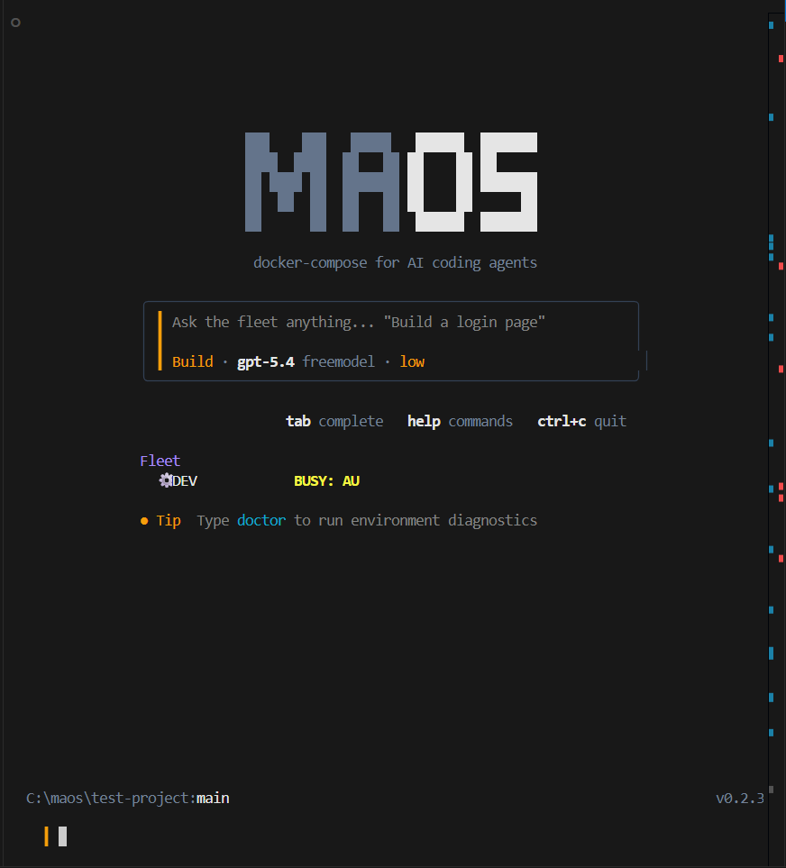

<div align="center">

# 🤖 MAOS - Multi-Agent Orchestrator System

### *docker-compose for AI coding agents*

[](https://www.npmjs.com/package/maosorch)
[](https://maos.web.app/)
[](https://www.typescriptlang.org/)
[](https://nodejs.org/)
[](LICENSE)

```bash
npm install -g maosorch
```

**MAOS lets you define, orchestrate, and run multiple AI coding agents on a single project - each with their own role, scope, and capabilities - using a simple config file.**

[Quick Start](#-quick-start) · [How It Works](#-how-it-works) · [Architecture](#-architecture) · [Commands](#-commands) · [Config](#-configuration)

</div>

---

<div align="center">

### 🖥️ Interactive REPL



*The MAOS REPL — ask the fleet anything, tab-complete commands, and watch agents work in real-time.*

</div>

---

## 💡 The Problem

Modern AI coding assistants are powerful but **single-threaded**. You can only use one model at a time, on one task. What if you could:

- Have a **planner agent** decompose a goal into subtasks
- Route each subtask to the **best-suited agent** based on capabilities
- Run a **backend coder**, **frontend designer**, and **test writer** in parallel
- Use **any model** - GPT-5, Claude, Gemini, Llama, Qwen, DeepSeek - through one unified interface
- Track cost, tokens, and latency across your entire AI fleet

**MAOS makes this possible.**

---

## 🏭 MAOS Industrial — Sovereign Solution Pack

MAOS Industrial is an **optional vertical profile** on top of MAOS Core. It coordinates locally hosted open-weight models and deterministic industrial tools to analyze confidential plant documents and sensor data — entirely offline, with zero cloud dependency.

- **100% Air-Gapped / Sovereign:** Binds strictly to loopback `127.0.0.1` — no external API keys, telemetry leaks, or cloud WAN calls.
- **Deterministic Rust Core:** Backed by `bin/maos-industrial-engine.exe` (`#![forbid(unsafe_code)]`) for streaming sensor CSV parsing, decimal math, canonical SHA-256 calculation, and tamper-evident audit chaining.
- **Specialized 4-Stage DAG Pipeline:** `INGEST → ANALYZE → APPROVAL → SYNTHESIZE` with fail-closed human-in-the-loop governance.
- **Verifiable Deliverables:** Generates validated OOXML Word (`.docx`), Excel (`.xlsx`), and PDF reports citing exact sensor rows, deviations, units, and corroborating maintenance evidence.
- **Safe Office Integration:** Inspect deliverables in native desktop office software (Microsoft Office / LibreOffice) via sanitized, injection-proof launch delegation.

### Industrial CLI Commands Reference

All industrial operations are exposed under the unified `maos industrial` namespace:

| Command | Description | Key Flags / Examples |
|---|---|---|
| `maos industrial preflight` | Verifies host firewall isolation, project initialization, and engine diagnostics | `--json`, `-p, --project-root <path>` |
| `maos industrial start` | Launches long-running project service on local loopback | `--port 3847`, `--profile industrial` |
| `maos industrial run` | Executes one-command 6-stage judged workflow with audit export | `--auto-approve -y`, `--enforce-firewall` |
| `maos industrial demo` | Runs sovereign RMS coding demo inside isolated sandbox | `--demo rms`, `--json` |
| `maos industrial verify` | Cryptographically verifies audit chain or boundary status | `--target audit`, `--target boundary` |
| `maos industrial kb` | Manages offline industrial knowledge base corpus and vector index | `status`, `build`, `search <query>`, `verify` |
| `maos industrial open` | Safely validates and opens local deliverable in native desktop Office | `<target>`, `--dry-run`, `-l libreoffice` |
| `maos industrial reset` | Deterministically cleans test queue, indices, sandbox mounts, and run outputs | `--dry-run`, `-y, --yes`, `-c all` |
| `maos industrial stop` | Gracefully or forcefully terminates running industrial service | `--force -y` (marks tasks `INTERRUPTED`) |

### Architectural Limits & Operating Boundaries

1. **Single-Project Boundary (MVP):** One project service per canonical project root. Multi-project concurrent leasing is a post-MVP roadmap item.
2. **Local Persistence:** Local audit chains (`.maos/audit/`) and deliverables persist on disk for regulatory compliance (no "zero-data-left" claim). Use `maos industrial reset -y` to clear evaluation state.
3. **Active Authoritative Rust:** Rust binary is active and authoritative in the MVP for all sensor arithmetic and hash chains (no deferred Rust).
4. **Browser Cockpit Interface:** React Single Page Application (SPA) connecting over local REST/WebSocket (no Tauri desktop wrapper claim).
5. **Office Viewer Delegation:** Deliverables are opened in installed local desktop applications; no embedded office editor is claimed.

See [Operator Runbook](demo/industrial/RUNBOOK.md) and [Presentation Script](demo/industrial/PRESENTATION_SCRIPT.md) for full instructions.

#### Start the local Industrial chat and GUI

Chat uses two local processes. In one PowerShell window, start the pinned model
server and leave it running:

```powershell
powershell -ExecutionPolicy Bypass -File scripts/start-industrial-model-server.ps1
```

In a second window, start the dashboard with `npm start`, then open
`http://127.0.0.1:3847/#/chat`. The model snapshot and pinned Python runtime
must already be installed in the local cache; the launcher does not download
them. If the GUI says the model server is unavailable, first check
`http://127.0.0.1:8000/health`.

---

## 🚀 Quick Start

### Install

```bash
npm install -g maosorch
```

### Or use directly with npx (no install needed)

```bash
npx maosorch init
```

### Step by step

```bash
# 1. Initialize MAOS in your project
cd your-project
maos init

# 2. Set your API key (Freemodel is default — free tier available)
echo "FREEMODEL_API_KEY=your_key_here" > .env

# 3. Run diagnostics to verify everything works
maos doctor

# 4. Decompose a complex goal into subtasks
maos plan "Build a REST API with auth" --yes

# 5. Start the orchestrator — agents work in parallel
maos start

# 6. Watch the fleet in your browser
maos dashboard

# npm users: `npm start` launches the same dashboard
# Use `npm run repl` (or `maos repl`) for the interactive CLI shell
```

---

## 🧠 How It Works

MAOS follows a **Plan → Route → Execute → Report** cycle:

```
┌──────────────────────────────────────────────────────────────┐
│                    maos plan "Build X"                        │
│                         │                                    │
│                    ┌────▼────┐                               │
│                    │DECOMPOSER│  AI breaks goal into subtasks│
│                    └────┬────┘                               │
│                         │                                    │
│              ┌──────────▼──────────┐                         │
│              │   CAPABILITY ROUTER  │  Scores agents per task│
│              └──────────┬──────────┘                         │
│                         │                                    │
│         ┌───────────────┼───────────────┐                    │
│         ▼               ▼               ▼                    │
│    ┌─────────┐    ┌─────────┐    ┌─────────┐                │
│    │  DEV    │    │ DESIGNER │    │ TESTER  │  Parallel exec │
│    │(Claude) │    │ (Gemini) │    │ (GPT-5) │                │
│    └────┬────┘    └────┬────┘    └────┬────┘                │
│         │              │              │                      │
│         └──────────────┼──────────────┘                      │
│                        ▼                                     │
│              ┌─────────────────┐                             │
│              │  GIT ISOLATION   │  Each agent = own branch   │
│              │  main ← merge    │                            │
│              └─────────────────┘                             │
└──────────────────────────────────────────────────────────────┘
```

### Key Concepts

| Concept | Description |
|---------|-------------|
| **Agent** | An AI model instance with a role, scope, and capabilities |
| **Task** | A unit of work in the queue (a markdown file in `.maos/queue/`) |
| **Router** | Scores agents against tasks using capability match, role affinity, cost, and complexity |
| **Decomposer** | AI-powered goal → subtask breakdown with dependency graphs |
| **Pool** | Enable/disable agents without changing config |
| **Branch Isolation** | Each agent works on its own git branch — no conflicts |

---

## 🏗️ Architecture

```
maos/
├── src/
│   ├── cli/                    # CLI commands
│   │   ├── index.ts            # Entry point — 10 commands + REPL
│   │   ├── init.ts             # maos init — scaffold .maos/
│   │   ├── task.ts             # maos task — queue a task
│   │   ├── plan.ts             # maos plan — AI decomposition
│   │   ├── start.ts            # maos start — run orchestrator
│   │   ├── status.ts           # maos status — fleet dashboard
│   │   ├── pool.ts             # maos pool — agent management
│   │   ├── logs.ts             # maos logs — view/tail logs
│   │   ├── brain.ts            # maos brain — codebase scanner + telemetry
│   │   ├── dashboard.ts        # maos dashboard — web UI at localhost:3847
│   │   ├── repl.ts             # Interactive REPL shell
│   │   └── clean.ts            # maos clean — reset queue
│   │
│   ├── core/                   # Core orchestration engine
│   │   ├── orchestrator.ts     # Main event loop (poll → match → dispatch)
│   │   ├── router.ts           # Capability-based routing engine
│   │   ├── decomposer.ts       # AI task decomposition
│   │   ├── agent-runner.ts     # Agentic tool-calling loop
│   │   ├── queue.ts            # File-based task queue (pending → active → done)
│   │   ├── pool-manager.ts     # Agent pool state management
│   │   ├── telemetry.ts        # Append-only JSONL task telemetry
│   │   └── brain.ts            # Codebase scanner + context injection
│   │
│   ├── backends/               # LLM provider abstraction (12+ providers)
│   │   ├── provider.ts         # IProvider interface
│   │   ├── openai-provider.ts  # OpenAI-compatible (GPT, DeepSeek, Qwen, Groq, etc.)
│   │   ├── anthropic-provider.ts # Native Anthropic SDK (Claude)
│   │   ├── gemini-provider.ts  # Native Google Gemini SDK
│   │   └── factory.ts          # Provider factory
│   │
│   ├── integrations/           # External tool integrations
│   │   ├── tools.ts            # Agent tools (read/write/list/exec/git)
│   │   └── git.ts              # Git branch isolation
│   │
│   └── utils/                  # Utilities
│       ├── logger.ts           # Structured logger (console + file)
│       └── paths.ts            # .maos/ directory management
│
├── .maos/                      # Project-specific MAOS data (git-ignored)
│   ├── maos.config.json        # Agent fleet configuration
│   ├── pool.json               # Agent enable/disable state
│   ├── queue/                  # Task queue
│   │   ├── pending/            # Queued tasks
│   │   ├── active/             # In-progress tasks
│   │   └── done/               # Completed tasks
│   ├── status/                 # Agent status files
│   └── logs/                   # Orchestrator logs
│
├── package.json
└── tsconfig.json
```

---

## 📦 Commands

| Command | Description |
|---------|-------------|
| `maos init` | Initialize MAOS in the current directory (creates `.maos/`) |
| `maos plan <goal>` | Use AI to decompose a goal into capability-tagged subtasks |
| `maos task <desc>` | Manually queue a single task |
| `maos start` | Start the orchestrator loop |
| `maos status` | Show fleet dashboard (agents, queue, statuses) |
| `maos pool` | Enable/disable agents (`--enable DEV`, `--disable all`) |
| `maos logs` | View orchestrator logs (`-f` to follow, `-a` to filter by agent) |
| `maos brain <action>` | Codebase scanner & telemetry (`init`, `status`, `context`, `telemetry`) |
| `maos dashboard` | Launch web dashboard at `http://localhost:3847` |
| `maos clean` | Clear queue, reset statuses, truncate logs |
| `maos` *(no args)* | Launch interactive REPL shell with tab completion |

### Examples

```bash
# Decompose a complex goal into subtasks
maos plan "Build a todo app with auth, dark mode, and REST API" --yes

# Queue a single task targeting a specific agent
maos task "Add rate limiting to the auth middleware" --agent DEV --complexity high

# Start with a different provider
maos start --provider openai

# Follow logs in real-time, filtered by agent
maos logs -f --agent DEV

# Disable an agent temporarily
maos pool --disable DESIGNER

# Clean everything and start fresh
maos clean
```

---

## ⚙️ Configuration

MAOS is configured via `.maos/maos.config.json`:

```jsonc
{
  "projectName": "my-app",
  "routingMode": "auto",

  // Provider configurations (any OpenAI-compatible API)
  "providers": {
    "freemodel": {
      "apiKey": "env:FREEMODEL_API_KEY",
      "baseURL": "https://api.freemodel.dev/v1",
      "costPerMillionTokens": 0.50
    },
    "openai": {
      "apiKey": "env:OPENAI_API_KEY",
      "baseURL": "https://api.openai.com/v1",
      "costPerMillionTokens": 15.0
    }
  },

  // Agent definitions
  "agents": [
    {
      "id": "DEV",
      "role": "coder",
      "provider": "freemodel",
      "model": "gpt-5.4",
      "capabilities": ["coding", "apis", "database", "refactoring", "testing"],
      "scope": ["**/*"],
      "maxIterations": 20,
      "costTier": "low"
    },
    {
      "id": "DESIGNER",
      "role": "designer",
      "provider": "freemodel",
      "model": "gemini-2.5-pro",
      "capabilities": ["design", "css", "frontend", "layout", "styling"],
      "scope": ["src/components/**", "src/styles/**", "public/**"],
      "maxIterations": 15,
      "costTier": "low"
    }
  ],

  // Routing configuration
  "routing": {
    "strategy": "capability_score",  // capability_score | round_robin | cheapest_first | best_model
    "costWeight": 0.3,
    "capabilityWeight": 0.7,
    "maxParallelAgents": 3,
    "fallbackProvider": "freemodel"
  }
}
```

### Supported Providers (12+)

MAOS supports **3 adapter types** covering every major AI provider:

**OpenAI-Compatible Adapters** (any OpenAI-style API):

| Provider | Base URL | Notes |
|----------|----------|-------|
| Freemodel | `https://api.freemodel.dev/v1` | Free tier, hackathon-friendly |
| OpenAI | `https://api.openai.com/v1` | GPT-4o, GPT-5 |
| DeepSeek | `https://api.deepseek.com/v1` | DeepSeek Coder V3 |
| Qwen | `https://dashscope.aliyuncs.com/compatible-mode/v1` | Alibaba Qwen |
| Together AI | `https://api.together.xyz/v1` | Open-source models |
| Groq | `https://api.groq.com/openai/v1` | Ultra-fast inference |
| Fireworks | `https://api.fireworks.ai/inference/v1` | Fast + cheap |
| Ollama | `http://localhost:11434/v1` | Local models (Llama, Qwen) |
| LM Studio | `http://localhost:1234/v1` | Local GUI-based |

**Native Adapters** (dedicated SDKs for best-in-class support):

| Provider | SDK | Models |
|----------|-----|--------|
| Anthropic | `@anthropic-ai/sdk` | Claude 3.5 Sonnet, Claude 3.5 Haiku, Claude Opus 4 |
| Google Gemini | `@google/generative-ai` | Gemini 2.5 Flash, Gemini 2.5 Pro, Gemini 1.5 Pro |

---

## 🧭 Routing Engine

The router scores each agent against a task using 4 dimensions:

```
SCORE = (capability_match × capabilityWeight)
      + role_bonus
      + complexity_bonus
      - (cost_penalty × costWeight)
```

| Dimension | Range | What It Measures |
|-----------|-------|------------------|
| Capability Match | 0.0 – 1.0 | % of required capabilities the agent has |
| Role Bonus | 0.0 – 0.25 | Does agent role match task category? |
| Complexity Bonus | 0.0 – 0.20 | Is the model powerful enough for hard tasks? |
| Cost Penalty | 0.0 – 0.15 | Prefer cheaper models when capable |

**Routing strategies:**
- `capability_score` — Intelligent scoring (default)
- `cheapest_first` — Use cheapest capable agent
- `best_model` — Always use the most expensive model
- `round_robin` — Simple rotation

---

## 🧠 The Intelligence Layer (P3)

MAOS features a self-improving, data-driven **Intelligence Layer** that connects fleet telemetry with orchestrator execution to allow agents to learn, collaborate, and adapt in real-time:

*   **Shared Context Memory (Inter-Agent Transfer):** Agents dynamically share discoveries and codebase maps through an append-only memory store. Injected automatically into system prompts, this eliminates redundant exploration and saves up to 5 iterations per agent task.
*   **Adaptive Capability Router:** The router goes beyond static rules. It reads historical run telemetry and computes an agent-to-capability **success rate matrix**. Scoring uses a 60/40 blend of static capability match and learned reputation to prefer agents with proven reliability on specific task types.
*   **File Ownership Engine:** Evolved from simple file locks to a high-concurrency ownership map with `READ`, `WRITE`, and `EXCLUSIVE` scopes. It tracks agent-file associations, detects line-level overlaps via git, defers concurrent writes to a conflict retry queue, and auto-releases files after 60 seconds of inactivity.
*   **Intelligent Task Decomposer:** Uses telemetry data to pre-compute task complexity. The decomposer generates plans with scope-aware boundaries that respect individual agent file access limits, and runs DFS cycle detection to validate task dependency graphs.

---

## 🛡️ Safety & Security (Secret Shield)

MAOS enforces strict isolation, safety, and security guardrails to keep codebase changes safe and prevent repository credential leakage:

*   **Branch Isolation:** Every agent operates in a dedicated git branch (`maos/<agent>/<task>`). Code is merged back only on task completion.
*   **Scope Enforcement:** Agents are restricted to specific file paths using glob patterns (e.g. `src/components/**`). They cannot read or write outside their defined boundaries.
*   **Circuit Breaker:** Automatically detects hung agents. If an agent runs for 5 iterations with no file system changes, execution halts gracefully.
*   **Secret Shield (Pre-Commit Guard):** A lightweight, zero-dependency pre-commit Git hook that scans staged changes before every commit:
    *   **Blocks Staged `.env` Files:** Instantly rejects commits staging `.env` or non-example environment files.
    *   **Credentials Scanner:** Scans staged additions for Freemodel keys (`fe_oa_...`), OpenAI keys (`sk-...`), and obvious token or API key assignments using entropy matching.
    *   **Interactive Terminal Warning:** Displays clean, structured error alerts directly in your shell showing the exact file, match line, and remediation instructions.
*   **Graceful Shutdown:** SIGINT/SIGTERM handlers clean up agent statuses and release file ownerships.

---

## 🗺️ Roadmap

- [x] Core orchestrator loop
- [x] Capability-based routing engine (4 strategies)
- [x] AI task decomposition (`maos plan`)
- [x] Git branch isolation per agent
- [x] File-based task queue
- [x] Provider abstraction (12+ providers, 3 adapter types)
- [x] Native Anthropic adapter (Claude)
- [x] Native Google Gemini adapter
- [x] Agent pool management
- [x] Structured logging
- [x] Cost + token telemetry
- [x] Codebase brain scanner
- [x] Interactive REPL shell
- [x] Web dashboard (real-time fleet visualization)
- [x] Historical performance learning & Adaptive Router
- [x] Shared inter-agent Context Memory
- [x] High-concurrency File Ownership Engine
- [x] Automated pre-commit Secret Shield scanner
- [x] CLI runtime orchestration (Copilot, Codex, Claude Code)
- [x] Adaptive scheduler with crash-aware routing
- [x] Health monitor with incident lifecycle management
- [x] Runtime crash detection and auto-recovery
- [x] Event sourcing and task replay system
- [x] Environment diagnostics (`maos doctor`)
- [x] npm-installable CLI (`npm install -g maosorch`)
- [ ] Plugin system for custom tools
- [ ] VS Code extension
- [ ] Cross-platform CLI launcher (Linux/macOS)

---

## 📄 License

MIT © [Amitakshya Sutar](https://github.com/Amitakshya333)

---

<div align="center">

**Built for the WORLD** 🏆

*MAOS - because one AI agent is never enough.*

📦 **[View on npm →](https://www.npmjs.com/package/maosorch)** · 🌐 **[Visit Website →](https://maos.web.app/)** · 

</div>

