# Verification Report: F8-04 — Sandbox Adversarial Tests

> **Task:** F8-04 — Sandbox Adversarial Tests  
> **Phase:** F8 (Genuine code sandbox and calculation traces)  
> **Date:** 2026-09-22T13:30 IST  
> **Status:** ✅ PASS — Fully Verified & Production-Hardened  
> **Gate Preconditions:** Gate G5 CONDITIONAL (pending offline weights), Gate G6 PASSED, Gate G7 PASSED  
> **Focused Adversarial Suite:** 42/42 passed across 10 security tiers (`tests/industrial/f8-04-sandbox-adversarial.test.ts`)  
> **Industrial Test Suite:** 822/822 passed across 29 test files (`tests/industrial/`)  
> **Full System Test Suite:** 2,122/2,122 passed across 77 test files (`npm test`)  
> **Backend Build:** `npm run build:backend` exits 0 (`tsc -p tsconfig.json && node scripts/copy-industrial-python.js`)  
> **GUI Typecheck:** `npm run typecheck:gui` exits 0 (`tsc -p tsconfig.gui.json --noEmit`)  
> **Full Production Build:** `npm run build` exits 0 (`tsc` + python copy + `vite build`)  
> **Protected Invariant:** `rust/test.txt` SHA-256 = `1392245502333919f23e58b8f544f12470db3829aabd5336a011e58d2b733435` (Strictly Unchanged)  

---

## Executive Summary

Task **F8-04** designs, executes, and verifies the comprehensive adversarial test battery for **Phase F8: Genuine Code Sandbox and Calculation Traces**. The objective of this phase is to prove beyond doubt that the container execution sandbox (`maos-sandbox-runner:0.3.0-industrial` with pinned digest `sha256:ceba1e7f48ac10413f0a75f53c062b917b10c6ba0457f1f67e4e30fe33a61f76`), tool dispatch gateway (`execute_code_sandbox`), and approval planner fail closed under all conceivable hostile, malformed, and adversarial inputs.

A complete battery of 42 distinct adversarial test scenarios across 10 security tiers was executed against both static screening layers and the live container execution gateway. In every attack scenario, the sandbox neutralized the attack, trapped malicious syscalls, enforced hard resource caps, prevented remote exfiltration, and preserved clean state with zero container orphans and zero host leakage.

---

## Adversarial Defense Battery (10 Security Tiers)

```mermaid
flowchart TD
    Attacker["Hostile / Adversarial Input"] --> Gateway["Ingestion & Screening Gateway"]
    
    subgraph S1["Tier 1: Network Denial & Remote Exfiltration"]
        T1_1["Static import rejection (socket, urllib, requests, httpx)"]
        T1_2["Dynamic socket trap: Errno 101 Network unreachable (--network none)"]
        T1_3["DNS resolution trap: socket.gaierror"]
        T1_4["Raw socket trap: Errno 1 Operation not permitted (--cap-drop ALL)"]
        T1_5["Loopback isolation: Connection refused"]
    end

    subgraph S2["Tier 2: Read-Only Filesystem & Execution Confinement"]
        T2_1["System dirs write trap: Errno 30 Read-only file system"]
        T2_2["/tmp execution trap: Errno 13 Permission denied (tmpfs noexec)"]
        T2_3["Workspace confinement: strictly /sandbox/workspace"]
        T2_4["Package integrity: site-packages strictly immutable"]
    end

    subgraph S3["Tier 3: Privilege Escalation & Non-Root Defense"]
        T3_1["Identity verification: strictly UID:GID 10001:10001"]
        T3_2["Root request rejection: ROOT_EXECUTION_FORBIDDEN"]
        T3_3["Syscall escalation trap: setuid/chown Errno 1 EPERM"]
        T3_4["SUID / sudo containment: su fails closed, no-new-privileges:true"]
    end

    subgraph S4["Tier 4: Container Breakout & Daemon Tampering"]
        T4_1["Docker socket mount block: DOCKER_SOCKET_FORBIDDEN"]
        T4_2["Socket absence: zero /var/run/docker.sock inside container"]
        T4_3["Kernel parameters: /proc/sys and /sys read-only"]
        T4_4["Host executor prohibition: HOST_EXECUTOR_FORBIDDEN_IN_INDUSTRIAL"]
    end

    subgraph S5["Tier 5: Path Traversal & Workspace Isolation"]
        T5_1["Staged files traversal block (../, /etc/passwd)"]
        T5_2["Host escape block: PROJECT_ESCAPE_DETECTED"]
        T5_3["Cross-project boundary: CROSS_PROJECT_WORKSPACE_FORBIDDEN"]
        T5_4["Canary isolation: rust/test.txt strictly unreachable in container"]
    end

    subgraph S6["Tier 6: Resource Starvation & Denial of Service (DoS)"]
        T6_1["Fork bomb trap: Errno 11 Resource temporarily unavailable (--pids-limit 32)"]
        T6_2["Memory bomb trap: OOM killer termination exitCode 137 (--memory 1024m)"]
        T6_3["Infinite loop kill: status TIMEOUT under hard deadline"]
        T6_4["Output flood truncation: maxOutputBytes buffer cap"]
    end

    subgraph S7["Tier 7: Secret Scrubbing & Clean Environment"]
        T7_1["Host secrets stripped: AWS, API keys, tokens removed"]
        T7_2["Container env clean: strictly FROZEN_CONTAINER_ENV"]
        T7_3["Audit log privacy: zero raw scripts or secret leakage in audit events"]
    end

    subgraph S8["Tier 8: Package Immutability & Runtime Neutralization"]
        T8_1["Static installer block: RUNTIME_INSTALL_FORBIDDEN"]
        T8_2["Package manager absence: pip/apt-get fail closed"]
        T8_3["Allowlist verification: UNAPPROVED_PACKAGE_DETECTED"]
    end

    subgraph S9["Tier 9: Prompt Injection & Tool Approval Defense"]
        T9_1["Approval bypass block: PROMPT_INJECTION_REJECTED"]
        T9_2["Tool escalation block: PROMPT_INJECTION_REJECTED"]
        T9_3["Caller role check: UNAUTHORIZED_AGENT"]
        T9_4["Shell command redirection: SHELL_BLOCKED"]
    end

    subgraph S10["Tier 10: Lifecycle Cleanup & Protected Invariants"]
        T10_1["Zero container orphans in docker ps -a"]
        T10_2["Staged runs cleanup in .maos/sandbox/runs/"]
        T10_3["Canary hash strictly preserved: 139224550..."]
        T10_4["Gates G5 CONDITIONAL, G6 PASSED, G7 PASSED preserved"]
    end

    Gateway --> S1 & S2 & S3 & S4 & S5 & S6 & S7 & S8 & S9 & S10
```

---

## Detailed Test Results Matrix

| Tier | Attack Vector / Adversarial Objective | Test Scenario | Live Mechanism | Status |
| :--- | :--- | :--- | :--- | :--- |
| **Tier 1** | Remote Exfiltration | Direct import of `socket`, `urllib`, `requests`, `httpx` | Static screening: `NETWORK_ACCESS_FORBIDDEN` | ✅ PASS |
| **Tier 1** | Remote Exfiltration | Obfuscated dynamic socket connect (`1.1.1.1:80`) | Kernel isolation: `--network none` (`Errno 101`) | ✅ PASS |
| **Tier 1** | Remote Exfiltration | DNS resolution attempt (`example.com`) | DNS lookup failure: `socket.gaierror` | ✅ PASS |
| **Tier 1** | Remote Exfiltration | Raw packet socket creation (`SOCK_RAW`) | Capability drop: `--cap-drop ALL` (`Errno 1 EPERM`) | ✅ PASS |
| **Tier 1** | Loopback Exfiltration | Connecting to `127.0.0.1:9999` | Localhost isolation: `ConnectionRefusedError` | ✅ PASS |
| **Tier 2** | Rootfs Tampering | Modifying `/usr/bin/hack`, `/etc/shadow`, `/root_marker` | Kernel filesystem mount: `--read-only` (`Errno 30`) | ✅ PASS |
| **Tier 2** | Malicious Payload Exec | Writing script to `/tmp` and executing | Mount flag: `noexec,nosuid` on `/tmp` (`Errno 13`) | ✅ PASS |
| **Tier 2** | Filesystem Boundary | Writing outside `/sandbox/workspace` and `/tmp` | Denied write outside mounted volume | ✅ PASS |
| **Tier 2** | Backdoor Injection | Injecting code into `site-packages` | Read-only Python environment (`Errno 30`) | ✅ PASS |
| **Tier 3** | Privilege Escalation | Probing container user and group IDs | Evaluates strictly to `10001:10001` (`sandboxuser`) | ✅ PASS |
| **Tier 3** | Privilege Escalation | Request specifying root `uid: 0` or `isRoot: true` | Validation error: `ROOT_EXECUTION_FORBIDDEN` | ✅ PASS |
| **Tier 3** | Privilege Escalation | Invoking `os.setuid(0)`, `os.setgid(0)`, `os.chown` | Kernel syscall block: `Errno 1 EPERM` | ✅ PASS |
| **Tier 3** | Privilege Escalation | Invoking `sudo`, `su`, `doas` binaries | `sudo` absent; `su` fails closed under `no-new-privileges` | ✅ PASS |
| **Tier 4** | Container Breakout | Mounting `/var/run/docker.sock` or Windows named pipe | Validation error: `DOCKER_SOCKET_FORBIDDEN` | ✅ PASS |
| **Tier 4** | Container Breakout | Probing for Docker socket inside container | Zero socket entries exist (`SOCKET_LEAKS=0`) | ✅ PASS |
| **Tier 4** | Container Breakout | Tampering with `/proc/sysrq-trigger` or `/sys/fs/cgroup` | Kernel virtual filesystems read-only | ✅ PASS |
| **Tier 4** | Container Breakout | Fallback to host executor (`execute_python`) in Industrial | Validation error: `HOST_EXECUTOR_FORBIDDEN_IN_INDUSTRIAL` | ✅ PASS |
| **Tier 5** | Path Traversal | Staging files with `../`, `../../etc/passwd`, `..\\evil.py` | Input validation error: `INVALID_INPUT` | ✅ PASS |
| **Tier 5** | Host Escape | Workspace path targeting `C:\Windows\System32` or `../../../` | Mount boundary error: `PROJECT_ESCAPE_DETECTED` | ✅ PASS |
| **Tier 5** | Cross-Project Leak | Accessing `project-beta` workspace from `project-alpha` | Isolation boundary: `CROSS_PROJECT_WORKSPACE_FORBIDDEN` | ✅ PASS |
| **Tier 5** | Canary Escape | Probing for host canary file `rust/test.txt` in container | Unmounted host files: `CANARY_IN_CONTAINER=False` | ✅ PASS |
| **Tier 5** | Symlink Attack | Staged symlink attempting upward host escape | Directory listing strictly confined to workspace | ✅ PASS |
| **Tier 6** | Denial of Service | Fork bomb loop (`os.fork()` exhaustion) | Kernel limit: `--pids-limit 32` (`Errno 11 EAGAIN`) | ✅ PASS |
| **Tier 6** | Denial of Service | Memory exhaustion allocating 3GB | Container memory cap: `--memory 1024m` (OOM kill exit 137) | ✅ PASS |
| **Tier 6** | Denial of Service | Infinite loop (`while True: pass`) | Hard execution timer: `status: TIMEOUT` | ✅ PASS |
| **Tier 6** | Denial of Service | Prolonged sleep (`time.sleep(30)`) | Hard execution timer: `status: TIMEOUT` | ✅ PASS |
| **Tier 6** | Denial of Service | Stdout buffer flooding (100,000 chars) | Buffer truncated at `maxOutputBytes`, `status: OUTPUT_LIMIT` | ✅ PASS |
| **Tier 7** | Secret Scraping | Host env vars containing AWS keys, tokens, passwords | `sanitizeSandboxEnvironment` strips all forbidden keys | ✅ PASS |
| **Tier 7** | Secret Scraping | Inspecting `os.environ` inside live container | Exposes strictly `FROZEN_CONTAINER_ENV` (zero host leaks) | ✅ PASS |
| **Tier 7** | Audit Privacy | Executing script containing proprietary formulas | Audit record contains hashes only, zero leaked plaintext | ✅ PASS |
| **Tier 8** | Package Tampering | `pip install`, `pip3 install`, `apt-get`, `apk add` | Screening error: `RUNTIME_INSTALL_FORBIDDEN` | ✅ PASS |
| **Tier 8** | Package Tampering | In-container check for package managers | `pip`, `pip3`, `apk`, `conda` absent; `apt-get` fails closed | ✅ PASS |
| **Tier 8** | Package Tampering | Unapproved package names in manifest verification | Policy error: `UNAPPROVED_PACKAGE_DETECTED` | ✅ PASS |
| **Tier 8** | Offline Integrity | Importing approved frozen libraries (`numpy`, `scipy`, etc.) | Instant offline import without network | ✅ PASS |
| **Tier 9** | Prompt Injection | Prompt attempting approval bypass on safety-critical code | Planner defense: `PROMPT_INJECTION_REJECTED` | ✅ PASS |
| **Tier 9** | Prompt Injection | Prompt attempting tool escalation to host shell | Planner defense: `PROMPT_INJECTION_REJECTED` | ✅ PASS |
| **Tier 9** | Role Impersonation | Direct execution from unapproved agent role (`guest_bot`) | Authorization check: `UNAUTHORIZED_AGENT` | ✅ PASS |
| **Tier 9** | Command Redirection | Executing `run_command` in industrial scope | Redirection block: `SHELL_BLOCKED` | ✅ PASS |
| **Tier 10** | Zero Orphans | Querying `docker ps -a` after all tests | Zero orphaned containers remaining on host | ✅ PASS |
| **Tier 10** | Ephemeral State | Inspecting `.maos/sandbox/runs/` after completion | Staging directory completely deleted in `finally` | ✅ PASS |
| **Tier 10** | Protected Invariant | SHA-256 hash of canary file `rust/test.txt` | Exactly `1392245502333919f23e58b8f544f12470...` | ✅ PASS |
| **Tier 10** | Gate Invariants | Gate G5 CONDITIONAL, G6 PASSED, G7 PASSED | Invariant state preserved | ✅ PASS |

---

## Verification Summary Across Test Suites

1. **Focused Adversarial Suite**:
   - Command: `npx vitest run tests/industrial/f8-04-sandbox-adversarial.test.ts`
   - Result: **42/42 passed (100%)** in 29.4s.
2. **All Industrial Suites**:
   - Command: `npx vitest run tests/industrial/`
   - Result: **29/29 files passed, 822/822 tests passed (100%)** in 244.1s.
3. **Repository-Wide Full Suite**:
   - Command: `npm test`
   - Result: **77/77 files passed, 2,122/2,122 tests passed (100%)** in 424.6s.
4. **Backend Build & Typechecks**:
   - `npm run build:backend` -> Exited 0.
   - `npm run typecheck:gui` -> Exited 0.
   - `npm run build` -> Exited 0.
5. **Host Invariant & Container Hygiene**:
   - `docker ps -a --filter "name=maos-sandbox-run-"` -> Zero containers.
   - `rust/test.txt` SHA-256 -> `1392245502333919f23e58b8f544f12470db3829aabd5336a011e58d2b733435`.

---

## Conclusion & Next Milestone

Task **F8-04** is complete, live-verified, and hardened.
The code sandbox has passed the tested remote exfiltration, root tampering, container breakout, fork-bomb, memory, directory traversal, prompt-injection, and credential-scraping scenarios. These claims are bounded to the tested Docker configuration and do not constitute universal host security proof.

## Independent Re-verification Addendum — 2026-09-22

- `f8-04-sandbox-adversarial.test.ts`: 42/42 passed with Docker Desktop running.
- Combined F8-02/F8-03/F8-04 live suites: 109/109 passed.
- Repository regression: 77 files, 2,122/2,122 passed.
- Docker orphan check is empty; canary SHA-256 remains unchanged.
- GUI production build now completes without Node `crypto`, `fs`, or `zlib` browser-external warnings.

Ready to proceed to **F8-05: Coding Demo**.
