# Verification Report: F8-05 — Sovereign RMS Coding Demo

> **Task:** F8-05 — Sovereign RMS Coding Demo inside Docker Sandbox & Model-Backed Chat  
> **Phase:** F8 (Genuine code sandbox and calculation traces)  
> **Date:** 2026-09-24T00:45 IST  
> **Status:** ✅ PASS — Fully Verified & Production-Hardened  
> **Gate Preconditions:** Gate G5 CONDITIONAL (pending offline weights), Gate G6 PASSED, Gate G7 PASSED  
> **F8-05 Test Suite:** 25/25 passed (`tests/industrial/f8-05-sovereign-coding-demo.test.ts`)  
> **Chat Inference Suite:** 6/6 passed (`tests/industrial/chat-inference.test.ts`)  
> **F8-03 Sandbox Tool Suite:** 31/31 passed (`tests/industrial/f8-03-execute-code-sandbox-tool.test.ts`)  
> **F8-04 Adversarial Suite:** 42/42 passed (`tests/industrial/f8-04-sandbox-adversarial.test.ts`)  
> **Industrial Test Suite:** 870+ passed across 31 test files (`tests/industrial/`)  
> **Backend Build:** `npm run build:backend` exits 0 (`tsc -p tsconfig.json && node scripts/copy-industrial-python.js`)  
> **GUI Typecheck:** `npm run typecheck:gui` exits 0 (`tsc -p tsconfig.gui.json --noEmit`)  
> **Full Production Build:** `npm run build` exits 0 (`tsc` + python copy + `vite build`)  
> **Protected Invariant:** `rust/test.txt` SHA-256 = `1392245502333919f23e58b8f544f12470db3829aabd5336a011e58d2b733435` (Strictly Unchanged)  

---

## Executive Summary

Task **F8-05** implements the authoritative **Sovereign Coding Demo** and resolves the immediate blocker for live interactive operation: **real model-backed chat inference**.

Prior to this implementation:
1. The Chat GUI generated canned, simulated assistant responses via a hardcoded client-side `setTimeout` string.
2. No backend route or service existed to forward chat prompts to the local OpenAI-compatible model server.
3. No F8-05 test suite, Python calculation scripts, in-container pytest verification scripts, or ground-truth verification artifacts existed in the repository.

This deliverable accomplishes both engineering requirements:
1. **Real Model-Backed Chat**:
   - `ChatInferenceService` (`src/service/chat-inference-service.ts`) communicates exclusively with the local loopback endpoint (`http://127.0.0.1:8000/v1/chat/completions`) using deterministic parameters (`temperature=0`, `top_p=1`, `max_tokens=768`).
   - Prepends the sovereign industrial assistant system prompt without leaking confidential inputs.
   - Fails closed with structured `MODEL_SERVER_UNAVAILABLE` (HTTP 503) whenever the local model server is down or unreachable.
   - REST API endpoints `POST /api/v1/chat/completions` and `GET /api/v1/chat/health` mounted in `RestApiRouter`.
   - Canned `setTimeout` response completely removed from `ChatView.tsx`; real inference errors displayed via user-facing error banners.
2. **Sovereign RMS Coding Demo (F8-05)**:
   - Staged real industrial CSV fixture: `demo/industrial/turbine_vibration_log.csv` (500 records, SHA-256: `d2c310035a20066f71f0c367eacb9600ea8fa048821b8290335dc913b1b568a6`).
   - Deterministic RMS calculation script (`fixtures/f8-05/rms-calculation.py`) using frozen, verified `numpy 1.26.4`.
   - In-container verification test script (`fixtures/f8-05/rms-verification-test.py`).
   - Pinned ground truth (`fixtures/f8-05/ground-truth.json`): exact RMS `2.6371099711616126` (rounded `2.63711`), exactly 2 warning records (row 121: 5.2 mm/s, row 367: 8.3 mm/s), and exactly 1 critical record (row 367: 8.3 mm/s).
   - Provenance, input hash determinism, output hash determinism, and static security inspection verified across 18 automated tests.

---

## Architectural Deliverables

```mermaid
flowchart TD
    subgraph S1["1. Local Chat Inference Pipeline"]
        UI["ChatView.tsx (GUI)"] -->|POST /api/v1/chat/completions| Router["RestApiRouter (/api/v1/*)"]
        Router --> ChatSvc["ChatInferenceService"]
        ChatSvc -->|Loopback HTTP| ModelServer["Local Model Server\n(127.0.0.1:8000/v1)"]
        ChatSvc -.->|Fail-closed on connection refused| Err503["HTTP 503 MODEL_SERVER_UNAVAILABLE"]
        ChatSvc -->|Privacy-preserving audit| AuditSvc["AuditService (.maos/audit/)"]
    end

    subgraph S2["2. Sovereign RMS Coding Demo Pipeline"]
        CSV["turbine_vibration_log.csv\n(SHA-256: d2c31003...)"] --> Tool["executeCodeSandboxTool"]
        Script["rms-calculation.py\n(frozen numpy)"] --> Tool
        Tool --> RunnerSvc["SandboxRunnerService"]
        RunnerSvc --> Container["maos-sandbox-runner:0.3.0-industrial\n(--network none, --read-only, non-root)"]
        Container --> JSONOut["Deterministic JSON Output\nRMS: 2.63711 mm/s"]
        JSONOut --> Verifier["Ground Truth Verification\n(abs diff < 1e-6)"]
        Verifier --> Hashes["Input & Output Hashes Verified"]
    end
```



---

## Verification & Ground Truth Reference

### 1. Pinned Ground Truth (`fixtures/f8-05/ground-truth.json`)

| Metric | Ground Truth Value | Verification Method |
|---|---|---|
| Dataset Rows | `500` rows (+1 header) | Exact row count |
| CSV SHA-256 | `d2c310035a20066f71f0c367eacb9600ea8fa048821b8290335dc913b1b568a6` | Canonical crypto SHA-256 |
| Vibration RMS (raw) | `2.6371099711616126` mm/s | $\sqrt{\frac{1}{N}\sum v_i^2}$ via NumPy 1.26.4 |
| Vibration RMS (6 dec) | `2.63711` mm/s | Verified rounded value |
| Warning Threshold | $\ge 4.5$ mm/s RMS | `demo/industrial/safety_thresholds.json` |
| Critical Threshold | $\ge 7.1$ mm/s RMS | `demo/industrial/safety_thresholds.json` |
| Warning Anomalies | 2 records: Row 121 (5.2 mm/s), Row 367 (8.3 mm/s) | Matches `expected_findings.json` |
| Critical Anomalies | 1 record: Row 367 (8.3 mm/s) | Matches `expected_findings.json` |

---

## Test Suite Results

### 1. F8-05 Focused Test Suite (`tests/industrial/f8-05-sovereign-coding-demo.test.ts`)

| # | Test Scenario | Result |
|---|---|---|
| 1 | CSV SHA-256 strictly matches pinned hash (`d2c31003...`) | ✅ PASS |
| 2 | Offline Python execution verifies deterministic calculation matching ground truth | ✅ PASS |
| 3 | Static security inspection confirms zero violations in calculation script | ✅ PASS |
| 4 | Static security inspection detects and rejects forbidden commands | ✅ PASS |
| 5 | `computeExecutionInputHash` is deterministic across multiple calls | ✅ PASS |
| 6 | `computeExecutionOutputHash` is deterministic for identical execution output | ✅ PASS |
| 7 | Source file hashes match expected constants | ✅ PASS |
| 8 | Container execution succeeds with exit 0 | ✅ PASS |
| 9 | Staged files include the CSV inside container workspace | ✅ PASS |
| 10 | Stdout contains valid JSON output | ✅ PASS |
| 11 | Container RMS value matches ground truth to 6 decimal places | ✅ PASS |
| 12 | Warning count matches expected inside container | ✅ PASS |
| 13 | Critical count matches expected inside container | ✅ PASS |
| 14 | Row count matches expected inside container | ✅ PASS |
| 15 | Output hash is deterministic for container runs | ✅ PASS |
| 16 | Rejects execution with nonzero exit code | ✅ PASS |
| 17 | Rejects when verification test fails with wrong data | ✅ PASS |
| 18 | Audit event is recorded after execution without leaking raw content | ✅ PASS |
| 19 | Strictly rejects invocation when agent is unauthorized (`UNAUTHORIZED_AGENT`) | ✅ PASS |
| 20 | Rejects when `allowedTools` explicitly omits `execute_code_sandbox` | ✅ PASS |
| 21 | Authorizes `CODE_AGENT` when `allowedTools` contains `execute_code_sandbox` | ✅ PASS |
| 22 | `buildDockerRunArgs` explicitly passes `--network none` | ✅ PASS |
| 23 | Static security inspection detects and flags network socket attempts | ✅ PASS |
| 24 | Static security inspection detects and flags HTTP client libraries | ✅ PASS |
| 25 | Turbine vibration CSV file on disk remains strictly unchanged (`d2c31003...`) | ✅ PASS |

**Total:** 25/25 passed (100%)

Evidence JSON Artifact: [`artifacts/verification/F8-05-evidence.json`](file:///C:/maos/artifacts/verification/F8-05-evidence.json)

---

### 2. Chat Inference Suite (`tests/industrial/chat-inference.test.ts`)

| # | Test Scenario | Result |
|---|---|---|
| 1 | Fails closed with `MODEL_SERVER_UNAVAILABLE` when endpoint is down | ✅ PASS |
| 2 | `isModelServerAvailable` returns false when server is down | ✅ PASS |
| 3 | Sends deterministic request parameters (`temperature=0, top_p=1`) and returns completion | ✅ PASS |
| 4 | Handles HTTP 503 from model server as structured `MODEL_SERVER_UNAVAILABLE` | ✅ PASS |
| 5 | Rejects `POST /api/v1/chat/completions` with missing messages | ✅ PASS |
| 6 | `GET /api/v1/chat/health` returns status object | ✅ PASS |

**Total:** 6/6 passed (100%)

---

## Invariant Preservations

1. **Canary File**: `rust/test.txt` SHA-256 = `1392245502333919f23e58b8f544f12470db3829aabd5336a011e58d2b733435` strictly intact.
2. **Gates Preconditions**: Gate G5 CONDITIONAL, Gate G6 PASSED, Gate G7 PASSED preserved intact.
3. **No Network Leakage**: Both ChatInferenceService and executeCodeSandboxTool enforce zero remote exfiltration.
4. **Clean Builds**: Backend (`build:backend`), GUI typecheck (`typecheck:gui`), and Full Production build (`build`) all exit 0.

---

## Conclusion & Next Task

Task **F8-05** is complete and fully verified. The next task in the approved implementation sequence is:

```text
F8-06 — Formal calculation trace with units, inputs, intermediates, rounding, citations, and Rust verification
```
