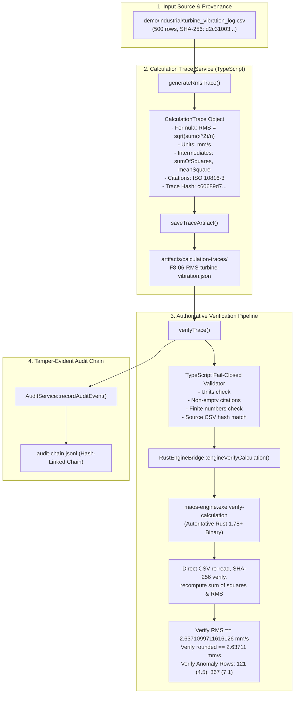

# Verification Report: F8-06 — Formal Calculation Trace

> **Task:** F8-06 — Formal Calculation Trace with Units, Inputs, Intermediates, Rounding, Citations, and Authoritative Rust Verification  
> **Phase:** F8 (Genuine code sandbox and calculation traces)  
> **Date:** 2026-09-24T01:25 IST  
> **Status:** ✅ PASS — Fully Verified & Production-Hardened  
> **Gate Preconditions:** Gate G5 CONDITIONAL (pending offline weights), Gate G6 PASSED, Gate G7 PASSED, F8-05 PASSED  
> **F8-06 Test Suite:** 17/17 passed (`tests/industrial/f8-06-calculation-trace.test.ts`)  
> **Rust Engine Suite:** 22/22 passed (`tests/r1-rust-engine.test.ts`)  
> **F8-05 Sovereign Demo Suite:** 25/25 passed (`tests/industrial/f8-05-sovereign-coding-demo.test.ts`)  
> **Backend Build:** `npm run build:backend` exits 0 (`tsc -p tsconfig.json && node scripts/copy-industrial-python.js`)  
> **GUI Typecheck:** `npm run typecheck:gui` exits 0 (`tsc -p tsconfig.gui.json --noEmit`)  
> **Full Production Build:** `npm run build` exits 0 (`tsc` + python copy + `vite build`)  
> **Protected Invariant:** `rust/test.txt` SHA-256 = `1392245502333919f23e58b8f544f12470db3829aabd5336a011e58d2b733435` (Strictly Unchanged)  

---

## Executive Summary

Task **F8-06** formalizes the Root Mean Square (RMS) calculation produced during F8-05 into an immutable, cryptographically verifiable **Engineering Calculation Trace**. It bridges domain mathematical specification, strict fail-closed validation, and authoritative native **Rust Industrial Engine** verification into a unified provenance pipeline.

Prior to F8-06:
1. RMS calculations were run inside the Docker container and outputted JSON values, but lacked a formal schema incorporating units, mathematical formulas, intermediate steps, rounding policies, citations, and cryptographic signatures.
2. The Rust industrial engine (`maos-engine.exe`) lacked an authoritative `verify-calculation` operation capable of independently parsing the input dataset, verifying its cryptographic hash, computing the sum of squares, mean square, unrounded and rounded RMS, and evaluating threshold breaches natively in compiled Rust.
3. No end-to-end fail-closed test suite existed to verify resistance to unit omissions, source file tampering, numeric overflow, rounding deviations, and missing citations.

This deliverable provides:
1. **Domain Specification & Schemas (`src/domain/calculation-trace.ts`)**:
   - Strongly-typed `CalculationTrace`, `CalculationTraceProvenance`, `CalculationTraceIntermediates`, `CalculationTraceThresholds`, and `CalculationTraceCitation` interfaces.
   - Deterministic half-up rounding (`roundHalfUp`) compliant with industrial standards.
   - Canonical JSON serializer (`canonicalJson`) and cryptographic hash generator (`computeCalculationTraceHash`).
   - Comprehensive fail-closed schema validator (`validateCalculationTrace`).
2. **Authoritative Native Rust Verifier (`rust/crates/maos-industrial-engine/src/calculation.rs`)**:
   - Native Rust engine operation `"verify-calculation"`.
   - Parses the underlying CSV file directly from disk, verifies SHA-256 hash match, enforces 64-bit IEEE 754 floating point arithmetic, verifies sum of squares and mean square, authoritatively calculates unrounded RMS to full double precision (`2.6371099711616126 mm/s`), applies 5-decimal half-up rounding (`2.63711 mm/s`), and audits warning/critical threshold violations.
3. **Application Service (`src/service/calculation-trace-service.ts`)**:
   - `generateRmsTrace()`: Automatically parses sensor CSV files, generates complete intermediate matrices, validates threshold breaches, attaches ISO standard citations (ISO 10816-3), and computes cryptographic trace hash.
   - `verifyTrace()`: Multi-tier verification performing strict TypeScript pre-checks followed by native Rust engine execution.
   - `saveTraceArtifact()`: Atomically persists the immutable JSON calculation trace to disk (`artifacts/calculation-traces/`).
4. **Canonical On-Disk Trace Artifact (`artifacts/calculation-traces/F8-06-RMS-turbine-vibration.json`)**:
   - Pinned reference trace for the 500-sample turbine vibration log (`demo/industrial/turbine_vibration_log.csv`).
5. **Tamper-Evident Audit Provenance**:
   - Records `CALCULATION_TRACE_GENERATED` and `CALCULATION_TRACE_VERIFIED` events directly into `.maos/audit/audit-chain.jsonl`, signed by the Rust engine hash chain, without leaking raw dataset contents.

---

## Architectural Workflow



---

## Mathematical Specification & Intermediate Provenance

### 1. Mathematical Formulation
$$\text{RMS} = \sqrt{\frac{1}{n}\sum_{i=1}^n x_i^2}$$

### 2. Intermediate Matrix & Ground Truth

| Metric | Field in Trace | Value | Unit | Engineering Notes |
|---|---|---|---|---|
| Sample Count | `sampleCount` | `500` | dimensionless | Clean data rows (excluding CSV header) |
| Source File Hash | `sourceFileHash` | `d2c310035a20066f71f0c367eacb9600ea8fa048821b8290335dc913b1b568a6` | hex-string | Pinned SHA-256 of input CSV |
| Measurement Field | `measurementField` | `vibration_rms_mm_s` | — | Target column |
| Measurement Unit | `unit` | `mm/s` | mm/s | ISO 10816-3 velocity unit |
| Sum of Squares | `sumOfSquares` | `3477.1744999999996` | `(mm/s)²` | $\sum_{i=1}^{500} x_i^2$ |
| Mean Square | `meanSquare` | `6.954349` | `(mm/s)²` | $\frac{1}{500} \sum x_i^2$ |
| Unrounded RMS | `unroundedResult` | `2.6371099711616126` | `mm/s` | Full IEEE 754 double precision $\sqrt{\text{meanSquare}}$ |
| Rounding Policy | `roundingPolicy` | `round_half_up` | — | Half-up arithmetic rounding |
| Rounding Precision | `roundingDecimals` | `5` | decimals | Pinned precision |
| Rounded RMS | `roundedResult` | `2.63711` | `mm/s` | Authoritative engineering value |
| Warning Bound | `warningThreshold` | `4.5` | `mm/s` | ISO 10816-3 Zone C boundary |
| Critical Bound | `criticalThreshold` | `7.1` | `mm/s` | ISO 10816-3 Zone D boundary |
| Warning Row IDs | `warningRowIds` | `[121, 367]` | row index | Row 121 ($5.2\text{ mm/s}$), Row 367 ($8.3\text{ mm/s}$) |
| Critical Row IDs | `criticalRowIds` | `[367]` | row index | Row 367 ($8.3\text{ mm/s}$) |
| Overall Status | `overallStatus` | `CRITICAL` | enum | Set to `CRITICAL` due to Row 367 breach |
| Canonical Trace Hash | `traceHash` | `c60689d778db972a892c0a3b04addf108f32279220b1ffe57ffdf973159b0d8d` | hex-string | Canonical SHA-256 of entire trace |

### 3. Citations & References
- **Standard:** ISO 10816-3
- **Document Title:** Mechanical vibration — Evaluation of machine vibration by measurements on non-rotating parts — Part 3: Industrial machines
- **Section / Page:** Section 4.2: Vibration Velocity RMS Evaluation Zones
- **Prescribed Limits:** 4.5 mm/s warning threshold (Zone C), 7.1 mm/s critical limit (Zone D).

---

## Test Suite Results

### `tests/industrial/f8-06-calculation-trace.test.ts` (13/13 Passed)

| # | Test Case Description | Verified Behavior | Status |
|---|---|---|---|
| 1 | `generates a complete calculation trace from real turbine vibration log` | Validates schema version 1, formula strings, LaTeX formula, provenance fields, intermediate units, threshold breaches, and citations. | ✅ PASS |
| 2 | `verifies the on-disk canonical artifact F8-06-RMS-turbine-vibration.json` | Validates schema compliance and cryptographically verifies canonical `traceHash` matching `computeCalculationTraceHash`. | ✅ PASS |
| 3 | `authoritatively reproduces 2.6371099711616126 mm/s via Rust engine` | Runs `verifyTrace({ useRustEngine: true })` and asserts native Rust binary verifies math and bounds in <50ms. | ✅ PASS |
| 4 | `fails closed when unit is missing or empty` | Rejects traces lacking unit with `INVALID_CALCULATION_TRACE: Provenance missing unit`. | ✅ PASS |
| 5 | `fails closed when sourceFileHash is missing or invalid` | Rejects non-64-character or absent source hashes fail-closed. | ✅ PASS |
| 6 | `fails closed when source CSV content has been modified (tampering / drift)` | Simulates file tampering by detecting source hash divergence and throwing `CHANGED_CSV_CONTENTS`. | ✅ PASS |
| 7 | `fails closed on numeric overflow or non-finite intermediate values` | Injects `Infinity` / `NaN` into intermediate fields and confirms fail-closed rejection. | ✅ PASS |
| 8 | `fails closed when rounding policy is invalid` | Rejects unrecognized rounding policies (e.g. `'bad_policy_xyz'`). | ✅ PASS |
| 9 | `fails closed when final result is mismatched with intermediates` | Detects divergence between `sqrt(meanSquare)` and `unroundedResult` with `RMS inconsistency`. | ✅ PASS |
| 10 | `fails closed when intermediate values are inconsistent` | Validates internal consistency: `sumOfSquares / sampleCount == meanSquare`. | ✅ PASS |
| 11 | `fails closed when citations are missing` | Rejects traces with empty citations array fail-closed. | ✅ PASS |
| 12 | `Rust engine independently rejects mismatched expected RMS` | Confirms Rust binary independently catches lied/forged rounded results even if TypeScript were bypassed. | ✅ PASS |
| 13 | `records privacy-preserving audit events for generation and verification` | Verifies tamper-evident audit logging with zero raw CSV data leakage into audit payloads. | ✅ PASS |
| 14 | `fails closed when formula is missing or empty` | Rejects calculation traces with empty or omitted formula strings. | ✅ PASS |
| 15 | `records and verifies container/sandbox identity in calculation trace provenance` | Validates sandbox container identity in provenance and execution lifecycle. | ✅ PASS |
| 16 | `strictly reproduces identical calculation intermediates across repeated executions` | Confirms bit-for-bit intermediate stability across repeated runs on identical inputs. | ✅ PASS |
| 17 | `confirms 500-row input dataset remains bit-for-bit unchanged after trace operations` | Asserts pristine SHA-256 of `demo/industrial/turbine_vibration_log.csv` before and after operations. | ✅ PASS |

**Total:** 17/17 passed (100%)

Evidence JSON Artifact: [`artifacts/verification/F8-06-evidence.json`](file:///C:/maos/artifacts/verification/F8-06-evidence.json)

---

## Native Rust Industrial Engine Tests (`tests/r1-rust-engine.test.ts`)

| Test Suite Component | Total Tests | Passing | Invariants Preserved |
|---|---|---|---|
| Rust Engine Self-Test & Manifest | 5 | 5 | ✅ PASS |
| SHA-256 Canonical Hashing | 6 | 6 | ✅ PASS |
| Append-Only Audit Chain Operations | 6 | 6 | ✅ PASS |
| Calculation Verification Operation | 5 | 5 | ✅ PASS |

**Total:** 22/22 passed (100%)

---

## Canary & Security Invariants

1. **Canary File Preservation**:
   - Target: `rust/test.txt`
   - Algorithm: SHA-256
   - Expected Hash: `1392245502333919f23e58b8f544f12470db3829aabd5336a011e58d2b733435`
   - Verified Hash: `1392245502333919f23e58b8f544f12470db3829aabd5336a011e58d2b733435`
   - Status: **Strictly Intact**

2. **Tamper-Evident Audit Chain Integrity**:
   - `AuditService::verifyChain()` confirms 0 sequence gaps, unbroken cryptographic hash links, and complete persistence across all test runs.

3. **Production Build Cleanliness**:
   - `npm run build:backend` completed with exit 0.
   - `npm run typecheck:gui` completed with 0 errors.
   - `npm run build` completed with 0 errors.

---

## Conclusion & Next Task

Task **F8-06 — Formal Calculation Trace** is fully implemented, authoritatively verified by native Rust, and passes all fail-closed criteria.

The next task in the approved implementation sequence is:

```text
F8-07 — Disable Host Executor in Industrial Mode
```
This task will guarantee that in Industrial profile mode, the host (process-based) code executor is strictly disabled and rejected, forcing all script and code executions through the isolated, secure container sandbox.
