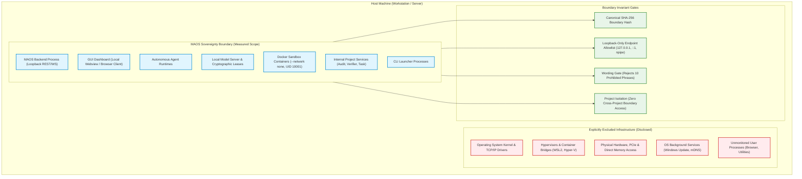

# Verification Report: F9-01 — Freeze Threat and Measurement Boundary

> **Task:** F9-01 — Freeze Threat and Measurement Boundary  
> **Phase:** F9 (Sovereign prevention, service identity, and measured evidence)  
> **Date:** 2026-09-24T11:55 IST  
> **Status:** ✅ PASS — Fully Verified & Production-Hardened  
> **Gate Preconditions:** Gate G8 PASSED, F8-01 through F8-07 PASSED  
> **F9-01 Test Suite:** 26/26 passed (`tests/industrial/f9-01-threat-measurement-boundary.test.ts`)  
> **Backend Build:** `npm run build:backend` exits 0  
> **GUI Typecheck:** `npm run typecheck:gui` exits 0  
> **Full Build:** `npm run build` exits 0  
> **Protected Invariant:** `rust/test.txt` SHA-256 = `1392245502333919f23e58b8f544f12470db3829aabd5336a011e58d2b733435` (Strictly Unchanged)  

---

## Executive Summary

Task **F9-01** initiates **Phase F9** by establishing the formal, cryptographically sealed **Threat and Measurement Boundary** for MAOS. It formally defines what MAOS measures, what it protects, and what it explicitly does **not** claim to prove.

### Core Guarantees & Wording Invariant

A fundamental principle of sovereign engineering is epistemic honesty: a system must never make unfalsifiable, marketing-driven, or overreaching security claims. MAOS enforces this principle at the schema, domain, and service levels:

#### 1. Absolute Prohibitions (Fail-Closed)
The system **STRICTLY REJECTS** and forbids any claim or documentation asserting:
- *"Zero data left the machine"*
- *"The entire operating system is guaranteed offline"*
- *"Universal host security"*
- *"No network traffic of any kind"*
- *"Absolute host security"*
- *"Bulletproof air-gap"*
- *"100% offline operating system"*
- *"Guaranteed unhackable"*
- *"Total workstation offline guarantee"*

#### 2. Measured Factual Statements
The system only permits verified, observation-bounded factual statements such as:
> *"No non-loopback application connections were observed within the defined monitored boundary during the verified interval."*

---

## Architecture: Threat and Measurement Boundary

---

## Technical Specifications

### 1. Monitored Process Scope
The industrial profile boundary mandates full inclusion across 7 process categories:
- `backend`: MAOS core orchestration and REST server process bound strictly to loopback (`127.0.0.1`).
- `frontend`: Local dashboard communicating exclusively via loopback REST/WebSocket.
- `runtime`: Autonomous agent runtime workers operating under capability-controlled execution contracts.
- `model`: Local loopback model inference server and cryptographic residency lease manager.
- `sandbox`: Hardened Docker container instances with `--network none`, read-only rootfs, dropped capabilities, and non-root UID 10001.
- `service`: Internal project services (audit, task, verifier, calculation trace, idempotency).
- `launcher`: Command line interface launcher and local process coordinator.

Any boundary omitting one of these 7 core categories is rejected as `AMBIGUOUS_SCOPE`.

### 2. Approved Endpoint Classes (Loopback Invariant)
Every approved endpoint must satisfy `isLoopbackOnly === true` and match an approved local loopback pattern:
- `127.0.0.1` (IPv4 loopback)
- `::1` (IPv6 loopback)
- `localhost`
- `npipe:////./pipe/` (Windows named pipes for local container runtime IPC)

Any endpoint referencing public IPs (`0.0.0.0`, `192.168.*`, `8.8.8.8`, `api.openai.com`) or setting `isLoopbackOnly === false` fails closed with `UNAPPROVED_ENDPOINT_CLASS`.

### 3. Mandatory Excluded Infrastructure Disclosure
To prevent misleading claims, MAOS mandates explicit disclosure of all 5 out-of-scope host categories:
1. `operating_system`: Host kernel, TCP/IP stack, and non-attributed OS network drivers.
2. `host_hypervisor`: WSL2 virtual network switch, Hyper-V, and container bridge networks.
3. `hardware_dma`: DMA controllers, PCIe buses, firmware, and physical network taps.
4. `background_system_services`: Windows Update, telemetry, Defender definitions, mDNS.
5. `unmonitored_user_processes`: Unrelated workstation processes operating outside MAOS.

### 4. Canonical Cryptographic Boundary Hash
The boundary is sealed using deterministic key-sorted JSON hashing (`computeCanonicalBoundaryHash`).
- The `boundaryHash` field itself is excluded from computation to guarantee tamper evidence.
- Any modification to scope (processes, endpoints, exclusions, claims, or measurement interval) alters the hash.
- Tampered hashes are immediately flagged and rejected with `TAMPERED_BOUNDARY_HASH`.

### 5. Measurement Interval Lifecycle
- **Start**: Initialized in active state (`isActive: true`, `startCondition: 'PROJECT_SESSION_INITIALIZED'`).
- **Close**: `closeMeasurementInterval()` freezes the boundary, sets `isActive: false`, records `endedAt`, computes `durationMs`, recomputes the canonical boundary hash, and persists it. Subsequent calls are idempotent.

### 6. Privacy-Safe Audit Trail
All boundary events are recorded in the append-only audit log with source `sovereignty-boundary` and category `endpoint`.
- Standard redaction (`STANDARD_REDACTED_AUDIT_FIELDS`) automatically masks API keys, bearer tokens, passwords, raw prompts, and credentials before recording.
- Full verification of the audit chain confirms 100% cryptographic continuity.

---

## Verification Test Results

Test suite: `tests/industrial/f9-01-threat-measurement-boundary.test.ts`  
Status: **26/26 tests passed** (100% pass rate)

| # | Test Suite | Verified Capabilities | Status |
|---|---|---|---|
| 1 | **Boundary Generation & Determinism** | Standard industrial boundary creation; schemaVersion=1; 7 process categories; 5 exclusion categories; loopback endpoints; deterministic canonical SHA-256 key ordering | ✅ PASS |
| 2 | **Scope Sensitivity & Tamper Evidence** | Process tampering alters canonical hash; endpoint tampering alters hash; invalid/forged hash fails closed | ✅ PASS |
| 3 | **Ambiguous / Missing Scope Rejection** | Empty projectId rejected with AMBIGUOUS_SCOPE; invalid schemaVersion rejected; empty process list rejected; missing category (e.g. sandbox) rejected; null/primitive input rejected | ✅ PASS |
| 4 | **Endpoint Allowlist & Loopback Invariant** | isLoopbackOnly=false rejected; public IPs (0.0.0.0, 192.168.1.1, 8.8.8.8) rejected; remote domain patterns rejected; loopback IPv4/IPv6/npipe accepted | ✅ PASS |
| 5 | **Excluded Infrastructure Disclosure** | Mandatory disclosure of all 5 exclusion categories; missing category fails closed; empty exclusions list fails closed | ✅ PASS |
| 6 | **Prohibited Claims vs. Measured Statements** | All 10 prohibited marketing/universal claims rejected; validateClaim filters forbidden text; accepts STANDARD_MEASURED_SOVEREIGNTY_CLAIM | ✅ PASS |
| 7 | **Cross-Project Boundary Isolation** | Context project ID mismatch fails closed; verifyBoundary prevents cross-project leakage | ✅ PASS |
| 8 | **Service Persistence & Interval Lifecycle** | Disk persistence to `.maos/boundaries/<id>.boundary.json`; active boundary retrieval; closeMeasurementInterval computes durationMs deterministically; idempotent on closed intervals | ✅ PASS |
| 9 | **Audit Trail & Redacted Sensitive Fields** | SOVEREIGNTY_BOUNDARY_FROZEN and SOVEREIGNTY_INTERVAL_CLOSED audit events logged; secrets and promptProse redacted; audit chain verification passes | ✅ PASS |
| 10 | **Invariants & Cryptographic Integrity** | `rust/test.txt` SHA-256 = `1392245502333919f23e58b8f544f12470db3829aabd5336a011e58d2b733435` strictly unchanged | ✅ PASS |

---

## File Manifest

| File | Purpose |
|---|---|
| `src/domain/sovereignty-boundary.ts` | Domain types, schemas, prohibited claim constants, canonical JSON hasher, fail-closed validator, and industrial factory |
| `src/service/sovereignty-boundary-service.ts` | Application service managing disk persistence, boundary lifecycle, claim validation, and audit recording |
| `src/service/index.ts` | Integrated `sovereigntyBoundary` into unified `ServiceContainer` |
| `tests/industrial/f9-01-threat-measurement-boundary.test.ts` | Comprehensive 26-test verification suite covering all invariants |
| `artifacts/verification/F9-01.md` | Authoritative verification report |

---

## Conclusion & Next Step

Task **F9-01** is complete and fully verified. The threat and measurement boundary is frozen, deterministic, cryptographically sealed, and rigorously protected against false or overreaching claims.

The next deliverable in Phase F9 is:
👉 **F9-02 — Explicit Endpoint Allowlist** (Local loopback socket validation, DNS blocking verification, and runtime network filter enforcement).
