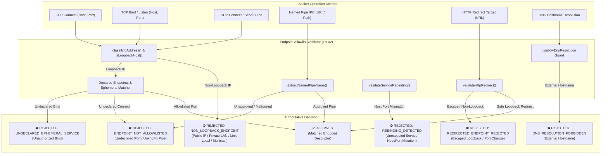

# Verification Report: F9-02 — Explicit Endpoint Allowlist

> **Task:** F9-02 — Explicit Endpoint Allowlist  
> **Phase:** F9 (Sovereign prevention, service identity, and measured evidence)  
> **Date:** 2026-09-24T12:28 IST  
> **Status:** ✅ PASS — Fully Verified & Production-Hardened  
> **Gate Preconditions:** Gate G8 PASSED, F9-01 PASSED  
> **F9-02 Test Suite:** 38/38 passed (`tests/industrial/f9-02-endpoint-allowlist.test.ts`)  
> **Backend Build:** `npm run build:backend` exits 0  
> **GUI Typecheck:** `npm run typecheck:gui` exits 0  
> **Full Build:** `npm run build` exits 0  
> **Protected Invariant:** `rust/test.txt` SHA-256 = `1392245502333919f23e58b8f544f12470db3829aabd5336a011e58d2b733435` (Strictly Unchanged)  

---

## Executive Summary

Task **F9-02** implements the authoritative socket-level endpoint policy for MAOS. This policy defines the precise set of allowed communications across TCP, UDP, and IPC (named pipes) and serves as the authoritative source of truth that downstream firewall enforcement (**F9-03**), process-attributed network monitoring (**F9-04**), and service identity validation (**F9-05**) consume.

### Core Guarantees

1. **Strict Loopback Invariant**:
   - Only explicitly approved local loopback sockets (`127.0.0.1`, `::1`, `localhost`) and approved Windows named pipes (`npipe:////./pipe/docker_engine`, `maos_ipc_*`) are permitted.
2. **Deterministic Fail-Closed Rejections**:
   The validator rejects unauthorized requests with standardized typed error codes:
   - `NON_LOOPBACK_ENDPOINT`: Public IPs (`8.8.8.8`, `1.1.1.1`), Private LANs (`10.0.0.0/8`, `192.168.0.0/16`, `172.16.0.0/12`), Carrier NAT (`100.64.0.0/10`), Link-Local (`169.254.169.254`, `fe80::1`), Multicast (`224.0.0.1`), and Wildcard Binds (`0.0.0.0`, `::`).
   - `DNS_RESOLUTION_FORBIDDEN`: External hostname resolution attempts (`api.openai.com`, `google.com`) fail closed prior to network dispatch.
   - `ENDPOINT_NOT_ALLOWLISTED`: Connect attempts to undeclared loopback ports outside approved ranges.
   - `REDIRECTED_ENDPOINT_REJECTED`: HTTP redirects attempting to escape loopback or jump to unapproved ports.
   - `REBINDING_DETECTED`: Services attempting dynamic port/host rebindings or port hijacking without declaration.
   - `UNDECLARED_EPHEMERAL_SERVICE`: Bind attempts on undeclared ephemeral ports.
3. **Model Dispatch Integration**:
   - `ChatInferenceService` validates target model endpoints against the active allowlist policy before issuing HTTP requests, preventing unintended outbound leaks.
4. **Canonical Policy Sealing & Tamper Evidence**:
   - Every allowlist policy is cryptographically sealed using deterministic key-sorted SHA-256 canonical hashing. Tampered policy files fail closed.

---

## Architecture: Endpoint Policy Enforcement Matrix

---

## Technical Specifications

### 1. IP Classification Engine
The domain classifier (`classifyIpAddress`) inspects IPv4 and IPv6 addresses against strict CIDR boundaries:
- **Loopback**: `127.0.0.0/8`, `::1`, `0:0:0:0:0:0:0:1`, `::ffff:127.*`.
- **Private LAN**: `10.0.0.0/8`, `172.16.0.0/12`, `192.168.0.0/16`, `fc00::/7` (IPv6 ULA).
- **Carrier-Grade NAT**: `100.64.0.0/10` (RFC 6598).
- **Link-Local**: `169.254.0.0/16`, `fe80::/10`.
- **Multicast**: `224.0.0.0/4`, `ff00::/8`.
- **Unspecified / Wildcard**: `0.0.0.0`, `::`, `255.255.255.255`.
- **Public**: Any routable global address outside the above ranges.

### 2. Standard Approved Declared Endpoints
The standard industrial policy automatically declares:
1. `ep_backend_rest`: TCP bind on `127.0.0.1:3847` (MAOS REST/WS server).
2. `ep_backend_rest_client`: TCP connect to `127.0.0.1:3847` (GUI dashboard & CLI).
3. `ep_model_server`: TCP connect to `127.0.0.1:8000` (Local OpenAI-compatible inference server).
4. `ep_ollama_server`: TCP connect to `127.0.0.1:11434` (Ollama fallback).
5. `ep_backend_ipv6`: TCP bind on `::1:3847`.
6. `ep_docker_pipe`: Named pipe connect to `npipe:////./pipe/docker_engine`.

### 3. Named Pipe Validation
Approved pipes include:
- `docker_engine`
- `dockerDesktopPluginEngine`
- `maos_ipc_default`
- `maos-engine-pipe`

Extracts and normalizes pipe names from both URL format (`npipe:////./pipe/name`) and Windows UNC format (`\\.\pipe\name`). Foreign or traversal paths are rejected.

### 4. HTTP Redirect Defense
Detects open redirects or server redirect responses attempting to:
- Move communication from loopback to external LAN or internet hosts.
- Shift to unauthorized loopback ports.
- Switch protocols to unapproved schemes.

### 5. Service Rebinding Defense
Prevents DNS rebinding and dynamic port-swapping attacks by maintaining an immutable runtime registry of declared service endpoints (`serviceId -> host, port, pid`). Any attempt by a registered service to bind or advertise a different host/port triggers `REBINDING_DETECTED`.

---

## Verification Test Results

Test suite: `tests/industrial/f9-02-endpoint-allowlist.test.ts`  
Status: **38/38 tests passed** (100% pass rate)

| # | Test Suite | Verified Capabilities | Status |
|---|---|---|---|
| 1 | **Loopback IPv4 & IPv6 Acceptance** | `127.0.0.1:3847` bind; `127.0.0.1:8000` connect; `127.0.0.1:11434` connect; `::1:3847` bind; `localhost` connect; ephemeral client connect (49152-65535) | ✅ PASS |
| 2 | **Approved Named Pipes Acceptance** | `npipe:////./pipe/docker_engine` URL & UNC; internal IPC pipe; rejects unauthorized pipe with ENDPOINT_NOT_ALLOWLISTED; rejects malformed pipe paths | ✅ PASS |
| 3 | **Public IP Address Rejection** | Rejects 8.8.8.8, 1.1.1.1, 93.184.216.34 with NON_LOOPBACK_ENDPOINT (public); rejects public IPv6 (2606:4700:4700::1111) | ✅ PASS |
| 4 | **Private LAN Address Rejection** | Rejects 10.0.0.1, 192.168.1.1, 172.16.0.1 with NON_LOOPBACK_ENDPOINT (private_lan); rejects carrier NAT (100.64.1.1) | ✅ PASS |
| 5 | **Link-Local & Multicast Rejection** | Rejects cloud metadata 169.254.169.254 (link_local); rejects fe80::1; rejects 224.0.0.1 and ff02::1 (multicast); rejects 0.0.0.0 and :: (unspecified) | ✅ PASS |
| 6 | **DNS Resolution Denial** | Rejects api.openai.com, google.com, etc. with DNS_RESOLUTION_FORBIDDEN; rejects DNS resolving to non-loopback IPs; permits localhost resolving to 127.0.0.1 | ✅ PASS |
| 7 | **Undeclared Ports & Binds** | Rejects connect to undeclared loopback port (4444) with ENDPOINT_NOT_ALLOWLISTED; rejects undeclared bind (9999) with UNDECLARED_EPHEMERAL_SERVICE | ✅ PASS |
| 8 | **HTTP Redirect Validation** | Accepts safe loopback redirect; rejects redirect jumping to LAN IP (192.168.1.50) with REDIRECTED_ENDPOINT_REJECTED; rejects redirect to public host; rejects unallowlisted port redirect | ✅ PASS |
| 9 | **Service Rebinding Defense** | Registers valid service endpoint; detects and rejects sudden service rebinding to a different port or host with REBINDING_DETECTED | ✅ PASS |
| 10 | **ChatInference Integration** | Allows loopback model server (http://127.0.0.1:8000); blocks external cloud endpoint (https://api.openai.com/v1) and LAN endpoint before issuing any network call | ✅ PASS |
| 11 | **Canonical Hashing & Tamper Evidence** | Key order invariance in canonical hash; hash changes on endpoint modification; tampered hash fails closed with Policy hash mismatch | ✅ PASS |
| 12 | **Cross-Project Isolation** | Rejects policy when context project ID does not match expected project ID | ✅ PASS |
| 13 | **Privacy-Safe Audit Trail** | Records frozen and rejected events with category endpoint/warning; masks credentials; audit chain verification passes | ✅ PASS |
| 14 | **Invariants & Cryptographic Integrity** | `rust/test.txt` SHA-256 = `1392245502333919f23e58b8f544f12470db3829aabd5336a011e58d2b733435` strictly unchanged | ✅ PASS |

---

## File Manifest

| File | Purpose |
|---|---|
| `src/domain/endpoint-allowlist.ts` | Domain types, IP classifier, pipe normalizer, canonical policy hasher, socket validator, redirect/rebind checkers |
| `src/service/endpoint-allowlist-service.ts` | Application service managing policy persistence, service registry, socket validation, DNS validation, and audit logging |
| `src/service/chat-inference-service.ts` | Integrated endpoint allowlist validation into chat completion pipeline |
| `src/service/index.ts` | Wired `endpointAllowlist` into `ServiceContainer` and re-exported service |
| `tests/industrial/f9-02-endpoint-allowlist.test.ts` | Comprehensive 38-test verification suite covering all requirements |
| `artifacts/verification/F9-02.md` | Authoritative verification report |

---

## Conclusion & Next Step

Task **F9-02** is complete and fully verified. The explicit endpoint allowlist is established as the authoritative policy defining allowed loopback communication for MAOS.

The next deliverable in Phase F9 is:
👉 **F9-03 — Network Boundary Enforcement / Firewall Status & Apply** (Host firewall integration, rule synthesis from allowlist policy, status queries, fail-safe rule rollback, and clean state restoration).
