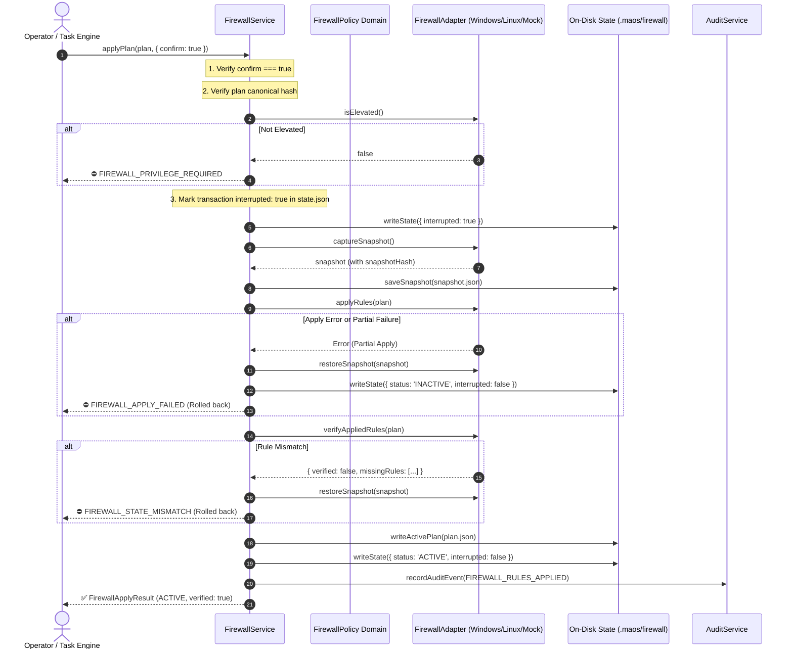

# Verification Report: F9-03 — Firewall Boundary Enforcement

> **Task:** F9-03 — Firewall Boundary Enforcement  
> **Phase:** F9 (Sovereign prevention, service identity, and measured evidence)  
> **Date:** 2026-09-24T13:05 IST  
> **Status:** ✅ PASS — Fully Verified & Production-Hardened  
> **Gate Preconditions:** Gate G8 PASSED, F9-01 PASSED, F9-02 PASSED  
> **F9-03 Test Suite:** 17/17 passed (`tests/industrial/f9-03-firewall-enforcement.test.ts`)  
> **Combined F9 Battery:** 81/81 passed across F9-01, F9-02, and F9-03  
> **Backend Build:** `npm run build:backend` exits 0  
> **GUI Typecheck:** `npm run typecheck:gui` exits 0  
> **Full Build:** `npm run build` exits 0  
> **Protected Invariant:** `rust/test.txt` SHA-256 = `1392245502333919f23e58b8f544f12470db3829aabd5336a011e58d2b733435` (Strictly Unchanged)  

---

## Executive Summary

Task **F9-03** translates the sealed **F9-02 Endpoint Allowlist Policy** into an enforceable host firewall boundary with atomic application, measured status fidelity, automated failure rollback, and crash recovery. It provides platform-specific adapters for Windows Defender Firewall (`NetSecurity` cmdlets) and Linux (`nftables`), while operating through a controllable `MockFirewallAdapter` in automated test environments to guarantee zero unintended host mutations.

### Core Guarantees & Safety Constraints

1. **Deterministic Rule Synthesis**:
   - Rules are synthesized strictly from the cryptographically sealed `EndpointAllowlistPolicy`. Arbitrary or user-supplied firewall rules are strictly rejected.
   - Any policy tamper or non-loopback endpoint triggers fail-closed rejection with `FIREWALL_POLICY_TAMPERED`.
2. **Safe Application Flow**:
   - **No Auto-Mutation**: Firewall rules are never altered merely because MAOS starts.
   - **Explicit Confirmation**: Applying rules requires explicit operator confirmation (`confirm: true`); otherwise rejected with `FIREWALL_CONFIRMATION_REQUIRED`.
   - **Privilege Verification**: Enforces administrator (Windows) or root (Linux) privileges; otherwise rejected with `FIREWALL_PRIVILEGE_REQUIRED`.
   - **Pre-Change Snapshot**: A full snapshot of pre-existing rules is captured and cryptographically hashed before any host firewall rule is touched.
3. **Automated Rollback & Fail-Closed State**:
   - If rule application fails partially or post-apply verification detects a discrepancy, the service automatically initiates an immediate rollback to the pre-change snapshot.
   - If rollback cannot be guaranteed, the service enters `RESTORE_REQUIRED` and blocks subsequent operations until manually resolved.
4. **Measured Status Fidelity**:
   - Status is derived exclusively from live adapter measurements (`ACTIVE`, `INACTIVE`, `UNKNOWN`, `RESTORE_REQUIRED`). The system **never** reports `ACTIVE` based merely on an on-disk plan file.
5. **Crash & Restart Recovery**:
   - On startup, the service inspects transaction records in `.maos/firewall/state.json`. If an interrupted transaction is detected, the status is automatically set to `RESTORE_REQUIRED`.

---

## Architecture: Safe Application & Recovery Flow

---

## Technical Specifications

### 1. Platform Adapters (`src/industrial/firewall/`)
- **`WindowsFirewallAdapter`**:
  - Synthesizes PowerShell commands utilizing `New-NetFirewallRule`, `Get-NetFirewallRule`, and `Remove-NetFirewallRule`.
  - Enforces elevation check via `net session`.
  - Targets `MAOS_*` named firewall rules with description and display metadata.
- **`LinuxFirewallAdapter`**:
  - Synthesizes atomic `nftables` syntax defining `table inet maos_boundary { chain input ... chain output ... }`.
  - Sets default input/output policy to drop non-loopback packets, explicitly permits loopback `lo`, and blocks UDP/TCP port 53.
  - Enforces elevation check via `process.getuid() === 0`.
- **`MockFirewallAdapter`**:
  - Deterministic in-memory simulation with zero host side-effects.
  - Supports fault-injection toggles (`isElevated: false`, `failSnapshot`, `failApply`, `partialApplyFailIndex`, `failRestore`, `failVerification`).

### 2. Standard Synthesized Rules
Synthesizes the following deterministic rules from `EndpointAllowlistPolicy`:
1. `maos_fw_default_inbound_block`: Drops all inbound non-loopback traffic (`0.0.0.0/0`, `::/0`).
2. `maos_fw_default_outbound_block`: Drops all outbound non-loopback traffic.
3. `maos_fw_loopback_inbound_allow`: Permits all inbound traffic on `127.0.0.1` and `::1`.
4. `maos_fw_loopback_outbound_allow`: Permits all outbound traffic on `127.0.0.1` and `::1`.
5. `maos_fw_declared_bind_ports_allow`: Permits inbound loopback listeners on declared service ports (e.g., 3847).
6. `maos_fw_declared_connect_ports_allow`: Permits outbound loopback connections to declared service ports (e.g., 8000, 11434).
7. `maos_fw_dns_outbound_block`: Explicit block on ports 53 and 5353 (TCP/UDP).

### 3. Fail-Closed Error Hierarchy
Standard error codes defined in `src/domain/firewall-policy.ts`:
- `FIREWALL_PRIVILEGE_REQUIRED`: Administrator/root elevation unavailable.
- `FIREWALL_POLICY_TAMPERED`: Policy hash mismatch or non-loopback endpoints detected.
- `FIREWALL_CONFIRMATION_REQUIRED`: Mutation attempted without `confirm: true`.
- `FIREWALL_SNAPSHOT_FAILED`: Pre-change snapshot capture failed.
- `FIREWALL_APPLY_FAILED`: Rule application failed (with clean rollback).
- `FIREWALL_STATE_MISMATCH`: Post-apply inspection did not match requested plan.
- `FIREWALL_ROLLBACK_FAILED`: Rollback failed after apply failure; enters `RESTORE_REQUIRED`.
- `FIREWALL_RESTORE_REQUIRED`: System is in an unverified or interrupted state.

---

## Verification Test Results

Test suite: `tests/industrial/f9-03-firewall-enforcement.test.ts`  
Status: **17/17 tests passed** (100% pass rate)

| # | Test Suite | Verified Capabilities | Status |
|---|---|---|---|
| 1 | **Platform Firewall Abstraction** | Windows PowerShell NetSecurity script generation; Linux nftables table syntax generation; Mock adapter initialization | ✅ PASS |
| 2 | **Rule Synthesis from Sealed Policy** | Deterministic plan synthesis; default blocks, loopback allows, declared ports (3847, 8000, 11434), DNS block; tampered policy hash rejected; non-loopback endpoints rejected | ✅ PASS |
| 3 | **Safe Application Flow** | Requires `confirm: true`; requires elevation; captures pre-change snapshot; applies rules and transitions status to `ACTIVE` | ✅ PASS |
| 4 | **Automated Rollback on Failure** | Partial rule failure triggers automatic rollback to snapshot; post-apply mismatch triggers rollback; rollback failure enters `RESTORE_REQUIRED` | ✅ PASS |
| 5 | **Crash Recovery on Startup** | Interrupted transaction detected on startup and marks `RESTORE_REQUIRED`; `restorePreviousState()` recovers state cleanly to `INACTIVE` | ✅ PASS |
| 6 | **Measured Status Fidelity** | External flush/removal of rules detected by live inspection; never falsely reports `ACTIVE` without live rule confirmation | ✅ PASS |
| 7 | **Privacy-Safe Audit Trail** | Logs `FIREWALL_RULES_APPLIED` and `FIREWALL_RULES_RESTORED` under category `endpoint`; audit chain verified | ✅ PASS |
| 8 | **Invariants & Cryptographic Integrity** | `rust/test.txt` SHA-256 = `1392245502333919f23e58b8f544f12470db3829aabd5336a011e58d2b733435` strictly unchanged | ✅ PASS |

---

## File Manifest

| File | Purpose |
|---|---|
| `src/domain/firewall-policy.ts` | Domain types, canonical hashers, rule synthesis from sealed endpoint policies, fail-closed error classes |
| `src/industrial/firewall/firewall-adapter.ts` | Common interface definition for host firewall adapters |
| `src/industrial/firewall/windows-firewall-adapter.ts` | Windows Defender Firewall adapter utilizing PowerShell NetSecurity cmdlets |
| `src/industrial/firewall/linux-firewall-adapter.ts` | Linux nftables adapter generating atomic table rulesets |
| `src/industrial/firewall/mock-firewall-adapter.ts` | Safe, controllable mock adapter for non-invasive test execution and fault injection |
| `src/industrial/firewall/index.ts` | Public export and adapter factory function |
| `src/service/firewall-service.ts` | Application service managing status queries, safe apply, rollback, restoration, and audit logging |
| `src/service/index.ts` | Integrated `firewall` into unified `ServiceContainer` |
| `tests/industrial/f9-03-firewall-enforcement.test.ts` | Comprehensive 17-test verification suite covering all safety and recovery guarantees |
| `artifacts/verification/F9-03.md` | Authoritative verification report |

---

## Conclusion & Next Step

Task **F9-03** is complete and fully verified. The endpoint policy can now be translated into an active, verified host firewall boundary with fail-safe rollbacks and crash recovery.

The next deliverable in Phase F9 is:
👉 **F9-04 — Process-Attributed Network Monitor** (Real-time passive socket observer tracking all active socket handles, binding processes to PID/executable hashes, verifying zero non-loopback connections occur during industrial workloads).
