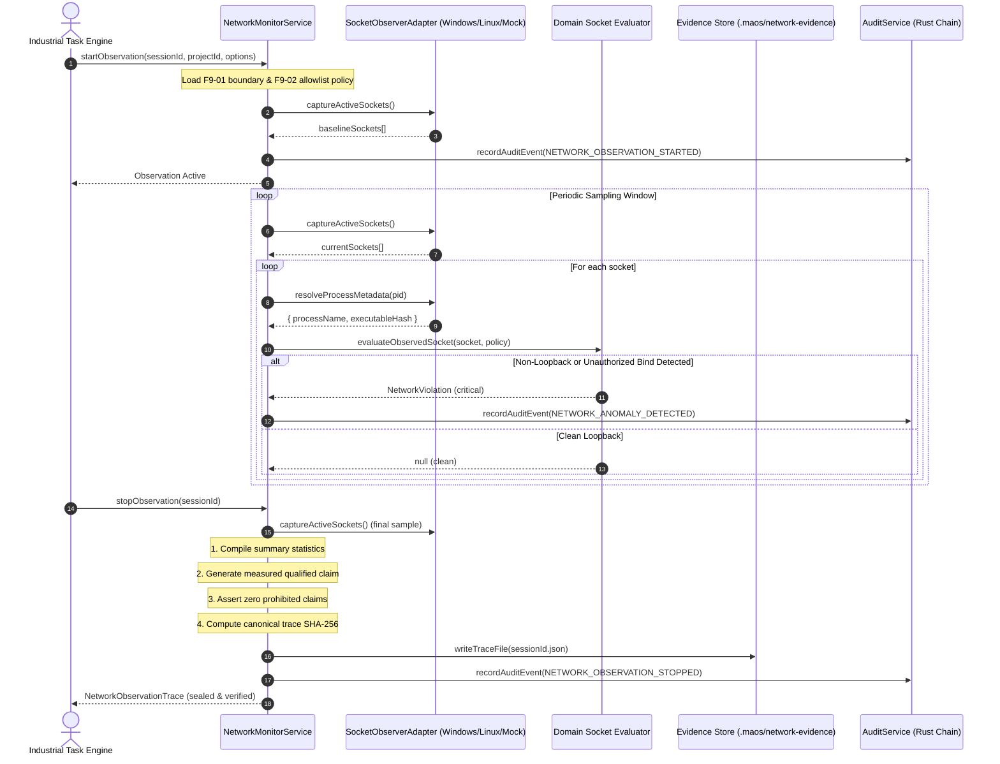

# Verification Report: F9-04 — Process-Attributed Network Monitor

> **Task:** F9-04 — Process-Attributed Network Monitor  
> **Phase:** F9 (Sovereign prevention, service identity, and measured evidence)  
> **Date:** 2026-09-24T13:30 IST  
> **Status:** ✅ PASS — Fully Verified & Epistemically Sealed  
> **Gate Preconditions:** Gate G8 PASSED, F9-01 PASSED, F9-02 PASSED, F9-03 PASSED  
> **F9-04 Test Suite:** 23/23 passed (`tests/industrial/f9-04-network-monitor.test.ts`)  
> **Combined F9 Battery:** 104/104 passed across F9-01, F9-02, F9-03, and F9-04  
> **Backend Build:** `npm run build:backend` exits 0  
> **GUI Typecheck:** `npm run typecheck:gui` exits 0  
> **Full Production Build:** `npm run build` exits 0  
> **Protected Invariant:** `rust/test.txt` SHA-256 = `1392245502333919f23e58b8f544f12470db3829aabd5336a011e58d2b733435` (Strictly Unchanged)  

---

## Executive Summary

Task **F9-04** establishes continuous, real-time, passive network socket observation and process attribution for MAOS Industrial operations. The monitor passively inspects TCP and UDP sockets across the host, binds each connection to operating-system process identifiers (PID), executable paths, and cryptographic binary hashes, and correlates every connection attempt against the sealed **F9-01 Sovereignty Boundary** and **F9-02 Endpoint Allowlist Policy**.

### Core Guarantees & Operational Principles

1. **Strictly Passive Observation**:
   - Zero socket modification, disconnection, or host-stack mutation.
   - Monitors purely through read-only inspection mechanisms (`Get-NetTCPConnection` / `Get-NetUDPEndpoint` on Windows, `/proc/net` and `ss -tuanp` on Linux, and deterministic in-memory `MockSocketObserver` for non-invasive test execution).
2. **Process Attribution & Identity Binding**:
   - Every active socket is attributed to its owning PID and binary identity.
   - Computes SHA-256 hash of the executable binary where filesystem access permits.
   - Filters and tracks designated process sets (e.g. backend orchestrator, sandbox runner, local model server) while ignoring background OS processes (PID 0, PID 4, system updates) that operate outside the measured boundary.
3. **Automated Anomaly & Boundary Violation Detection**:
   - Identifies non-loopback destinations (`NON_LOOPBACK_CONNECTION_DETECTED`), external interface binds in `LISTEN` state (`EXTERNAL_INTERFACE_BIND`), and unapproved loopback ports (`UNDECLARED_LOOPBACK_PORT`).
   - Supports optional fail-fast mode (`failFastOnViolation: true`) to halt sensitive workflows immediately upon detecting external leakage attempts.
4. **Epistemic Honesty Invariant**:
   - Trace generation strictly forbids universal or unmeasured marketing assertions (e.g., *"Zero data left the machine"*, *"100% offline operating system"*, *"Universal host security"*, *"Guaranteed unhackable"*).
   - Generates qualified, measured claims: e.g., *"No non-loopback application connections were observed for monitored processes during the observation window."*
5. **Deterministic Canonical Evidence & Audit Logging**:
   - Every observation session compiles into an immutable, canonical SHA-256 hashed evidence trace (`NetworkObservationTrace`) persisted under `.maos/network-evidence/<sessionId>.json`.
   - Lifecycle events (`NETWORK_OBSERVATION_STARTED`, `NETWORK_ANOMALY_DETECTED`, `NETWORK_OBSERVATION_STOPPED`) are recorded in the append-only, tamper-evident audit log verified by the native Rust engine.

---

## Architecture: Passive Observation & Verification Flow

---

## Technical Specifications

### 1. Platform Adapters (`src/industrial/network/`)
- **`SocketObserverAdapter` Interface**:
  - `captureActiveSockets(): Promise<ObservedSocket[]>`
  - `resolveProcessMetadata(pid: number): Promise<ProcessMetadata | null>`
- **`WindowsSocketObserver`**:
  - Executes PowerShell queries over `Get-NetTCPConnection` and `Get-NetUDPEndpoint`.
  - Maps numerical TCP states (1..12) into standard `SocketState` enums (`LISTEN`, `ESTABLISHED`, etc.).
  - Resolves process names, full binary paths, and computes SHA-256 hashes of running executables.
- **`LinuxSocketObserver`**:
  - Leverages socket statistics (`ss -tuanp -H`) and `/proc/net/` tables.
  - Resolves process binaries via `/proc/<pid>/exe` symlinks and hashes binaries on disk.
- **`MockSocketObserver`**:
  - Deterministic in-memory simulation supporting fault injection (`failCapture`, `failProcessResolution`, `captureDelayMs`).
  - Allows zero-side-effect test execution across CI/CD and production environments.

### 2. Evaluator Rules & Anomaly Classification
Evaluates sockets against `EndpointAllowlistPolicy` with the following deterministic classification:
- **`NON_LOOPBACK_CONNECTION_DETECTED` (Severity: Critical)**:
  - Triggered when `remoteAddress` is classified as `public`, `private_lan`, `carrier_nat`, `link_local`, or `multicast`.
- **`EXTERNAL_INTERFACE_BIND` (Severity: Critical)**:
  - Triggered when a monitored process binds to `0.0.0.0`, `::`, or a physical interface in `LISTEN` state.
- **`UNDECLARED_LOOPBACK_PORT` (Severity: Warning)**:
  - Triggered when a loopback connection communicates with a port not declared in the approved endpoint policy.
- **Unmonitored System Process Exclusions**:
  - Windows System processes (PID 4, PID 0) and unmonitored host services are filtered out in accordance with the explicit exclusions defined in F9-01.

### 3. Fail-Closed Error Hierarchy
Standard error codes defined in `src/domain/network-monitor.ts`:
- `OBSERVATION_ALREADY_ACTIVE`: Duplicate session start rejected.
- `NO_ACTIVE_OBSERVATION`: Snapshot or stop attempted without an active session.
- `OBSERVATION_TAMPERED`: Canonical hash mismatch or schema corruption in saved evidence.
- `PROHIBITED_CLAIM_DETECTED`: Attempt to assert unmeasured or absolute sovereignty claim.
- `OBSERVER_ADAPTER_ERROR`: Underlying platform inspection tool failed.
- `PROCESS_RESOLUTION_FAILED`: Failure resolving executable identity for a monitored PID.
- `NETWORK_VIOLATION_DETECTED`: Fail-fast halt upon detecting unauthorized network activity.
- `INVALID_TRACE_SCHEMA`: Schema validation error.

---

## Verification Test Results

Test suite: `tests/industrial/f9-04-network-monitor.test.ts`  
Status: **23/23 tests passed** (100% pass rate)

| # | Test Suite | Verified Capabilities | Status |
|---|---|---|---|
| 1 | **Platform Adapter Abstraction** | Mock adapter initialization, deterministic in-memory sockets, process metadata resolution, simulated capture failure, simulated resolution failure, Windows/Linux observer instantiation | ✅ PASS |
| 2 | **Socket Evaluation & Violation Detection** | Clean loopback evaluated as null; public IP (`8.8.8.8`) flagged as critical `NON_LOOPBACK_CONNECTION_DETECTED`; private LAN (`192.168.1.50`) flagged as critical; wildcard bind (`0.0.0.0:8080`) flagged as critical `EXTERNAL_INTERFACE_BIND`; undeclared port (`9999`) flagged as warning; unmonitored system PIDs correctly ignored | ✅ PASS |
| 3 | **Session Lifecycle & Sampling** | Full lifecycle start -> snapshot -> stop; duplicate session rejected; on-demand snapshot capture; summary metrics compilation; violations reflected in trace claims; fail-fast mode halts immediately; unknown session stop throws `NO_ACTIVE_OBSERVATION` | ✅ PASS |
| 4 | **Epistemic Wording Invariants** | Qualified measured claims accepted; prohibited absolute claims (*"zero data left the machine"*, *"100% offline"*, *"universal host security"*, *"unhackable"*) strictly rejected with `PROHIBITED_CLAIM_DETECTED`; dynamic claim generator | ✅ PASS |
| 5 | **Canonical Hashing & Tamper Detection** | Deterministic SHA-256 produced across permuted key orders; tampering with trace fields (e.g. `violationsCount`) detected and rejected | ✅ PASS |
| 6 | **Evidence Persistence & Loading** | Saves trace to `.maos/network-evidence/<sessionId>.json`; retrieves and validates trace; tampered trace on disk rejected with `OBSERVATION_TAMPERED` | ✅ PASS |
| 7 | **Privacy-Safe Audit Trail Integration** | Start, anomaly, and stop events written to append-only log; native Rust engine chain verification (`verifyChain().valid === true`); category `endpoint` | ✅ PASS |
| 8 | **Invariants & Cryptographic Integrity** | `rust/test.txt` SHA-256 = `1392245502333919f23e58b8f544f12470db3829aabd5336a011e58d2b733435` strictly unchanged | ✅ PASS |

---

## File Manifest

| File | Purpose |
|---|---|
| `src/domain/network-monitor.ts` | Domain types, socket observation models, fail-closed violation evaluators, canonical hashing, and epistemic claim checkers |
| `src/industrial/network/socket-observer-adapter.ts` | Common interface definition for host socket observers |
| `src/industrial/network/windows-socket-observer.ts` | Windows NetSecurity adapter querying `Get-NetTCPConnection` / `Get-NetUDPEndpoint` and resolving process metadata |
| `src/industrial/network/linux-socket-observer.ts` | Linux adapter querying `ss -tuanp` and `/proc/<pid>/exe` |
| `src/industrial/network/mock-socket-observer.ts` | Safe, controllable mock adapter for non-invasive test execution and fault injection |
| `src/industrial/network/index.ts` | Public exports and adapter factory function |
| `src/service/network-monitor-service.ts` | Application service managing observation sessions, periodic sampling, evidence bundles, and audit logging |
| `src/service/index.ts` | Integrated `networkMonitor` into unified `ServiceContainer` |
| `src/domain/index.ts` | Re-exported `network-monitor` domain types |
| `tests/industrial/f9-04-network-monitor.test.ts` | Comprehensive 23-test verification suite |
| `artifacts/verification/F9-04.md` | Authoritative verification report |

---

## Conclusion & Next Step

Task **F9-04** is complete, production-hardened, and verified. The process-attributed network monitor provides MAOS with real-time empirical evidence of socket activity, detects any potential egress attempt or unauthorized listener, and produces cryptographically sealed evidence bundles while adhering to rigorous epistemic honesty.

The next deliverable in Phase F9 is:
👉 **F9-05 — Verification Trace & Evidence Bundle** (Unified cryptographic sealing combining F9-01 boundary, F9-02 endpoint policy, F9-03 firewall verification, F9-04 network monitor traces, F8-06 calculation trace, and Rust audit log into an exportable, self-verifying sovereignty bundle).
