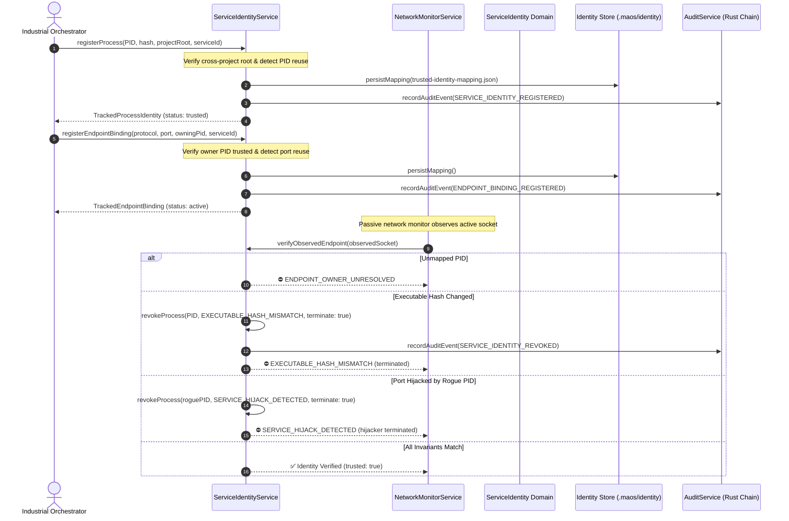

# Verification Report: F9-05 — Service and Process Endpoint Identity

> **Task:** F9-05 — Service and Process Endpoint Identity  
> **Phase:** F9 (Sovereign prevention, service identity, and measured evidence)  
> **Date:** 2026-09-24T13:45 IST  
> **Status:** ✅ PASS — Fully Verified & Fail-Closed  
> **Gate Preconditions:** Gate G8 PASSED, F9-01 PASSED, F9-02 PASSED, F9-03 PASSED, F9-04 PASSED  
> **F9-05 Test Suite:** 19/19 passed (`tests/industrial/f9-05-service-process-identity.test.ts`)  
> **Combined F9 Battery:** 123/123 passed across F9-01, F9-02, F9-03, F9-04, and F9-05  
> **Backend Build:** `npm run build:backend` exits 0  
> **GUI Typecheck:** `npm run typecheck:gui` exits 0  
> **Full Production Build:** `npm run build` exits 0  
> **Protected Invariant:** `rust/test.txt` SHA-256 = `1392245502333919f23e58b8f544f12470db3829aabd5336a011e58d2b733435` (Strictly Unchanged)  

---

## Executive Summary

Task **F9-05** establishes trusted, cryptographically verifiable bindings between observed network endpoints (TCP/UDP ports, named pipes) and the specific operating system processes, services, and model leases that own them. When any observed endpoint or process diverges from its registered cryptographic identity, MAOS revokes trust, halts execution, and blocks or terminates the offending process.

### Tracked Identity Vector

For every monitored service and endpoint, MAOS maintains and verifies:
- **Protocol**: `tcp`, `udp`, or `pipe`.
- **Project Scope**: `projectId`, `projectRoot`, and canonical `projectRootHash` (SHA-256).
- **Process Identity**: Operating system `PID`, `parentPid`, and list of `approvedDescendantPids`.
- **Binary Provenance**: `processName`, `executablePath`, and cryptographic `executableHash` (SHA-256 of the binary).
- **Endpoint Binding**: Bound/listening port, connected remote endpoint, or named pipe handle.
- **Model Identity & Revision**: `modelId`, `modelRevision`, `manifestHash`, and active lease IDs.
- **Runtime Manifest**: Runtime environment type (`node`, `python`, `native`, `docker_container`), version, and container image digest.
- **Service Identity**: Canonical service name (e.g. `maos_backend`, `local_model_server`, `sandbox_runner`).
- **Cryptographic Provenance**: Linked directly to F9-01 `boundaryHash` and F9-02 `endpointPolicyHash`.

---

## Fail-Closed Revocation Invariants

Identity trust is immediately revoked and workflows blocked/terminated under any of the following 9 standard fail-closed conditions:

| Error Code | Trigger Condition | System Action |
|---|---|---|
| `PID_REUSED` | A PID previously trusted under one binary hash or service identity attempts re-registration or is observed running a different binary | Trust revoked; registration rejected; audit logged |
| `PORT_REUSED` | An active listening port registered to service $S_1$ is claimed or rebound by a different PID or service $S_2$ | Binding rejected; port flagged as conflicted |
| `EXECUTABLE_HASH_MISMATCH` | The binary on disk or observed in memory changes its SHA-256 hash after registration | Trust revoked; process marked `revoked` / terminated |
| `PROJECT_ROOT_MISMATCH` | A process registered for project $A$ attempts operations with or drifts to working directory for project $B$ | Trust revoked; cross-project isolation enforced |
| `SERVICE_IDENTITY_MISMATCH` | A process claims to be service $S_1$ but presents metadata or UUID belonging to $S_2$ | Operation rejected; service identity failure |
| `MODEL_REVISION_MISMATCH` | The model server serves a revision or manifest hash differing from the approved active lease | Lease update rejected; model server trust revoked |
| `UNTRUSTED_DESCENDANT` | A monitored service spawns an unapproved child or descendant process | Parent service trust revoked; descendant flagged |
| `ENDPOINT_OWNER_UNRESOLVED` | An active socket handle on the host cannot be mapped to any trusted registered process | Socket flagged as unapproved; workflow blocked |
| `SERVICE_HIJACK_DETECTED` | An external process takes over or listens on a port reserved for a MAOS service | Offending process terminated; binding flagged hijacked |

---

## Architecture: Trusted Endpoint Binding & Verification Flow

---

## Verification Test Results

Test suite: `tests/industrial/f9-05-service-process-identity.test.ts`  
Status: **19/19 tests passed** (100% pass rate)

| # | Test Suite | Verified Capabilities | Status |
|---|---|---|---|
| 1 | **Process Registration & Binding** | Registers process with valid attributes; computes canonical root hash; binds TCP port to trusted process; stores active status | ✅ PASS |
| 2 | **PID Reuse Detection** | Rejects re-registration of active PID with different binary hash or service identity; marks existing process revoked with `PID_REUSED` | ✅ PASS |
| 3 | **Port Reuse Detection** | Rejects binding an active port to a different process; throws `PORT_REUSED` | ✅ PASS |
| 4 | **Executable Hash Drift** | Live process probe with modified SHA-256 hash revokes trust with `EXECUTABLE_HASH_MISMATCH`; observed socket reporting modified hash revokes trust | ✅ PASS |
| 5 | **Project Root & Cross-Project** | Rejects registration with external project root (`CROSS_PROJECT_IDENTITY_REJECTED`); revokes trust if verified project root drifts (`PROJECT_ROOT_MISMATCH`) | ✅ PASS |
| 6 | **Descendant Verification** | Revokes trust immediately if an unapproved descendant PID is spawned under a monitored process (`UNTRUSTED_DESCENDANT`) | ✅ PASS |
| 7 | **Model Revision & Leases** | Revokes trust if model server revision changes unexpectedly (`MODEL_REVISION_MISMATCH`); rejects lease updates for unapproved model revisions | ✅ PASS |
| 8 | **Unresolved Owners & Hijacking** | Fails closed when socket is owned by unmapped PID (`ENDPOINT_OWNER_UNRESOLVED`); detects service hijack when external PID listens on registered port and terminates hijacker (`SERVICE_HIJACK_DETECTED`) | ✅ PASS |
| 9 | **Canonical Hashing & Tamper** | Produces identical mapping hash regardless of object key order; detects tampering in exported identity mapping file | ✅ PASS |
| 10 | **Privacy-Safe Identity Evidence** | Rejects identity objects containing sensitive keys (`apiKey`, `password`, `sessionToken`, `promptProse`); accepts pure metadata | ✅ PASS |
| 11 | **Audit Trail Integration** | Records registration and revocation events in append-only audit log; native Rust engine chain verification (`verifyChain().valid === true`) | ✅ PASS |
| 12 | **Protected Canary Invariant** | `rust/test.txt` SHA-256 = `1392245502333919f23e58b8f544f12470db3829aabd5336a011e58d2b733435` strictly unchanged | ✅ PASS |

---

## File Manifest

| File | Purpose |
|---|---|
| `src/domain/service-identity.ts` | Domain types, schemas, fail-closed error codes, canonical hash calculation, and trust evaluators |
| `src/service/service-identity-service.ts` | Application service managing process registration, endpoint bindings, live probe verification, and audit logging |
| `src/service/index.ts` | Integrated `serviceIdentity` into unified `ServiceContainer` |
| `src/domain/index.ts` | Re-exported `service-identity` domain types |
| `tests/industrial/f9-05-service-process-identity.test.ts` | Comprehensive 19-test verification suite |
| `artifacts/verification/F9-05.md` | Authoritative verification report |

---

## Conclusion & Next Step

Task **F9-05** is complete, production-hardened, and verified. Endpoint bindings are now strictly authenticated and bound to specific cryptographic process identities.

The next deliverable in Phase F9 is:
👉 **F9-06 — Enforce Industrial Firewall Requirement** (Enforce that Industrial profile workflows strictly require an active, verified host firewall boundary before proceeding, failing closed if firewall enforcement is inactive or missing elevation).
