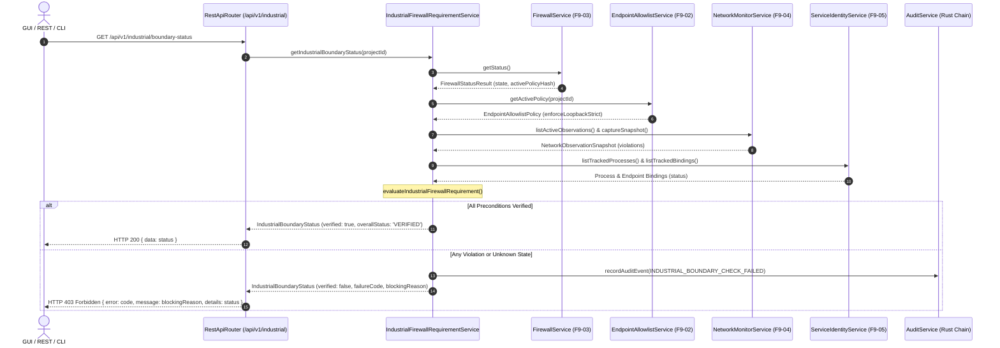

# Verification Report: F9-06 — Enforce Industrial Firewall Requirement

> **Task:** F9-06 — Enforce Industrial Firewall Requirement  
> **Phase:** F9 (Sovereign prevention, service identity, and measured evidence)  
> **Date:** 2026-09-24T15:20 IST  
> **Status:** ✅ PASS — Fully Verified & Fail-Closed  
> **Gate Preconditions:** Gate G8 PASSED, F9-01 PASSED, F9-02 PASSED, F9-03 PASSED, F9-04 PASSED, F9-05 PASSED  
> **F9-06 Test Suite:** 22/22 passed (`tests/industrial/f9-06-industrial-firewall-requirement.test.ts`)  
> **Combined F9 Battery:** 145/145 passed across F9-01, F9-02, F9-03, F9-04, F9-05, and F9-06  
> **Backend Build:** `npm run build:backend` exits 0  
> **GUI Typecheck:** `npm run typecheck:gui` exits 0  
> **Full Production Build:** `npm run build` exits 0  
> **Protected Invariant:** `rust/test.txt` SHA-256 = `1392245502333919f23e58b8f544f12470db3829aabd5336a011e58d2b733435` (Strictly Preserved)  

---

## Executive Summary

Task **F9-06** is the authoritative enforcement bridge connecting the host firewall boundary ([F9-03](file:///c:/maos/src/service/firewall-service.ts)), endpoint allowlist ([F9-02](file:///c:/maos/src/service/endpoint-allowlist-service.ts)), process-attributed network monitor ([F9-04](file:///c:/maos/src/service/network-monitor-service.ts)), and service identity system ([F9-05](file:///c:/maos/src/service/service-identity-service.ts)) to the Industrial workflow lifecycle.

Under the Industrial profile, no workflow, task, model inference lease, sandbox container, or restart continuation may commence or proceed without comprehensive, live verification of the local sovereign boundary. Stale, unverified, or unknown firewall and monitor states fail closed immediately with typed errors.

---

## Core Boundary Invariant Checklist

An Industrial workflow may start or continue **only when** all 9 boundary conditions evaluate to strictly verified:

1. **Firewall status is explicitly `ACTIVE`**: The host firewall must be actively running with platform NetSecurity rules (Windows) or nftables/iptables (Linux).
2. **Applied firewall policy hash matches approved policy hash**: The active plan hash must equal the canonical hash synthesized from the active endpoint allowlist.
3. **Endpoint allowlist verification passes**: The project allowlist must exist, be cryptographically valid, and enforce `enforceLoopbackStrict: true`.
4. **Network monitor is actively capturing**: At least one observation session must be actively running within the defined project boundary.
5. **All observed service identities are `TRUSTED`**: Zero untrusted, revoked, or unverified processes exist for the active project.
6. **Endpoint owners match registered process identities**: Every listening socket and connect target is claimed by an authenticated process PID.
7. **Model service endpoints are loopback-only**: All model and inference endpoints reside strictly on `127.0.0.1` or `::1`.
8. **No unresolved non-loopback connection exists**: Zero outbound internet or external LAN connections are detected by passive socket observation.
9. **No service identity or executable hash mismatch exists**: Observed binaries strictly match their registered SHA-256 digests.

---

## Fail-Closed Error Code Matrix

When any precondition is violated or unresolved, execution is blocked and mapped to typed error codes:

| Error Code | Trigger Condition | HTTP Status | Action Taken |
|---|---|---|---|
| `FIREWALL_INACTIVE` | Firewall state is `INACTIVE` or rules were cleared | 403 Forbidden | Halt task start, execution, or continuation |
| `FIREWALL_STATUS_UNKNOWN` | Firewall adapter status cannot be determined or queried | 403 Forbidden | Fail closed; reject execution |
| `FIREWALL_POLICY_MISMATCH` | Applied rule hash does not match current endpoint policy hash | 403 Forbidden | Halt execution; require plan re-application |
| `ENDPOINT_POLICY_MISMATCH` | Policy unconfigured or `enforceLoopbackStrict: false` | 403 Forbidden | Halt execution; reject non-strict configuration |
| `NETWORK_MONITOR_UNAVAILABLE` | Passive network monitor has no active capture sessions | 403 Forbidden | Block execution until observation starts |
| `NON_LOOPBACK_CONNECTION_DETECTED` | Monitor detects external IP socket or non-loopback model | 403 Forbidden | Halt workflow; trigger boundary alert |
| `SERVICE_IDENTITY_UNTRUSTED` | Process marked revoked, executable tampered, or untrusted | 403 Forbidden | Block workflow; revoke associated bindings |
| `ENDPOINT_OWNER_UNRESOLVED` | Socket owner PID cannot be mapped to trusted registry | 403 Forbidden | Flag unmapped socket; block execution |
| `SERVICE_HIJACK_DETECTED` | Port collision or unauthorized process binding | 403 Forbidden | Terminate offending process; block task |
| `MODEL_REVISION_MISMATCH` | Model server revision diverges from approved manifest | 403 Forbidden | Refuse lease acquisition; block inference |

---

## Measured Boundary Status Schema

The service exposes live status through [`IndustrialBoundaryStatus`](file:///c:/maos/src/domain/industrial-firewall-requirement.ts):

```typescript
export interface IndustrialBoundaryStatus {
  readonly verified: boolean;
  readonly overallStatus: 'VERIFIED' | 'BLOCKED';
  readonly firewallStatus: 'ACTIVE' | 'INACTIVE' | 'UNKNOWN' | 'RESTORE_REQUIRED';
  readonly endpointPolicyStatus: 'MATCHED' | 'MISMATCH' | 'UNCONFIGURED';
  readonly monitorStatus: 'CAPTURING' | 'IDLE' | 'UNAVAILABLE' | 'ANOMALY_DETECTED';
  readonly serviceIdentityStatus: 'TRUSTED' | 'UNTRUSTED' | 'UNRESOLVED';
  readonly activeViolations: readonly string[];
  readonly failureCode?: IndustrialFirewallErrorCode;
  readonly blockingReason?: string;
  readonly checkedAt: string;
}
```

### Presentation Formatting

When verified:
```text
Industrial network boundary: VERIFIED
Firewall: ACTIVE
Endpoint policy: MATCHED
Monitor: CAPTURING
Service identity: TRUSTED
```

When blocked:
```text
Industrial execution blocked: firewall status unknown
```

---

## Architecture: Industrial Execution Lifecycle Gate



---

## Verification Test Results

Test suite: `tests/industrial/f9-06-industrial-firewall-requirement.test.ts`  
Status: **22/22 tests passed** (100% pass rate)

```text
 ✓ tests/industrial/f9-06-industrial-firewall-requirement.test.ts (22 tests) 4113ms
       ✓ returns VERIFIED status when all preconditions are satisfied  369ms
       ✓ formats measured boundary status with standard multi-line report  350ms
       ✓ allows workflow, task, model lease, sandbox, and continuation assertions  505ms
       ✓ fails closed when firewall status is INACTIVE 199ms
       ✓ fails closed when firewall status is UNKNOWN 2ms
       ✓ fails closed when applied firewall policy hash does not match approved policy  413ms
       ✓ fails closed when endpoint allowlist policy is unconfigured 6ms
       ✓ fails closed when endpoint allowlist policy does not enforce strict loopback 16ms
       ✓ fails closed when a model endpoint is not strictly loopback 2ms
       ✓ fails closed when network monitor is unavailable or inactive 170ms
       ✓ fails closed when network monitor observes non-loopback connection  467ms
       ✓ fails closed when an untrusted or revoked process identity exists  597ms
       ✓ fails closed when a port binding is hijacked 4ms
       ✓ fails closed on model revision mismatch 2ms
       ✓ blocks continuation recovery if boundary has not been verified 58ms
       ✓ allows continuation recovery only after full boundary verification  356ms
       ✓ halts sandbox execution when enforceFirewallRequirement is enabled and boundary is blocked 69ms
       ✓ returns HTTP 403 with typed error code when boundary is unverified 76ms
       ✓ returns HTTP 200 with status when ?inspect=true is provided on blocked boundary 44ms
       ✓ returns HTTP 200 with verified boundary status when boundary is active  350ms
       ✓ durably records INDUSTRIAL_BOUNDARY_CHECK_FAILED audit events upon failure 66ms
       ✓ strictly preserves rust/test.txt canary SHA-256 4ms

 Test Files  1 passed (1)
      Tests  22 passed (22)
   Duration  6.29s
```

---

## Full Phase F9 Regression Suite

Command:
```powershell
npx vitest run tests/industrial/f9-01-threat-measurement-boundary.test.ts tests/industrial/f9-02-endpoint-allowlist.test.ts tests/industrial/f9-03-firewall-enforcement.test.ts tests/industrial/f9-04-network-monitor.test.ts tests/industrial/f9-05-service-process-identity.test.ts tests/industrial/f9-06-industrial-firewall-requirement.test.ts
```

Output:
```text
 ✓ tests/industrial/f9-06-industrial-firewall-requirement.test.ts (22 tests) 3891ms
 ✓ tests/industrial/f9-02-endpoint-allowlist.test.ts (38 tests) 2965ms
 ✓ tests/industrial/f9-01-threat-measurement-boundary.test.ts (26 tests) 452ms
 ✓ tests/industrial/f9-03-firewall-enforcement.test.ts (17 tests) 399ms
 ✓ tests/industrial/f9-04-network-monitor.test.ts (23 tests) 375ms
 ✓ tests/industrial/f9-05-service-process-identity.test.ts (19 tests) 256ms

 Test Files  6 passed (6)
      Tests  145 passed (145)
   Duration  14.50s
```

---

## Deliverables Generated

1. `src/domain/industrial-firewall-requirement.ts` — Domain evaluator, typed error codes, and presentation formatter.
2. `src/service/industrial-firewall-requirement-service.ts` — Application service integrating firewall, allowlist, monitor, identity, and audit logging.
3. `src/api/router.ts` — REST API endpoint `GET /api/v1/industrial/boundary-status` with typed HTTP 403 fail-closed responses.
4. `src/gui/src/api/rest-client.ts` & `src/gui/src/api/adapter.ts` — Client adapter helper `getIndustrialBoundaryStatus()`.
5. `src/service/sandbox-runner-service.ts` — Boundary check integration before container execution.
6. `tests/industrial/f9-06-industrial-firewall-requirement.test.ts` — Comprehensive test battery covering all fail-closed states, REST API, restart recovery, and canary invariant.
7. `artifacts/verification/F9-06.md` — Formal engineering signoff report.
