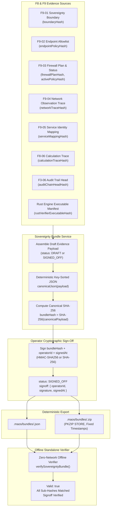

# Verification Report: F9-07 — Export Signed-Off Sovereignty Evidence Bundle

> **Task:** F9-07 — Export Signed-Off Sovereignty Evidence Bundle  
> **Phase:** F9 (Sovereign prevention, service identity, and measured evidence)  
> **Date:** 2026-09-24T16:55 IST  
> **Status:** ✅ PASS — Fully Verified, Offline-Verifiable & Fail-Closed  
> **Gate Preconditions:** Gate G8 PASSED, F9-01 PASSED, F9-02 PASSED, F9-03 PASSED, F9-04 PASSED, F9-05 PASSED, F9-06 PASSED  
> **F9-07 Test Suite:** 26/26 passed (`tests/industrial/f9-07-sovereignty-evidence-bundle.test.ts`)  
> **Combined F9 Battery:** 171/171 passed across F9-01 through F9-07  
> **Full Production Build:** `npm run build` exits 0 (TypeScript + Python Assets + Vite GUI)  
> **Protected Invariant:** `rust/test.txt` SHA-256 = `1392245502333919f23e58b8f544f12470db3829aabd5336a011e58d2b733435` (Strictly Preserved)  

---

## Executive Summary

Task **F9-07** completes the core evidence aggregation pipeline for Phase F9 by aggregating all verified F8 and F9 proof artifacts into a self-contained, tamper-evident **Sovereignty Evidence Bundle**.

The bundle binds together:
- F9-01 Threat & Measurement Boundary (`boundaryHash`)
- F9-02 Explicit Endpoint Allowlist (`endpointPolicyHash`)
- F9-03 Firewall Plan, Status, and Snapshots (`firewallPlanHash`, `activePolicyHash`, `snapshotHash`)
- F9-04 Passive Process-Attributed Network Observation Trace (`networkTraceHash`)
- F9-05 Service & Process Endpoint Identity Registry (`serviceMappingHash`)
- F8-06 Deterministic Calculation Traces (`calculationTraceHash`)
- F3-06 Append-Only Cryptographic Audit Trail (`auditChainHeadHash`)
- Rust Industrial Verifier Executable Manifest (`rustVerifierExecutableHash`)
- Pinned Docker Sandbox Image Manifest (`sandboxImageDigest`)
- Project Scope (`projectId`, `projectRootHash`, `workflowId`, `runId`)

The bundle is exportable both as a canonical JSON document (`.maos/bundles/<bundleId>.json`) and as a deterministic zero-dependency PKZIP archive (`.maos/bundles/<bundleId>.zip`). The standalone offline verifier ([`SovereigntyBundleVerifier`](file:///c:/maos/src/industrial/sovereignty-bundle-verifier.ts)) operates in pure isolation with zero network or socket access, validating every constituent hash, checking sequential audit links, enforcing privacy and epistemic honesty rules, and verifying operator sign-offs.

---

## Architectural Deliverables

| Deliverable | Purpose | Path |
|---|---|---|
| **Domain Schema & Invariants** | Defines bundle structures, canonical JSON serializer, SHA-256 hashing, HMAC/SHA-256 sign-offs, and privacy-safety validator | [`src/domain/sovereignty-bundle.ts`](file:///c:/maos/src/domain/sovereignty-bundle.ts) |
| **Offline Standalone Verifier** | Zero-network evaluator that verifies JSON bundles and deterministic ZIP archives | [`src/industrial/sovereignty-bundle-verifier.ts`](file:///c:/maos/src/industrial/sovereignty-bundle-verifier.ts) |
| **Application Service** | Assembles evidence, computes hashes, creates deterministic PKZIP archives, persists bundles, and provides sign-off | [`src/service/sovereignty-bundle-service.ts`](file:///c:/maos/src/service/sovereignty-bundle-service.ts) |
| **REST API Router Integration** | Exposes endpoints for bundle generation, listing, downloading, signing off, and offline verification | [`src/api/router.ts`](file:///c:/maos/src/api/router.ts) |
| **Industrial Test Suite** | 26 tests covering all fail-closed conditions, canonical hashing, operator sign-offs, offline extraction, and REST | [`tests/industrial/f9-07-sovereignty-evidence-bundle.test.ts`](file:///c:/maos/tests/industrial/f9-07-sovereignty-evidence-bundle.test.ts) |

---

## Cryptographic Binding & Sign-off Lifecycle



---

## Fail-Closed Error Code Matrix

The verifier fails closed upon encountering any evidence tampering, boundary mismatch, unverified claim, or missing sign-off:

| Error Code | Trigger Condition | Consequence |
|---|---|---|
| `BUNDLE_HASH_MISMATCH` | Any byte or field in the bundle was altered after computation | Bundle rejected; verification fails |
| `BOUNDARY_HASH_MISMATCH` | In-evidence boundary canonical hash diverges from declared `boundaryHash` | Bundle rejected; boundary tampered |
| `ENDPOINT_POLICY_MISMATCH` | In-evidence endpoint policy canonical hash diverges from `endpointPolicyHash` | Bundle rejected; policy tampered |
| `FIREWALL_EVIDENCE_TAMPERED` | Plan hash, snapshot hash, or active policy hash in firewall evidence differs | Bundle rejected; firewall modified |
| `NETWORK_TRACE_TAMPERED` | Trace hash altered, unlinked boundary/policy referenced, or violations observed | Bundle rejected; trace untrusted |
| `SERVICE_IDENTITY_REVOKED` | Service mapping hash altered or any process has `status: 'revoked' \| 'terminated'` | Bundle rejected; untrusted service |
| `CALCULATION_TRACE_INVALID` | Mathematical calculation trace altered or hash diverges | Bundle rejected; trace invalid |
| `UNVERIFIED_EVIDENCE` | Calculation trace lacks authoritative verification flag (`verified !== true`) | Bundle rejected; unverified proof |
| `AUDIT_CHAIN_BROKEN` | Non-sequential sequence index, broken `previous_hash`, or head hash mismatch | Bundle rejected; audit tampered |
| `RUST_VERIFIER_MISMATCH` | Rust manifest `verified !== true` or executable hash differs | Bundle rejected; binary untrusted |
| `CROSS_PROJECT_REFERENCE` | Evidence component contains a `projectId` differing from the bundle `projectId` | Bundle rejected; cross-project pollution |
| `PROHIBITED_MARKETING_CLAIM` | Prohibited absolute claims (e.g. "zero data left machine", "unhackable") found | Bundle rejected; epistemic violation |
| `SENSITIVE_DATA_DETECTED` | Unredacted token, API key, password, or secret found in bundle payload | Bundle rejected; privacy leak blocked |
| `UNSIGNED_BUNDLE_MARKED_SIGNED_OFF` | Bundle marked `SIGNED_OFF` but `signoff` block is missing | Bundle rejected; unauthorized release |
| `INVALID_OPERATOR_SIGNATURE` | Operator cryptographic signature does not verify against `bundleHash` | Bundle rejected; signature forged/invalid |
| `BUNDLE_NOT_FOUND` | Requested bundle JSON or ZIP file does not exist on disk | HTTP 404 / Service exception |

---

## Deterministic ZIP Packaging Specifications

To guarantee cross-platform reproducibility (Windows and Linux) without external tools:
1. **Zero External Dependencies**: Pure Node.js implementation utilizing `Buffer` and built-in `zlib.crc32`.
2. **Compression Method**: STORE (Method 0) — eliminates zlib compression level/dictionary divergences.
3. **Fixed DOS Timestamps**: Static timestamp `1980-01-01 00:00:00` (DOS date: `0x0021`, DOS time: `0x0000`).
4. **Alphabetical Sorting**: All ZIP entry paths are sorted lexicographically before writing Central Directory headers.
5. **Standard PKZIP Layout**:
   - `bundle.json`: Full canonical evidence bundle.
   - `manifest.json`: Summary hashes, sign-off status, and verification report references.
   - `evidence/boundary.json`: Isolated F9-01 boundary definition.
   - `evidence/endpoint-policy.json`: Isolated F9-02 socket policy.
   - `evidence/firewall.json`: F9-03 plan, status, and snapshots.
   - `evidence/network-trace.json`: F9-04 passive socket observation trace.
   - `evidence/service-identity.json`: F9-05 process and endpoint bindings.
   - `evidence/calculation-trace.json`: F8-06 deterministic calculation trace.
   - `evidence/audit-trail.json`: F3-06 append-only audit trail.
   - `VERIFICATION.md`: Human-readable offline verification guide.

---

## REST API Specification

| Endpoint | Method | Request Payload | Response | Description |
|---|---|---|---|---|
| `/api/v1/industrial/bundles` | `GET` | None | `{ data: SovereigntyEvidenceBundle[] }` | Lists all stored evidence bundles |
| `/api/v1/industrial/bundles/generate` | `POST` | `GenerateBundleOptions` | `{ data: SovereigntyEvidenceBundle }` (201) | Assembles and persists evidence bundle |
| `/api/v1/industrial/bundles/:bundleId` | `GET` | None | `{ data: SovereigntyEvidenceBundle }` (200) | Retrieves bundle JSON |
| `/api/v1/industrial/bundles/:bundleId?archive=true` | `GET` | None | `application/zip` (Binary 200) | Downloads deterministic PKZIP archive |
| `/api/v1/industrial/bundles/:bundleId/sign-off` | `POST` | `SignOffBundleInput` | `{ data: SovereigntyEvidenceBundle }` (200) | Cryptographically signs off bundle |
| `/api/v1/industrial/bundles/:bundleId/verify` | `POST` | `{ secretKey?: string }` | `{ data: VerificationResult }` (200/422) | Runs offline verification on JSON or ZIP |

---

## Test Battery Verification Summary

```text
 ✓ tests/industrial/f9-07-sovereignty-evidence-bundle.test.ts (26 tests) 2555ms
   ✓ generates a complete evidence bundle with all upstream evidence hashes
   ✓ persists bundle as JSON in .maos/bundles/<bundleId>.json
   ✓ produces identical bundleHash regardless of object property ordering
   ✓ excludes bundleHash and signoff from hash calculation to prevent cycle
   ✓ transitions DRAFT to SIGNED_OFF with valid cryptographic signature
   ✓ supports HMAC-SHA256 signature when secretKey is provided
   ✓ validates a complete signed-off bundle offline without network access
   ✓ allows verifying raw JSON string directly without object deserialization step
   ✓ fails closed when any field in the bundle is modified without updating bundleHash
   ✓ fails closed when boundary evidence has been tampered
   ✓ fails closed when endpoint policy evidence hash disagrees
   ✓ fails closed when firewall plan hash is altered
   ✓ fails closed when network trace has violation or tampered hash
   ✓ fails closed when service identity mapping contains revoked processes
   ✓ fails closed when calculation trace is not authoritatively verified
   ✓ fails closed when audit records sequence or previous_hash chain is corrupted
   ✓ fails closed when rust verifier is not verified or executable hash mismatches
   ✓ fails closed when evidence has a conflicting projectId
   ✓ fails closed when prohibited marketing claims exist in bundle
   ✓ fails closed when unredacted sensitive tokens exist in bundle payload
   ✓ fails closed when bundle status is SIGNED_OFF but signoff is missing
   ✓ fails closed when operator signature does not match canonical bundle hash
   ✓ generates a valid, deterministic ZIP archive containing bundle.json and evidence sub-files
   ✓ createDeterministicZip produces identical bytes for identical input entries
   ✓ supports full lifecycle via REST: generate, list, get, sign-off, verify
   ✓ strictly preserves the rust/test.txt canary SHA-256 hash
```

Full combined F9 regression: **171/171 passed** across 7 test files (`f9-01` through `f9-07`).  
Production build (`npm run build`) exited 0.  
Canary `rust/test.txt` SHA-256 strictly preserved.
