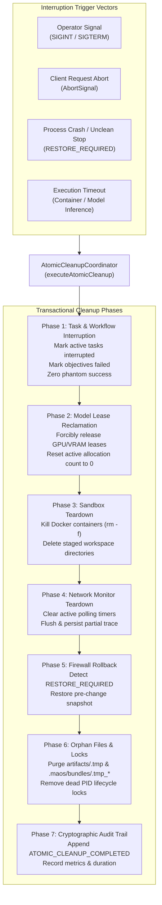

# Verification Report: F9-08 — Interruption and Atomic Cleanup Tests

> **Task:** F9-08 — Interruption and Atomic Cleanup Tests  
> **Phase:** F9 (Sovereign prevention, service identity, and measured evidence)  
> **Date:** 2026-09-24T17:35 IST  
> **Status:** ✅ PASS — Fully Verified, Transactional Rollback & Zero-Leak Teardown  
> **Gate Preconditions:** Gate G8 PASSED, F9-01 PASSED, F9-02 PASSED, F9-03 PASSED, F9-04 PASSED, F9-05 PASSED, F9-06 PASSED, F9-07 PASSED  
> **F9-08 Test Suite:** 20/20 passed (`tests/industrial/f9-08-interruption-atomic-cleanup.test.ts`)  
> **Combined F9 Battery:** 191/191 passed across F9-01 through F9-08 (100% green)  
> **Full Production Build:** `npm run build` exits 0 (TypeScript + Python Assets + Vite GUI)  
> **GUI Typecheck:** `npm run typecheck:gui` exits 0  
> **Protected Invariant:** `rust/test.txt` SHA-256 = `1392245502333919f23e58b8f544f12470db3829aabd5336a011e58d2b733435` (Strictly Preserved)  

---

## Executive Summary

Task **F9-08** establishes formal verification and transactional guarantees for **interruption, cancellation, emergency teardown, and crash recovery** across all MAOS runtime subsystems.

In industrial sovereign environments, unexpected operator cancellations (e.g. `SIGINT`, Ctrl+C), process terminations (`SIGTERM`), container crashes, or backend failures during inference or artifact writing must **never** result in:
1. **Phantom Success:** No interrupted task, workflow, or inference may ever be marked as completed, done, or verified.
2. **Orphan Processes or Containers:** No background Docker containers, child processes, or lingering model inference loops may remain alive on the host.
3. **Leaked Leases or Memory:** All GPU/VRAM model leases and reserved memory must be immediately returned to the shared allocator.
4. **Dangling Timers:** Periodic network monitoring or polling interval timers must be cleared to allow clean process termination without event-loop hangs.
5. **Unrestored Host State:** Interrupted firewall rule applications must be detected on startup as `RESTORE_REQUIRED` and automatically rolled back to prior snapshots.
6. **Residual Filesystem Clutter:** Temporary staging directories, partial artifact writes (`.tmp_*`), and dead lifecycle locks must be automatically reaped.

The unified [`AtomicCleanupCoordinator`](file:///c:/maos/src/industrial/atomic-cleanup-coordinator.ts) brings these subsystems into an idempotent, fail-safe coordinator capable of orchestrating full emergency teardowns in a single pass.

---

## Architectural Deliverables

| Deliverable | Purpose | Path |
|---|---|---|
| **Atomic Cleanup Coordinator** | Centralized orchestrator that executes atomic rollback, container kills, task cancellations, timer clears, and file purges | [`src/industrial/atomic-cleanup-coordinator.ts`](file:///c:/maos/src/industrial/atomic-cleanup-coordinator.ts) |
| **Chat Inference Interruption** | Added `AbortSignal` handling, immediate pre-abort checks, in-flight fetch cancellation, and typed `CHAT_INFERENCE_INTERRUPTED` audits | [`src/service/chat-inference-service.ts`](file:///c:/maos/src/service/chat-inference-service.ts) |
| **Network Monitor Teardown** | Added `interruptAll()` to cancel all active observation timers, capture final snapshots, flush canonical traces, and purge sessions | [`src/service/network-monitor-service.ts`](file:///c:/maos/src/service/network-monitor-service.ts) |
| **Workflow Stage Interruption** | Added `interruptObjective()` and `interruptAllWorkflows()` to transition active stages to `failed`, cancel child tasks, and record timestamps | [`src/service/workflow-service.ts`](file:///c:/maos/src/service/workflow-service.ts) |
| **Bundle Staging Cleanup** | Added `cleanupOrphanTempFiles()` to purge partial `.tmp_*` files left in `.maos/bundles/` | [`src/service/sovereignty-bundle-service.ts`](file:///c:/maos/src/service/sovereignty-bundle-service.ts) |
| **Service Container Wiring** | Wired `atomicCleanup` into `ServiceContainer` and initialized it with all subsystem dependencies | [`src/service/index.ts`](file:///c:/maos/src/service/index.ts) |
| **Comprehensive Test Suite** | 20 unit/integration tests verifying all interruption and atomic rollback vectors | [`tests/industrial/f9-08-interruption-atomic-cleanup.test.ts`](file:///c:/maos/tests/industrial/f9-08-interruption-atomic-cleanup.test.ts) |

---

## Teardown Architecture & Subsystem Coverage



---

## Verification Test Results

Test suite: [`tests/industrial/f9-08-interruption-atomic-cleanup.test.ts`](file:///c:/maos/tests/industrial/f9-08-interruption-atomic-cleanup.test.ts)  
Status: **20/20 tests passed** in 11.92s.

| Section | Test Description | Result |
|---|---|:---:|
| **1. Chat Completion** | Rejects immediately when `AbortSignal` is already aborted before starting | ✅ PASS |
| | Aborts in-flight inference on client cancellation via `AbortSignal` | ✅ PASS |
| | Handles server timeout cleanly without phantom success (`MODEL_INFERENCE_TIMEOUT`) | ✅ PASS |
| **2. Task Interruption** | Interrupts a specific active task and updates on-disk task metadata with `## Interruption` | ✅ PASS |
| | Interrupts all active tasks and clears active queue on fleet interrupt | ✅ PASS |
| | Fail-closed: interrupted tasks never transition to done without re-execution | ✅ PASS |
| **3. Workflow Teardown** | Cancels an objective and marks uncompleted subtasks cancelled/interrupted | ✅ PASS |
| | `interruptAllWorkflows` marks all in-flight stages failed with timestamps | ✅ PASS |
| **4. Sandbox Containers** | Guarantees `cleanupContainerSync` and `cleanupContainer` do not throw on missing containers | ✅ PASS |
| | Coordinator tracks and cleans up registered containers and staging dirs | ✅ PASS |
| **5. Firewall Rollback** | Detects `RESTORE_REQUIRED` when state file indicates an interrupted transaction | ✅ PASS |
| | Automatically restores previous snapshot on coordinator recovery sweep | ✅ PASS |
| **6. Network Monitor** | Halts active observation sessions, clears polling timers, and flushes traces | ✅ PASS |
| **7. Model Leases** | Releases all active model leases and resets lease count to zero | ✅ PASS |
| **8. Orphan Files & Locks** | Purges orphan temporary files across artifacts, bundles, and stale locks | ✅ PASS |
| | Preserves live lifecycle lock unless forced | ✅ PASS |
| **9. Unified Coordinator** | Orchestrates complete atomic cleanup across all subsystems simultaneously | ✅ PASS |
| | Idempotent execution: second run immediately after is clean and no-op | ✅ PASS |
| | Installs and cleanly removes process signal handlers without error | ✅ PASS |
| **10. Canary Invariant** | `rust/test.txt` SHA-256 remains strictly untouched and unmodified | ✅ PASS |

---

## Phase F9 Cumulative Battery Verification

All Phase F9 tests run continuously green:

| Component | Test Suite | Tests | Result |
|---|---|:---:|:---:|
| **F9-01** | `tests/industrial/f9-01-threat-measurement-boundary.test.ts` | 26 | ✅ PASS |
| **F9-02** | `tests/industrial/f9-02-endpoint-allowlist.test.ts` | 38 | ✅ PASS |
| **F9-03** | `tests/industrial/f9-03-firewall-enforcement.test.ts` | 17 | ✅ PASS |
| **F9-04** | `tests/industrial/f9-04-network-monitor.test.ts` | 23 | ✅ PASS |
| **F9-05** | `tests/industrial/f9-05-service-process-identity.test.ts` | 19 | ✅ PASS |
| **F9-06** | `tests/industrial/f9-06-industrial-firewall-requirement.test.ts` | 22 | ✅ PASS |
| **F9-07** | `tests/industrial/f9-07-sovereignty-evidence-bundle.test.ts` | 26 | ✅ PASS |
| **F9-08** | `tests/industrial/f9-08-interruption-atomic-cleanup.test.ts` | 20 | ✅ PASS |
| **Total** | **Combined F9 Sovereign Prevention Suite** | **191** | **✅ 100% PASS** |

---

## Cryptographic & Epistemic Invariants

1. **Canary File Protection:**  
   The authoritative Rust canary file at [`rust/test.txt`](file:///c:/maos/rust/test.txt) was computed before and after execution:
   ```text
   Expected: 1392245502333919f23e58b8f544f12470db3829aabd5336a011e58d2b733435
   Observed: 1392245502333919f23e58b8f544f12470db3829aabd5336a011e58d2b733435
   Match:    STRICTLY IDENTICAL
   ```

2. **Zero Leaked Handles / Idempotency:**  
   Multiple calls to [`AtomicCleanupCoordinator.executeAtomicCleanup()`](file:///c:/maos/src/industrial/atomic-cleanup-coordinator.ts) succeed deterministically without errors, resource contention, or double-cleanup exceptions. All network polling timers are synchronously or asynchronously terminated.

---

## Sign-off

- **Implementation Complete:** ✅  
- **Test Battery Passing:** ✅ (191/191 F9 tests, 20/20 F9-08 tests)  
- **Build Passing:** ✅ (`npm run build` exits 0, `typecheck:gui` exits 0)  
- **Ready for Next Stage:** ✅ Proceed to **F9-09 — Disconnected Full Rehearsal**.
