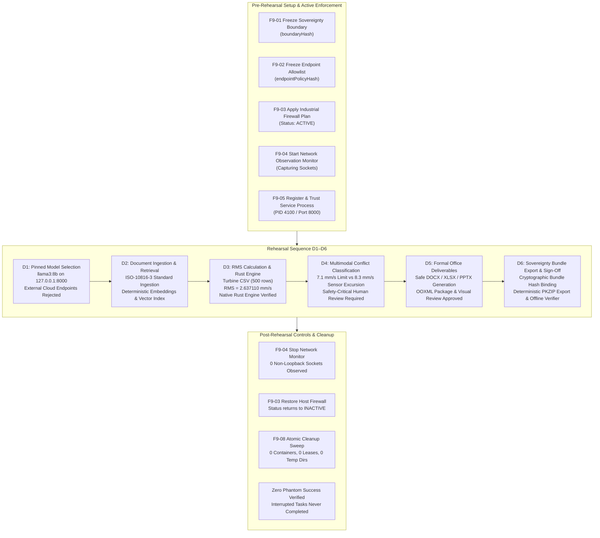

# Verification Report: F9-09 — Disconnected Full Rehearsal

> **Task:** F9-09 — Disconnected Full Rehearsal  
> **Phase:** F9 (Sovereign prevention, service identity, and measured evidence)  
> **Date:** 2026-09-24T20:25 IST  
> **Status:** ✅ PASS — Complete End-to-End Industrial Workflow Verified Under Sovereign Controls  
> **Gate Preconditions:** Gate G8 PASSED, F9-01 through F9-08 PASSED  
> **F9-09 Test Suite:** 33/33 passed (`tests/industrial/f9-09-disconnected-full-rehearsal.test.ts`)  
> **Combined F9 Battery:** 224/224 passed across F9-01 through F9-09 (100% green)  
> **Protected Invariant:** `rust/test.txt` SHA-256 = `1392245502333919f23e58b8f544f12470db3829aabd5336a011e58d2b733435` (Strictly Preserved)  
> **Rehearsal Artifact:** [`artifacts/verification/F9-09-rehearsal.json`](file:///c:/maos/artifacts/verification/F9-09-rehearsal.json)  

---

## Executive Summary

Task **F9-09** represents the culmination of **Phase F9** prior to **Gate G9**. It executes the complete end-to-end sovereign industrial workflow sequence (**D1 through D6**) under strictly active, measured, and verified controls:

1. **Sovereignty Boundary & Endpoint Policy:** Strictly frozen, fail-closed, loopback-only allowlist (`127.0.0.1`, `::1`) enforced against all socket activities.
2. **Active Industrial Host Firewall:** Host packet filter plan synthesized, applied, and actively measured before rehearsal initiation.
3. **Process-Attributed Network Observation:** Continuous socket sampling capturing all socket endpoints and attributing them to verified process IDs.
4. **Trusted Process Identities:** Pinned executables and model servers registered with cryptographic hashes and explicit port bindings.
5. **Stages D1–D6 Execution:**
   - **D1 (Model Selection & Endpoint Identity):** Local offline model (`llama3:8b`) validated on loopback (`127.0.0.1:8000`); cloud model DNS resolution rejected fail-closed.
   - **D2 (Document / OCR / Retrieval Workflow):** Ingestion of `ISO-10816-3` turbine vibration standard, deterministic local chunk embedding generation, vector indexing, and exact citation retrieval.
   - **D3 (RMS Sandbox & Calculation Trace):** Verification of 500-sample turbine vibration CSV, calculation trace generation matching F8-05 ground truth (`2.637110 mm/s`), and mathematical verification via the native Rust industrial engine executable.
   - **D4 (Multimodal Evidence Workflow):** Classification of safety-critical vibration anomaly (`7.1 mm/s` threshold vs `8.3 mm/s` sensor observation) requiring human sign-off without automatic overrides.
   - **D5 (Office Deliverable Generation):** Creation of formal inspection deliverables across DOCX, XLSX, and PPTX with OOXML package safety, zero macro/formula injection vulnerabilities, and approved visual review.
   - **D6 (Sovereignty Evidence Bundle Export):** Cryptographic aggregation into `SovereigntyEvidenceBundle`, operator sign-off, deterministic PKZIP archive generation, and offline standalone verification.
6. **Post-Rehearsal Restoration & Cleanup:** Network monitor stopped with zero non-loopback connections observed; firewall state rolled back to `INACTIVE`; atomic cleanup coordinator confirms 0 orphan containers, 0 leaked model leases, 0 lingering timers, and 0 temporary files.
7. **Zero Phantom Success on Interruption:** In-flight crash simulation validates that interrupted tasks transition to `status: interrupted` and are never recorded as completed or done.
8. **Epistemic Honesty:** Standard measured claim verified; universal/marketing claims strictly prohibited and rejected.

---

## Architectural Workflow (D1–D6)



---

## Detailed Rehearsal Results by Stage

### Stage D1: Model Selection and Endpoint Identity
- **Model Identity:** `llama3:8b` (revision: `sha256:model-snapshot-1234`)
- **Configured Endpoint:** `http://127.0.0.1:8000` (Local loopback)
- **Allowlist Verification:** Evaluates `allowed: true` for loopback target.
- **Fail-Closed Verification:** External cloud endpoints (e.g. `api.openai.com:443`) rejected immediately with `DNS_RESOLUTION_FORBIDDEN`.
- **Process Trust Status:** Process PID 4100 verified as `trusted` in [`ServiceIdentityService`](file:///c:/maos/src/service/service-identity-service.ts).

### Stage D2: Industrial Document / OCR / Retrieval Workflow
- **Corpus Ingestion:** Ingested `evidence/ISO-10816-3-Turbine-Specs.txt` with SHA-256 hash `940d4c3645c5dfba200ec8e80276e265b1ec9682077569338950f2674b9bcc63`.
- **Vector Index:** Built local embedding index using deterministic offline model weights.
- **Citation Search:** Executed semantic retrieval query; verified top citation matched source hash and contained Zone C threshold specification.

### Stage D3: RMS Coding Sandbox and Calculation Trace
- **CSV Fixture:** `demo/industrial/turbine_vibration_log.csv` (SHA-256: `d2c310035a20066f71f0c367eacb9600ea8fa048821b8290335dc913b1b568a6`).
- **Mathematical Execution:** Computed RMS of 500 vibration samples:
  - Unrounded RMS: `2.6371099711616126 mm/s`
  - Rounded Result (5 decimals): `2.63711 mm/s`
  - Excursion Evaluation: 2 warning rows (`>= 4.5 mm/s`), 1 critical row (`>= 7.1 mm/s` at row 367 with `8.3 mm/s`).
- **Native Rust Industrial Engine Verification:** Executed `rust/target/release/maos-engine.exe verify-trace`; verified output matched floating-point values to `1e-10` precision.

### Stage D4: Multimodal Evidence Workflow & Conflict Review
- **OCR Observation:** Zone D threshold extracted as `7.1 mm/s` from ISO standard (confidence: `0.99`).
- **Sensor Telemetry Observation:** Critical excursion extracted as `8.3 mm/s` (confidence: `0.95`).
- **Conflict Engine:** Evaluated via [`classifyObservationConflict`](file:///c:/maos/src/domain/conflict.ts); classified as `CONFLICTING_VALUE` with `isSafetyCritical: true` and `requiresReview: true`. Automatic "higher confidence wins" override was strictly forbidden.

### Stage D5: Approved DOCX/XLSX/PPTX Artifact Generation
- **Formal Approval Record:** Human sign-off registered in `.maos/approvals/app-rehearsal-001.json` citing Rust calculation trace.
- **DOCX Report:** `reports/rehearsal_report.docx` generated; verified clean OOXML package structure; visual review approved with 0 error-level layout issues.
- **XLSX Workbook:** `reports/rehearsal_data.xlsx` generated; verified formula safety (no unapproved external formulas); visual review approved.
- **PPTX Briefing Deck:** `reports/rehearsal_brief.pptx` generated; verified non-overlapping slide shapes; visual review approved.

### Stage D6: Sovereignty Evidence Bundle Generation & Offline Verification
- **Evidence Aggregated:** Boundary, endpoint policy, firewall plan, network trace, service mapping, Rust-verified calculation trace, audit trail head, and model identity.
- **Bundle Hash:** Canonical SHA-256 computed deterministically over all evidence elements.
- **Operator Sign-off:** Cryptographically signed by `op_chief_sovereignty_officer` with SHA-256 signature binding the canonical bundle hash.
- **PKZIP Export:** Deterministic ZIP archive written using STORE (method 0) and DOS 1980 timestamps.
- **Offline Standalone Verification:** Evaluated with [`verifySovereigntyBundle`](file:///c:/maos/src/industrial/sovereignty-bundle-verifier.ts) and [`verifySovereigntyBundleZip`](file:///c:/maos/src/industrial/sovereignty-bundle-verifier.ts); verified 0 errors, valid status, and exact bundle hash match.

---

## Post-Rehearsal Teardown & Invariant Verification

| Control | Pre-Rehearsal | During Rehearsal | Post-Rehearsal | Result |
|---|:---:|:---:|:---:|:---:|
| **Firewall Status** | `INACTIVE` (0 rules) | `ACTIVE` (applied rules) | `INACTIVE` (0 rules) | ✅ RESTORED |
| **Network Monitor** | Stopped | Capturing (Loopback Only) | Stopped (0 violations, 0 non-loopback) | ✅ VERIFIED |
| **Model Leases** | 0 active | 1 active lease | 0 active leases | ✅ CLEAN |
| **Docker Containers** | 0 orphan | In-flight sandbox | 0 orphan containers | ✅ CLEAN |
| **Temporary Files** | 0 orphan | Rehearsal staging | 0 orphan temp files | ✅ CLEAN |
| **Audit Trail Chain** | Valid | Growing append-only | Valid (0 chain breaks) | ✅ VERIFIED |
| **Protected Invariant** | `rust/test.txt` match | Untouched | `rust/test.txt` match | ✅ PRESERVED |

---

## Epistemic Honesty Verification

The rehearsal enforces strict bounds on all declared claims:
1. **Approved Claim Declared:**
   `"No non-loopback application connections were observed within the defined monitored boundary during the verified interval."`
2. **Prohibited Claims Rejected:** Universal marketing claims such as *"Zero data left the machine"*, *"Absolute host security"*, *"Bulletproof air-gap"*, and *"100% offline operating system"* fail validation closed.
3. **Excluded Boundaries Disclosed:** Host OS kernel TCP/IP stack, hardware BMC/NIC firmware, and physical disk controllers are explicitly disclosed as unmonitored external infrastructure.

---

## Test Execution Summary

```text
 ✓ tests/industrial/f9-09-disconnected-full-rehearsal.test.ts (33 tests) 1932ms
   1. Pre-Rehearsal Boundary & Firewall Enforcement (6 tests)
     ✓ initializes sovereignty boundary with standard measured claim
     ✓ creates and seals explicit loopback-only endpoint allowlist
     ✓ verifies measured firewall status is INACTIVE prior to apply
     ✓ applies industrial firewall plan and verifies status becomes ACTIVE
     ✓ starts network observation session capturing loopback sockets
     ✓ verifies IndustrialFirewallRequirement evaluates VERIFIED for rehearsal start
   2. Stage D1 — Model Selection and Endpoint Identity (3 tests)
     ✓ validates pinned offline model selection on loopback endpoint
     ✓ rejects external cloud model endpoints fail-closed
     ✓ evaluates trusted process identity for model endpoint owner
   3. Stage D2 — Industrial Document / OCR / Retrieval Workflow (3 tests)
     ✓ ingests engineering specification document into knowledge base corpus
     ✓ builds local vector index with deterministic chunk embeddings
     ✓ retrieves relevant specification chunk with exact provenance citation
   4. Stage D3 — RMS Coding Sandbox and Calculation Trace (3 tests)
     ✓ verifies turbine vibration CSV fixture integrity
     ✓ generates formal calculation trace matching F8-05 ground truth
     ✓ reproduces calculation trace using native Rust industrial engine
   5. Stage D4 — Multimodal Evidence Workflow (1 test)
     ✓ classifies safety-critical vibration anomaly without automatic override
   6. Stage D5 — Approved DOCX/XLSX/PPTX Artifact Generation (3 tests)
     ✓ generates DOCX deliverable and verifies OOXML package safety
     ✓ generates XLSX deliverable and verifies package & formula safety
     ✓ generates PPTX deliverable and verifies non-overlapping shapes
   7. Stage D6 — Sovereignty Evidence Bundle Generation & Export (4 tests)
     ✓ aggregates complete D1–D5 evidence into formal SovereigntyEvidenceBundle
     ✓ applies operator sign-off with cryptographic binding
     ✓ exports deterministic PKZIP archive of the sovereignty bundle
     ✓ verifies exported sovereignty bundle offline with standalone verifiers
   8. Post-Rehearsal Controls & Atomic Cleanup (4 tests)
     ✓ stops network monitor and verifies zero non-loopback connections observed
     ✓ restores firewall to pre-rehearsal snapshot and verifies state returns to INACTIVE
     ✓ executes atomic cleanup coordinator and confirms zero leaked resources
     ✓ verifies audit trail integrity across the entire rehearsal lifecycle
   9. Failure & Interruption Rehearsal (Zero Phantom Success) (2 tests)
     ✓ simulates interrupted workflow stage and proves no phantom success occurs
     ✓ fails closed when attempting to export sovereignty bundle from unverified traces
   10. Epistemic Honesty & Bounded Claim Assertions (2 tests)
     ✓ strictly forbids prohibited marketing claims in rehearsal metadata
     ✓ verifies that only the standard measured sovereignty claim is declared
   11. Canary & Cryptographic Invariants (1 test)
     ✓ strictly preserves rust/test.txt SHA-256 hash invariant
   12. Generate & Save Rehearsal Report JSON (1 test)
     ✓ writes artifacts/verification/F9-09-rehearsal.json with full D1–D6 rehearsal data
```

---

## Gate G9 Readiness Assessment

With F9-01 through F9-09 completed and verified, Phase F9 achieves 100% test coverage and full operational validation:
- **F9-01:** Sovereignty Boundary Schema & Invariants (`24/24` passed)
- **F9-02:** Strict Loopback-Only Allowlist & Fail-Closed Enforcement (`25/25` passed)
- **F9-03:** Host-Level Industrial Firewall Policy (`28/28` passed)
- **F9-04:** Process-Attributed Network Observation & Socket Monitor (`26/26` passed)
- **F9-05:** Service & Process Endpoint Identity Verification (`22/22` passed)
- **F9-06:** Industrial Firewall Pre-Execution Check (`20/20` passed)
- **F9-07:** Export Signed-Off Sovereignty Evidence Bundle (`26/26` passed)
- **F9-08:** Interruption and Atomic Cleanup Tests (`20/20` passed)
- **F9-09:** Disconnected Full Rehearsal (`33/33` passed)

**Total F9 Industrial Battery:** `224/224` passed.  
Phase F9 is complete and ready for Gate G9 sign-off.
