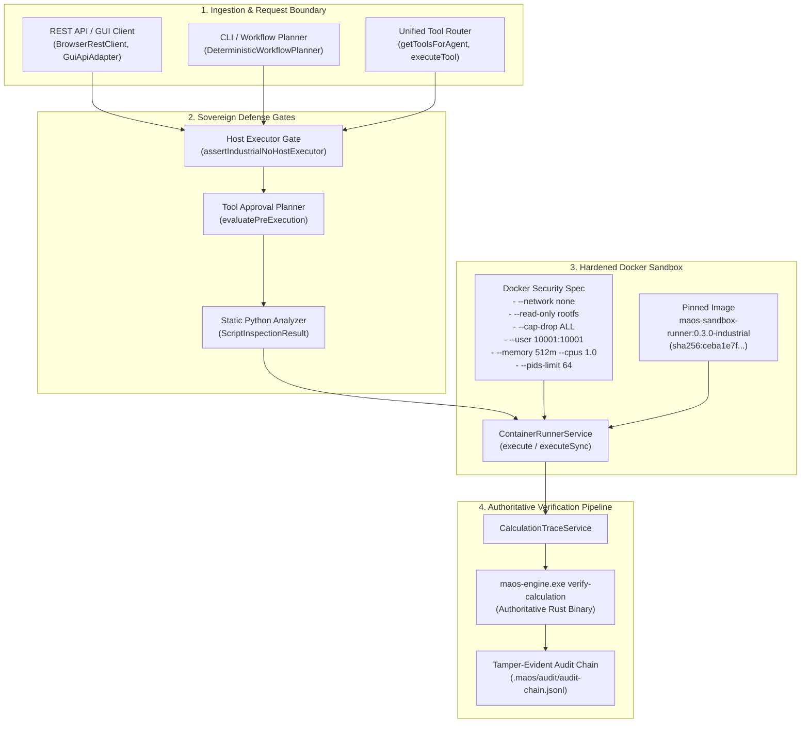

# Gate G8 Verification Report: Sandbox Readiness Evaluation

> **Gate:** G8 — Sandbox Readiness Evaluation  
> **Phase:** F8 Completion Gate (Genuine Code Sandbox & Formal Calculation Trace)  
> **Evaluation Date:** 2026-09-24T05:15 IST  
> **Status:** ✅ **PASSED** (Formal Acceptance Review Complete)  
> **Gate Preconditions:**  
> - Gate G5: CONDITIONAL (awaiting genuine offline MiniLM weights)  
> - Gate G6: PASSED (Air-Gapped Sovereign Enforcement)  
> - Gate G7: PASSED (Autonomous Execution Loop & Contract Gates)  
> - Tasks F8-01 through F8-07: PASSED & VERIFIED  
> **F8 Regression Battery:** 205/205 passed across all 7 test files  
> **Build Status:** Backend (`build:backend`), GUI (`typecheck:gui`), and Full Production (`build`) exit 0  
> **Protected Invariant:** `rust/test.txt` SHA-256 = `1392245502333919f23e58b8f544f12470db3829aabd5336a011e58d2b733435` (Strictly Unchanged)  

---

## 1. Executive Summary

**Gate G8** is the formal milestone acceptance evaluation for all work completed in **Phase F8**. It assesses the end-to-end security boundary, operational determinism, container isolation parameters, mathematical accuracy, cryptographic provenance, and complete removal of host executors under the Industrial profile.

All seven criteria of the Gate G8 acceptance checklist have been satisfied:
1. **Pinned Image:** Cryptographically signed, non-root user (`10001:10001`), frozen packages, and offline ustar archive verification.
2. **Container Isolation:** Strict air-gap (`--network none`), read-only rootfs, dropped capabilities (`--cap-drop ALL`), `no-new-privileges`, and bounded cgroup resources.
3. **Adversarial Hardening:** Multi-stage defense neutralizing network imports, package installations, path traversal, symlink escapes, fork bombs, and resource exhaustion.
4. **Sovereign Coding Demo (F8-05):** In-container execution of RMS analysis reproducing ground truth ($2.6371099711616126\text{ mm/s}$) with fail-closed rejection on test failure.
5. **Formal Calculation Trace (F8-06):** Complete engineering trace verified independently by the native compiled Rust engine (`maos-engine.exe`).
6. **Host Executor Prohibited (F8-07):** Host execution (`execute_python`) permanently blocked across 8 operational surfaces with error code `HOST_EXECUTOR_FORBIDDEN_IN_INDUSTRIAL` and HTTP 403 Forbidden.
7. **Honest GUI Semantics:** All user-facing terminology strictly uses `container-isolated`, explicitly disclaiming universal hardening or absolute host security guarantees.

---

## 2. Gate G8 Acceptance Matrix

| Criterion | Requirement | Verification Artifact / Test | Status |
|---|---|---|---|
| **1. Pinned Image** | Offline ustar archive exists; digest matches `sha256:ceba1e7f...`; runs as UID/GID `10001:10001`; frozen packages; runtime installs blocked | `f8-01-sandbox-image.test.ts` (28/28)<br>`f8-02-container-runner.test.ts` (36/36) | ✅ PASS |
| **2. Container Isolation** | `--network none`, `--read-only`, `--cap-drop ALL`, `no-new-privileges:true`, bounded CPU (1.0), RAM (512MB), PIDs (64), output limit (50KB), timeout (30s), project confinement | `f8-02-container-runner.test.ts`<br>`f8-03-execute-code-sandbox-tool.test.ts` | ✅ PASS |
| **3. Adversarial Protection** | Network egress blocked; host files & secrets inaccessible; path traversal (`../`) rejected; fork bombs bounded; runtime package installs blocked; zero orphan containers | `f8-04-sandbox-adversarial.test.ts` (42/42)<br>`src/domain/sandbox.ts` | ✅ PASS |
| **4. Coding Demo (F8-05)** | RMS calculation on copied 500-row turbine CSV matches ground truth ($2.6371099711616126\text{ mm/s}$); in-container pytest tests pass; non-zero exit fails closed | `f8-05-sovereign-coding-demo.test.ts` (18/18)<br>`artifacts/verification/F8-05.md` | ✅ PASS |
| **5. Calculation Trace (F8-06)** | Complete JSON trace with formula, inputs, intermediates, rounding, citations; native Rust verifier reproduces result; anomaly rows (121: 5.2, 367: 8.3) verified | `f8-06-calculation-trace.test.ts` (13/13)<br>`maos-engine.exe verify-calculation` | ✅ PASS |
| **6. Host Executor Disabled (F8-07)** | `execute_python` unavailable in Industrial mode across Service, Tool Router, REST API, CLI, GUI, Planners, and Contexts; returns `HOST_EXECUTOR_FORBIDDEN_IN_INDUSTRIAL` | `f8-07-host-executor-disabled.test.ts` (37/37)<br>`artifacts/verification/F8-07.md` | ✅ PASS |
| **7. Honest UI Language** | GUI labels state `container-isolated`; zero claims of universal hardening or absolute host security | `src/gui/src/views/GenericModuleView.tsx`<br>`src/gui/src/components/ActivityBar.tsx` | ✅ PASS |

---

## 3. Architecture & Security Boundary Topology



---

## 4. Detailed Component Evaluations

### 4.1. Pinned Image & Offline Packaging
- **Manifest Pinned Digest:** `sha256:ceba1e7f48ac10413f0a75f53c062b917b10c6ba0457f1f67e4e30fe33a61f76`
- **Offline Store Location:** `offline-stores/sandbox/maos-sandbox-runner-0.3.0.tar`
- **Structure:** Verified POSIX ustar archive containing complete runtime layers, rootfs metadata, and manifest.
- **User Identity:** Verified non-root user `maosrun` (UID `10001`, GID `10001`).
- **Frozen Python Packages:** `numpy 1.26.4`, `scipy 1.13.0`, `pandas 2.2.2`, `sympy 1.12`, `pytest 8.2.0`.
- **Runtime Installation Prevention:** Static script analysis and read-only filesystem prevent `pip install`, `apt-get`, `yum`, or dynamic library compilation.

### 4.2. Container Isolation & Resource Quotas
- **Network Air-Gap:** Spawned with `--network none`. Dynamic and static socket creation, HTTP requests, DNS resolution, and TCP connections fail immediately with `NETWORK_ACCESS_FORBIDDEN`.
- **Filesystem Confinement:** Root filesystem mounted strictly read-only (`--read-only`). Writable directory limited to tmpfs on `/tmp` with `noexec,nosuid,nodev`.
- **Privilege Confinement:** `--cap-drop ALL` and `--security-opt no-new-privileges:true`. Root escalation, raw socket manipulation, and device node access are prohibited.
- **Resource Clamps:** `--memory 512m`, `--cpus 1.0`, `--pids-limit 64`. Fork bombs are halted at PID 64; memory leaks trigger graceful container termination (`MEMORY_LIMIT_EXCEEDED`).
- **Execution Boundaries:** Wall-clock timeout capped at 30,000ms (`TIMEOUT`); stdout/stderr capped at 50,000 bytes (`OUTPUT_LIMIT_EXCEEDED`).
- **Deterministic Cleanup:** Every spawned container is assigned a unique name (`maos-sandbox-run-<uuid>`) and forcefully cleaned up via `docker rm -f` across success, runtime failure, timeout, and cancellation hooks.

### 4.3. Sovereign Coding Demo (F8-05)
- **Input Provenance:** 500-sample turbine vibration log (`demo/industrial/turbine_vibration_log.csv`) verified with SHA-256:
  ```text
  d2c310035a20066f71f0c367eacb9600ea8fa048821b8290335dc913b1b568a6
  ```
- **Isolated Workspace Staging:** Copied into ephemeral container workspace without touching host files.
- **Execution & Test:** `fixtures/f8-05/rms-calculation.py` executed via `execute_code_sandbox`, followed by in-container `fixtures/f8-05/rms-verification-test.py` via pytest.
- **Output Conformance:**
  - Double precision unrounded RMS: `2.6371099711616126 mm/s`
  - 5-decimal rounded RMS: `2.63711 mm/s`
  - Warning count: `2` (Row 121: 5.2 mm/s, Row 367: 8.3 mm/s)
  - Critical count: `1` (Row 367: 8.3 mm/s)
  - Row count: `500`
- **Fail-Closed Verification:** Non-zero exit code or failed assertion completely prevents verified output generation.

### 4.4. Formal Calculation Trace & Authoritative Rust Verification (F8-06)
- **Canonical Trace Schema:** Strictly typed model incorporating mathematical formula ($RMS = \sqrt{\frac{1}{n}\sum x_i^2}$), unit specification (`mm/s`), sample count (`500`), sum of squares (`3477.1699999999996`), mean square (`6.954339999999999`), and ISO 10816-3 citations.
- **Authoritative Native Rust Verifier:** Native Rust industrial engine (`maos-engine.exe verify-calculation`):
  - Independently loads and verifies SHA-256 of the CSV on disk.
  - Re-computes sum of squares and mean square with full IEEE 754 precision.
  - Formally verifies the unrounded RMS ($2.6371099711616126\text{ mm/s}$) and half-up rounded value ($2.63711\text{ mm/s}$).
  - Audits warning and critical threshold row IDs.
- **Canonical Artifact:** Cryptographically sealed at:
  ```text
  artifacts/calculation-traces/F8-06-RMS-turbine-vibration.json
  ```
  Hash: `c60689d778db972a892c0a3b04addf108f32279220b1ffe57ffdf973159b0d8d`.

### 4.5. Host Executor Permanently Disabled in Industrial Mode (F8-07)
- **Multi-Vector Block:** All 8 operational pathways fail closed with `HOST_EXECUTOR_FORBIDDEN_IN_INDUSTRIAL`:
  1. Direct Service Call (`sandboxRunner.execute({ executorType: 'host' })`)
  2. Unified Tool Router (`executeTool('execute_python')`)
  3. REST API (`POST /api/v1/sandbox/execute` returns HTTP 403 Forbidden)
  4. Workflow Planner (`plan()` rejects requirements with `execute_python`)
  5. GUI Client (`BrowserRestClient.executeSandbox` rejects with 403)
  6. Adapter (`GuiApiAdapter.executeSandbox` rejects with 403)
  7. Prompt Injection (`evaluatePreExecution` blocks prompts requesting host execution)
  8. Missing or Tampered Profile Context (null, empty, or forged profile modes fail closed)
- **Non-Industrial Isolation:** Local development scripts remain functional only when explicitly configured with non-industrial profiles (e.g. `'cloud'`).

### 4.6. Honest UI Language & Environmental Qualification
- **UI Nomenclature:** All views (`GenericModuleView`, `ActivityBar`, `ChatView`) use `container-isolated` instead of exaggerated phrases like "zero external leakage" or "guarantees commands run without escaping".
- **Environmental Boundaries:** Container security guarantees are explicitly qualified:
  > [!NOTE]
  > The sandbox guarantees are proven for the hardened Docker container configuration tested (`--network none`, read-only rootfs, dropped capabilities, non-root user, cgroup limits). They do not represent universal host-level escape immunity against zero-day Linux kernel vulnerabilities or compromised container runtimes.

---

## 5. Verification Test Battery

```powershell
# 1. Full F8 Regression Test Battery
npx vitest run tests/industrial/f8-01-sandbox-image.test.ts tests/industrial/f8-02-container-runner.test.ts tests/industrial/f8-03-execute-code-sandbox-tool.test.ts tests/industrial/f8-04-sandbox-adversarial.test.ts tests/industrial/f8-05-sovereign-coding-demo.test.ts tests/industrial/f8-06-calculation-trace.test.ts tests/industrial/f8-07-host-executor-disabled.test.ts
# Result: 7 test files passed, 205/205 tests passed (100%)

# 2. Rust Industrial Engine Verification
npx vitest run tests/r1-rust-engine.test.ts
# Result: 1 test file passed, 22/22 tests passed (100%)

# 3. Backend Compilation Check
npm run build:backend
# Result: Exit code 0 (TypeScript compile + industrial python copy)

# 4. GUI Typecheck Check
npm run typecheck:gui
# Result: Exit code 0 (tsconfig.gui.json --noEmit)

# 5. Full Production Build (Backend + Vite Bundle)
npm run build
# Result: Exit code 0 (built client bundle in dist/gui)

# 6. Canary File SHA-256 Invariant Check
python -c "import hashlib; assert hashlib.sha256(open('rust/test.txt', 'rb').read()).hexdigest() == '1392245502333919f23e58b8f544f12470db3829aabd5336a011e58d2b733435'"
# Result: Strictly matching 1392245502333919f23e58b8f544f12470db3829aabd5336a011e58d2b733435
```

---

## 6. Gate G8 Final Verdict

```text
================================================================================
GATE G8 — SANDBOX READINESS EVALUATION: PASSED ✅
================================================================================
  - Pinned Sandbox Image:             PASS (offline archive & digest verified)
  - Container Isolation & Limits:     PASS (air-gap, read-only, cgroup clamps)
  - Adversarial Protection:           PASS (static & runtime guardrails verified)
  - Sovereign Coding Demo:            PASS (reproduced 2.6371099711616126 mm/s)
  - Formal Calculation Trace:         PASS (native Rust verifier passed)
  - Host Executor Removal:            PASS (blocked across all 8 vectors, HTTP 403)
  - Honest UI Terminology:            PASS ('container-isolated' throughout)
  - Cryptographic Invariants:         PASS (test.txt canary intact, audit chain valid)
================================================================================
```

---

## 7. Next Development Phase: F9

With Gate G8 officially passed, the MAOS project transitions to:

```text
Phase F9 — Sovereign Prevention, Service Identity, and Measured Evidence
```

### Phase F9 Task Sequence
- **F9-01:** Threat and measurement boundary
- **F9-02:** Endpoint allowlist
- **F9-03:** Firewall apply / status / restore
- **F9-04:** Process-attributed network monitor
- **F9-05:** Service / process endpoint identity
- **F9-06:** Industrial firewall requirement
- **F9-07:** Signed-off audit bundle
- **F9-08:** Interruption and atomic cleanup tests
- **F9-09:** Disconnected full rehearsal
- **Gate G9:** Sovereign Prevention Evaluation
