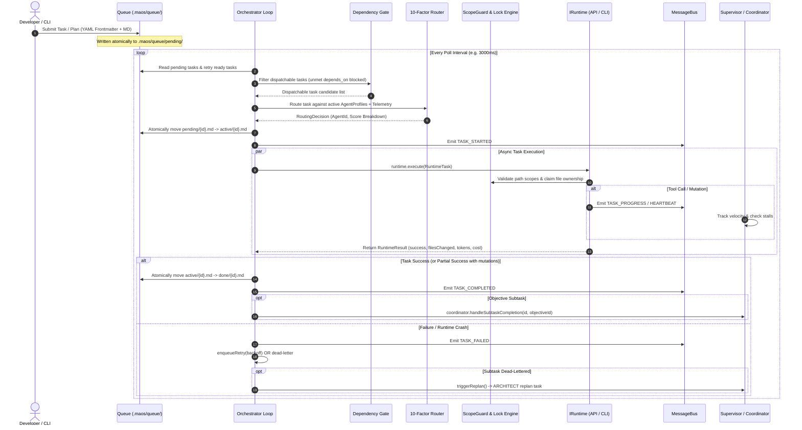
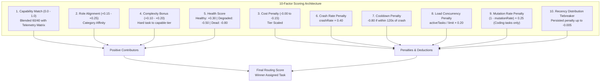
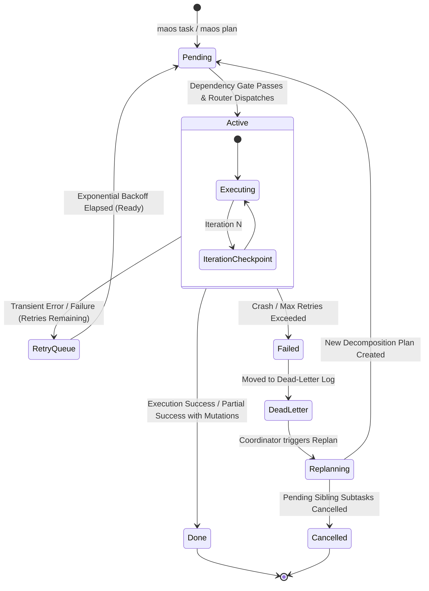

# MAOS Architecture Specification

> **Multi-Agent Orchestrator System (MAOS)**  
> *Sovereign, local-first multi-agent orchestration workbench — "docker-compose for AI coding agents".*

---

## 1. High-Level Overview & Design Philosophy

MAOS is an autonomous orchestration platform that coordinates specialized AI agents (planners, coders, reviewers, devops, and security analysts) on local development environments. Built to eliminate the fragility of single-agent loops and cloud-locked agent stacks, MAOS treats coding agents as interchangeable, isolated micro-workers running against local git repositories.

```
┌───────────────────────────────────────────────────────────────────────────────────┐
│                                   MAOS CLI / REPL                                 │
│         (maos init | maos task | maos plan | maos start | maos dashboard)         │
└────────────────────────────────────────┬──────────────────────────────────────────┘
                                         │
                                         ▼
┌───────────────────────────────────────────────────────────────────────────────────┐
│                                ORCHESTRATOR CORE                                  │
│  ┌─────────────────────────┐  ┌─────────────────────────┐  ┌───────────────────┐  │
│  │   Central Dispatcher    │  │   10-Factor Router      │  │  Dependency Gate  │  │
│  └────────────┬────────────┘  └────────────┬────────────┘  └─────────┬─────────┘  │
│               │                            │                         │            │
│  ┌────────────▼────────────┐  ┌────────────▼────────────┐  ┌─────────▼─────────┐  │
│  │    Supervisor (PM)      │  │   Coordinator (Replan)  │  │  Retry & DLQ      │  │
│  └─────────────────────────┘  └─────────────────────────┘  └───────────────────┘  │
│  ┌─────────────────────────────────────────────────────────────────────────────┐  │
│  │                 In-Process Typed Message Bus & Event Store                  │  │
│  └─────────────────────────────────────────────────────────────────────────────┘  │
└────────────────────────┬───────────────────────────────────┬──────────────────────┘
                         │                                   │
                         ▼                                   ▼
┌────────────────────────────────────────┐ ┌────────────────────────────────────────┐
│             SAFETY & STATE             │ │          EXECUTION BACKENDS            │
│  ┌──────────────────────────────────┐  │ │  ┌──────────────────────────────────┐  │
│  │ Atomic Queue (.maos/queue/)      │  │ │  │ ApiRuntime (Universal IProvider) │  │
│  ├──────────────────────────────────┤  │ │  │ - OpenAI, Anthropic, Gemini      │  │
│  │ ScopeGuard & File Ownership      │  │ │  │ - DeepSeek, Groq, Ollama, vLLM   │  │
│  ├──────────────────────────────────┤  │ │  ├──────────────────────────────────┤  │
│  │ Crash Checkpoints (.maos/check/) │  │ │  │ CliRuntime (Subprocess Sessions) │  │
│  ├──────────────────────────────────┤  │ │  │ - GitHub Copilot CLI, Codex CLI  │  │
│  │ Context Memory & Brain Scanner   │  │ │  │ - Claude CLI, OpenCode           │  │
│  └──────────────────────────────────┘  │ │  └──────────────────────────────────┘  │
└────────────────────────────────────────┘ └────────────────────────────────────────┘
```

### Core Design Principles

1. **Sovereignty & Local-First Execution**  
   MAOS requires no proprietary orchestrator clouds, external SaaS databases, or centralized brokers. State is persisted directly in `.maos/` using atomic file-backed queues, JSONL event logs, and markdown task specifications.
2. **Universal Runtime & Provider Agnosticism**  
   The platform draws a strict conceptual line between:
   - **`IProvider`**: Generates text and handles tool-call schemas across LLM APIs (OpenAI, Anthropic, Gemini, DeepSeek, Ollama, LM Studio).
   - **`IRuntime`**: Manages execution lifecycles across distinct environments—from in-process tool-calling loops (`ApiRuntime`) to headless or terminal subprocesses (`CliRuntime`).
3. **Defense-in-Depth Safety Architecture**  
   Agents operate under strict sandboxing. The `ScopeGuard` enforces root isolation, directory containment, path traversal rejection, Windows Alternate Data Stream (ADS) filtering, dangerous command blocklisting, and fine-grained file ownership with read/write access arbitration.
4. **Autonomous Self-Healing & Resilience**  
   No manual intervention is needed for typical agent failure modes:
   - **Crash Recovery**: Checkpoint engine restarts interrupted tasks or commits verified progress.
   - **Adaptive Routing**: 10-factor capability scoring routes tasks dynamically and avoids crashing runtimes.
   - **Autonomous Supervision**: Heartbeat monitors identify stalled or looping agents, nudging them to consolidate work.
   - **Dynamic Replanning**: The coordinator automatically invalidates dependent tasks and commands architects to draft alternate approaches when a subtask fails permanently.

---

## 2. System Request Flow & Lifecycle

The lifecycle of an objective or task progresses through discrete, deterministic stages.

### 2.1 End-to-End Sequence Flow



---

## 3. Core Engine Modules & Key Interfaces

### 3.1 Orchestrator (`src/core/orchestrator.ts`)
The `Orchestrator` is the central engine driver. It initializes runtime instances, loads configuration (`maos.config.json`), boots the `MessageBus` and `EventStore`, runs startup crash recovery via `recoverOrphanedTasks()`, and manages the dispatch poll loop.

- **Non-blocking Pre-reservation**: Pre-marks routed agents as busy in `state.activeAgents` synchronously before kicking off fire-and-forget execution to prevent race conditions during concurrent polling.
- **Session Guards**: Maintains `sessionDispatchedTaskIds` and `sessionCompletedTaskIds` sets to eliminate infinite re-dispatch loops for tasks that exit cleanly with zero mutations (`no_mutation`).
- **Graceful Teardown**: Intercepts `SIGINT` and `SIGTERM`, disposes all runtimes, stops health monitor sweeps, and resets agent statuses to `IDLE`.

### 3.2 Adaptive 10-Factor Router (`src/core/router.ts`)
The router calculates an exhaustive capability score for every idle, enabled agent against incoming task requirements.



#### The 10 Factors Defined:
1. **Capability Overlap & Telemetry Feedback**: Matches task-required skills against agent capabilities. Blends static capabilities (60%) with historical success rates from `.maos/telemetry/` (40%).
2. **Role Affinity**: Grants up to +0.25 bonus if the agent's role matches task categorization (`planner` → architecture/decomposition, `coder` → implementation/refactoring, `tester` → QA/testing).
3. **Cost Efficiency**: Deducts score proportional to the agent's cost tier, favoring cheaper options when capabilities are equivalent.
4. **Complexity Matching**: Grants bonuses when high-complexity tasks are paired with high/premium cost tiers.
5. **Runtime Health State**: Dynamically adjusted via `HealthMonitor` (+0.30 for `HEALTHY`, -0.50 for `DEGRADED`, -0.80 for `DEAD`).
6. **Crash Rate Penalty**: Proportional penalty calculated from `RuntimeStatsStore` historical crashes.
7. **Post-Crash Cooldown**: Imposes a flat -0.80 deduction during the 120-second window following a `RUNTIME_CRASHED` event.
8. **Concurrency & Load Penalty**: Deducts points if an agent runtime is running concurrent tasks.
9. **Mutation Rate Penalty**: Exclusively applied to coding/implementation tasks when an agent historically finishes with zero file writes. Analysis and planning categories are immune.
10. **Persistent Recency Penalty**: Breaks ties among identically capable agents (e.g. `CODER_1` vs `CODER_2`) using disk-persisted dispatch counters (`.maos/router-dispatch-history.json`).

### 3.3 Atomic Queue (`src/core/queue.ts`)
The queue stores tasks as human-readable Markdown files with structured YAML frontmatter:

```markdown
---
id: CODER_1__1725558400000_a1b2
agent: AUTO
branch: maos/coder_1/CODER_1__1725558400000_a1b2
status: pending
capabilities: [coding, backend, typescript]
complexity: medium
category: implementation
depends_on: [ARCHITECT__1725558000000_9z8y]
created_at: 2026-09-05T18:40:00.000Z
type: subtask
objective_id: OBJ__1725557000000_init
depth: 1
review_required: true
fix_attempts: 0
parent_task_id: ''
---

# Task: CODER_1__1725558400000_a1b2
## Description
Implement the user authentication endpoint...
```

#### Queue Transition Guarantees:
- **Crash-Proof Atomicity**: All state writes first hit unique hidden temporary files (`.filename.<ts>_<rand>.tmp`) in the target directory before an atomic `fs.renameSync()` moves them to final destination.
- **Directory Isolation**: Tasks progress through `.maos/queue/pending/` → `.maos/queue/active/` → `.maos/queue/done/`, with auxiliary directories for `.maos/queue/retry/`, `.maos/queue/failed/`, and `.maos/queue/cancelled/`.

### 3.4 Agent Execution Loop (`src/core/agent-runner.ts`)
The runner powers `ApiRuntime` instances via a managed tool-calling loop:
- **Semantic Progress Tracker**: Evaluates discovery and mutations (new files read, directories listed, search queries executed, writes committed). If an agent spins repeatedly on the same command without new context, `idleCount` increments toward a circuit breaker limit.
- **Sliding Context Window & Compression**: When total tokens cross `CONTEXT_TOKEN_LIMIT` (60,000 tokens), the runner compresses intermediate dialogue into a concise summary preserving file paths read/written, commands executed, and error outputs, retaining the initial system prompt and recent message pairs.
- **Budget Auto-Nudge**: When an agent consumes 80% of its `maxIterations`, the runner injects an urgent directive commanding the agent to commit current progress and execute `task_complete`.
- **Checkpointing**: Every iteration persists execution state to `.maos/checkpoints/{taskId}.json` for seamless crash resumption.

### 3.5 ScopeGuard & Security Model (`src/core/scope-guard.ts`)
Enforces strict boundaries against unauthorized filesystem alterations and dangerous terminal operations:

```
                          Incoming Action
                                │
               ┌────────────────┴────────────────┐
               │                                 │
         Write Operation                  Shell Execution
               │                                 │
               ▼                                 ▼
      isPathInScope Check?             Command Blocklist Scan
     - Project root escape?            - Destructive (rm -rf, format, del)
     - Out of defined scope?           - Exfiltration (curl POST, wget POST)
     - Windows ADS payload?            - Secret reads (cat *.env, *.ssh)
               │                                 │
               ▼                                 ▼
      File Ownership Claim              Allow / Block Decision
     - Same owner? -> Re-acquire
     - Idle > 60s? -> Transfer
     - Active owner? -> BLOCKED
```

- **Path Scope Sanitization**: Normalizes slashes, resolves absolute paths against the project root, and rejects attempts to navigate up (`..`) or write to Alternate Data Streams (paths containing colons).
- **Command Blocklist**: Denies destructive utilities (`rm -rf`, `format`, `del /s /f`, `rmdir /s`), data exfiltration attempts (`curl -X POST`, `wget --post`), secret harvesting (`cat *.env`, `type *.key`, `.ssh`), and process sabotage (`taskkill`, `kill -9`).
- **Semantic File Ownership Engine**: Replaces crude file locks with time-aware ownership. Owners retain rights while actively writing. Ownership transfers smoothly if an agent remains idle on a file for >60s or becomes stale after 10m.

### 3.6 Supervisor & Autonomous PM (`src/core/supervisor.ts`)
Operates every 3rd orchestrator tick (~9 seconds) to maintain macro-level project health:
- **Velocity & Stall Detection**: Measures agent progress against periodic `HEARTBEAT` and `TASK_PROGRESS` signals. If an agent emits 5 consecutive heartbeats without productive file mutations or tool invocations, the supervisor injects a non-blocking nudge into the agent's inbox.
- **Objective Lifecycle Completion**: Evaluates running objectives in `.maos/objectives/`. Once all decomposed child subtasks are registered in `done/`, the supervisor promotes the objective status to `done` and emits `OBJECTIVE_COMPLETED`.
- **Timeout Alerts**: Flags objectives running longer than 30 minutes for operator review.

### 3.7 Coordinator (`src/core/coordinator.ts`)
Handles inter-agent collaboration and automated replanning:
- **Dynamic Replanning on Dead-Letter**: When a critical subtask fails all retries, the coordinator cancels all unstarted sibling subtasks of that objective, moves them to `.maos/queue/cancelled/`, and issues a `REPLAN` task to the `ARCHITECT` agent with failure diagnostics.
- **Inter-Agent Inbox**: Provides an in-memory queue where agents publish requests (`request_from_team`) and responses (`respond_to_team`). The coordinator automatically checks `ContextMemory` to satisfy queries immediately before broadcasting.

### 3.8 In-Process Message Bus (`src/core/message-bus.ts`)
A lightweight, typed event bus facilitating decoupling across subsystems:
- Supports typed subscriptions (`bus.on('TASK_COMPLETED', handler)`), wildcards (`bus.onAll(handler)`), and asynchronous barriers (`bus.waitFor('OBJECTIVE_PLAN_READY')`).
- Automatically logs all events to an in-memory ring buffer (default 1,000 events) and delegates persistence to `EventStore` (`.maos/events/events.jsonl`).

---

## 4. Data Flow & Queue State Machine

Tasks transition through a deterministic finite state machine backed by filesystem operations:



### Queue Directory Structure
```
.maos/
├── config.json                 # Project configuration & agent roster
├── credentials.json            # Encrypted / secure local credential store
├── router-dispatch-history.json# Persistent recency tracking
├── health-state.json           # Agent health status cache
├── queue/
│   ├── pending/                # Unstarted tasks waiting for dispatch
│   ├── active/                 # Tasks currently claimed and running
│   ├── done/                   # Successfully completed task records
│   ├── retry/                  # Failed tasks awaiting backoff expiration
│   ├── failed/                 # Tasks abandoned after exceeding retry limit
│   └── cancelled/              # Tasks invalidated by objective replanning
├── checkpoints/                # Active task progress snapshots ({taskId}.json)
├── events/
│   └── events.jsonl            # Append-only unified bus event audit log
├── memory/
│   └── memory.json             # Shared inter-agent discovery store
└── logs/
    └── orchestrator.log        # Rolling human-readable engine logs
```

---

## 5. Universal Provider & Runtime Abstraction

MAOS decouples agent models and execution environments into two distinct interfaces.

```
┌────────────────────────────────────────────────────────────────────────┐
│                        ORCHESTRATOR DISPATCH                           │
└───────────────────────────────────┬────────────────────────────────────┘
                                    │ Calls runtime.execute(task)
                                    ▼
┌────────────────────────────────────────────────────────────────────────┐
│                          IRuntime INTERFACE                            │
│  - execute(task: RuntimeTask): Promise<RuntimeResult>                  │
│  - getCapabilityProfile(): RuntimeCapabilityProfile                   │
│  - dispose(): Promise<void>                                            │
└───────────────────┬────────────────────────────────┬───────────────────┘
                    │                                │
                    ▼                                ▼
┌─────────────────────────────────────┐ ┌────────────────────────────────┐
│             ApiRuntime              │ │           CliRuntime           │
│  - Manages runAgent() tool loop     │ │  - Spawns subprocess (PTY/WT) │
│  - Sliding context compression      │ │  - Quiescence stream detection │
│  - Handles tool execution           │ │  - Exit code & git diff parsing│
│  - Uses IProvider abstraction       │ │  - Zero per-token API cost     │
└───────────────────┬─────────────────┘ └────────────────────────────────┘
                    │ Uses provider.generate()
                    ▼
┌────────────────────────────────────────────────────────────────────────┐
│                         IProvider INTERFACE                            │
│  - generate(messages: ChatMessage[], tools?: ToolDef[]): Promise<Resp> │
└───────┬──────────────┬──────────────┬──────────────┬───────────────────┘
        ▼              ▼              ▼              ▼
  OpenAIProvider  AnthropicProvider GeminiProvider LocalProvider (Ollama)
```

### 5.1 `IProvider` Interface
Defined in `src/backends/provider.ts`. Manages conversation formatting and tool calling:

```typescript
export interface IProvider {
  readonly name: string;
  readonly model: string;
  generate(messages: ChatMessage[], tools?: ToolDef[]): Promise<ProviderResponse>;
}
```

Implementations include:
- **`OpenAIProvider`**: Connects to OpenAI, DeepSeek, Together, Groq, Fireworks, Qwen, and local Ollama/LM Studio endpoints using standard completions schemas.
- **`AnthropicProvider`**: Integrates with the Anthropic Claude Messages API and handles native tool use specifications.
- **`GeminiProvider`**: Integrates with Google Generative AI SDK with structured function declarations.

### 5.2 `IRuntime` Interface
Defined in `src/backends/runtime.ts`. Manages the physical execution environment:

```typescript
export interface IRuntime {
  readonly type: 'api' | 'cli' | 'local';
  readonly name: string;
  readonly model: string;
  execute(task: RuntimeTask): Promise<RuntimeResult>;
  getCapabilityProfile(): RuntimeCapabilityProfile;
  dispose(): Promise<void>;
}
```

- **`ApiRuntime`**: Runs agents inside the Node.js process using `runAgent()`, processing tool invocations locally with `executeTool()`.
- **`CliRuntime`**: Launches terminal coding agents (GitHub Copilot CLI, Codex CLI, Claude CLI, OpenCode) as managed subprocesses in terminal windows or PTY sessions, capturing output streams and monitoring quiescence.

### 5.3 Credential Resolution Priority
Credentials resolve automatically through a 4-stage precedence chain:
1. Local credential store: `.maos/credentials.json` (configured via `maos configure`)
2. Project `.env` file (`.env` in workspace root)
3. Process environment variables (`process.env`)
4. Static configuration strings in `maos.config.json`

---

## 6. Extension Points

### 6.1 Adding a New AI Provider
1. Create a class implementing `IProvider` in `src/backends/<provider-name>-provider.ts`:
   ```typescript
   import { IProvider, ChatMessage, ToolDef, ProviderResponse } from './provider';

   export class CustomProvider implements IProvider {
     readonly name = 'custom';
     readonly model: string;
     constructor(config: { model: string; apiKey: string }) {
       this.model = config.model;
     }
     async generate(messages: ChatMessage[], tools?: ToolDef[]): Promise<ProviderResponse> {
       // Transform ChatMessage[] to provider format
       // Execute API call
       // Return standard ProviderResponse
     }
   }
   ```
2. Register the provider in `createProvider()` inside `src/backends/factory.ts`.
3. Add default pricing to `DEFAULT_COSTS` in `src/backends/factory.ts`.
4. Add unit test coverage in `tests/`.

### 6.2 Adding a New Runtime Backend
1. Create an implementation of `IRuntime` in `src/backends/<name>-runtime.ts`:
   ```typescript
   import { IRuntime, RuntimeTask, RuntimeResult, RuntimeCapabilityProfile } from './runtime';

   export class CustomRuntime implements IRuntime {
     readonly type = 'local';
     readonly name = 'custom-runner';
     readonly model = 'custom-model';

     async execute(task: RuntimeTask): Promise<RuntimeResult> {
       // Execute task workload
       return {
         success: true,
         summary: 'Completed work',
         filesChanged: ['src/example.ts'],
         iterations: 1,
         totalTokens: 0,
         costUSD: 0,
         latencyMs: 1200,
         runtimeType: 'local',
       };
     }

     getCapabilityProfile(): RuntimeCapabilityProfile {
       return {
         runtimeId: 'custom-runner',
         runtimeType: 'local',
         provider: 'custom',
         supportsTools: true,
         supportsCodeMutation: true,
         supportsLongContext: true,
         supportsStreaming: false,
         supportsParallelism: false,
         estimatedAvgLatencyMs: 2000,
         estimatedCostPerTask: 0,
         concurrencyLimit: 1,
       };
     }

     async dispose(): Promise<void> {
       // Teardown child processes or network sockets
     }
   }
   ```
2. Integrate into `RuntimeFactory.create()` in `src/backends/factory.ts`.

### 6.3 Registering Built-In Agent Tools
To expose new tools to all API agents:
1. Define the tool definition in `AGENT_TOOLS` within `src/integrations/tools.ts`.
2. Add the execution handler to `executeTool()` within `src/integrations/tools.ts`.
3. Update `allowedTools` filtering in agent configuration if least-privilege scoping is active.

---

## 7. Configuration Reference (`maos.config.json`)

```json
{
  "projectName": "my-project",
  "routingMode": "capability_score",
  "routing": {
    "strategy": "capability_score",
    "costWeight": 0.3,
    "capabilityWeight": 0.7,
    "maxParallelAgents": 4,
    "fallbackProvider": "freemodel"
  },
  "providers": {
    "openai": {
      "apiKey": "env:OPENAI_API_KEY",
      "costPerMillionTokens": 2.50
    },
    "anthropic": {
      "apiKey": "env:ANTHROPIC_API_KEY",
      "costPerMillionTokens": 3.00
    },
    "ollama": {
      "baseURL": "http://localhost:11434/v1",
      "costPerMillionTokens": 0.00
    }
  },
  "agents": [
    {
      "id": "ARCHITECT",
      "role": "planner",
      "runtime": "api",
      "provider": "anthropic",
      "model": "claude-3-7-sonnet",
      "capabilities": ["planning", "architecture", "decomposition"],
      "costTier": "premium",
      "maxIterations": 15,
      "scope": ["docs/", "package.json"]
    },
    {
      "id": "CODER_1",
      "role": "coder",
      "runtime": "api",
      "provider": "openai",
      "model": "gpt-4o",
      "capabilities": ["coding", "backend", "typescript"],
      "costTier": "medium",
      "maxIterations": 30,
      "scope": ["src/", "tests/"]
    },
    {
      "id": "COPILOT_CLI",
      "role": "coder",
      "runtime": "cli",
      "cliCommand": "copilot",
      "capabilities": ["coding", "refactoring"],
      "costTier": "free",
      "scope": ["src/"]
    }
  ]
}
```
